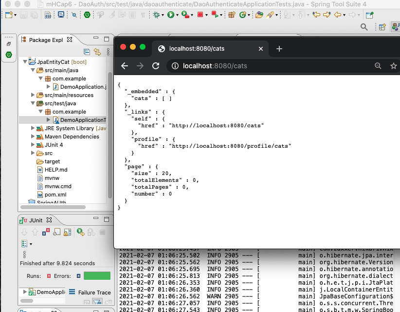

JPA entity Cat
===
> Book: Cloud Native Java 
> Author: Josh Long & Kenny Bastani
> Date: 2017

A rudimentary Spring Boot application with a JPA entity Cat


[ software.md ]( /mynote.md/software.md)


210206JpaEntityCat.png 

#### DemoApplication.java
``` java
package com.example;

import org.springframework.boot.SpringApplication;
import org.springframework.boot.autoconfigure.SpringBootApplication;
import org.springframework.data.jpa.repository.JpaRepository;
import org.springframework.data.rest.core.annotation.RepositoryRestResource;

import javax.persistence.Entity;
import javax.persistence.GeneratedValue;
import javax.persistence.Id;

/* 1. Annotates a class as a Spring Boot application */
@SpringBootApplication
public class DemoApplication {

	/* 2. Start with the Spring Boot Application */
	public static void main(String[] args) {
		SpringApplication.run(DemoApplication.class, args);
	}
}

/* 3. A plain JPA entity to model a Cat entity. */
@Entity
class Cat {

	@Id
	@GeneratedValue
	private Long id;

	private String name;

	Cat() {
	}

	public Cat(String name) {
		this.name = name;
	}

	@Override
	public String toString() {
		return "Cat{" + "id=" + id + ", name='" + name + '\'' + "}";
	}

	public Long getId() {
		return id;
	}

	public String getName() {
		return name;
	}

}

/*
 * 4. A Spring Data JPA repository (which handles all common
 * create-read-update-and-delete operations) that has been exported as a REST
 * API
 */
@RepositoryRestResource
interface CatRepository extends JpaRepository<Cat, Long> {
}

/* web browsers localhost:8080/cats
{
  "_embedded" : {
    "cats" : [ ]
  },
  "_links" : {
    "self" : {
      "href" : "http://localhost:8080/cats"
    },
    "profile" : {
      "href" : "http://localhost:8080/profile/cats"
    }
  },
  "page" : {
    "size" : 20,
    "totalElements" : 0,
    "totalPages" : 0,
    "number" : 0
  }
}
*/
```

#### DemoApplicationTests.java
``` java
package com.example;
/*
 *  An integration test for our application
 */

import org.junit.Before;
//import org.junit.Test;
import org.junit.jupiter.api.Test;
import org.junit.runner.RunWith;
import org.springframework.beans.factory.annotation.Autowired;
//@formatter:off
import org.springframework.boot.test.autoconfigure.web.servlet.AutoConfigureMockMvc;
//@formatter:on
import org.springframework.boot.test.context.SpringBootTest;
import org.springframework.http.MediaType;
import org.springframework.test.context.junit4.SpringRunner;
import org.springframework.test.web.servlet.MockMvc;

import java.util.stream.Stream;

import static org.junit.Assert.assertTrue;
//@formatter:off
import static org.springframework.test.web.servlet.request.MockMvcRequestBuilders.get;
import static org.springframework.test.web.servlet.result.MockMvcResultMatchers.content;
import static org.springframework.test.web.servlet.result.MockMvcResultMatchers.status;
//@formatter:on

/* 1. This is a unit test */
@RunWith(SpringRunner.class)
@SpringBootTest(webEnvironment = SpringBootTest.WebEnvironment.MOCK)
@AutoConfigureMockMvc
class DemoApplicationTests {

	/* 2. Inject a Spring MVC test MockMvc client */
	@Autowired
	private MockMvc mvc;

	/* 3. We can reference any other beans */
	@Autowired
	private CatRepository catRepository;

	/* 4. Install some sample data in the database */
	@Before
	public void before() throws Exception {
		Stream.of("Felix", "Garfield", "Whiskers").forEach(n -> catRepository.save(new Cat(n)));
	}

	/* 5. Invoke the HTTP Get endpoint for the /cats resource */ 
	@Test
	public void catsReflectedInRead() throws Exception {
		
		MediaType halJson = MediaType
//			.parseMediaType("application/hal+json;charset=UTF-8"); // WAS
			.parseMediaType("application/hal+json");

		this.mvc.perform(get("/cats"))
			.andExpect(status().isOk())
			.andExpect(content().contentType(halJson))
			.andExpect(mvcResult -> {
					String contentAsString = mvcResult.getResponse().getContentAsString();
					assertTrue(contentAsString
						.split("totalElements")[1]
						.split(":")[1]
						.trim()
						.split(",")[0]
//						.equals("3")); // WAS
						.equals("0"));
				})
			;
	}
}

/* console
 * WAS RED
MockHttpServletRequest:
      HTTP Method = GET
      Request URI = /cats
       Parameters = {}
          Headers = []
             Body = null
    Session Attrs = {}

Handler:
             Type = org.springframework.data.rest.webmvc.RepositoryEntityController
           Method = org.springframework.data.rest.webmvc.RepositoryEntityController#getCollectionResource(RootResourceInformation, DefaultedPageable, Sort, PersistentEntityResourceAssembler)

Async:
    Async started = false
     Async result = null

Resolved Exception:
             Type = null

ModelAndView:
        View name = null
             View = null
            Model = null

FlashMap:
       Attributes = null

MockHttpServletResponse:
           Status = 200
    Error message = null
          Headers = [Vary:"Origin", "Access-Control-Request-Method", "Access-Control-Request-Headers", Content-Type:"application/hal+json"]
     Content type = application/hal+json
             Body = {
  "_embedded" : {
    "cats" : [ ]
  },
  "_links" : {
    "self" : {
      "href" : "http://localhost/cats"
    },
    "profile" : {
      "href" : "http://localhost/profile/cats"
    }
  },
  "page" : {
    "size" : 20,
    "totalElements" : 0,
    "totalPages" : 0,
    "number" : 0
  }
}
    Forwarded URL = null
   Redirected URL = null
          Cookies = []
 * */
```

---
