### Directories and files
date: Nov 29, 2020

``` console
antw@Mac-mini CoreBanking % ls -R1
Dump20201129
build
build.xml
img
logNov16_2020.txt
log_v3.properties
logger.log.0
manifest.mf
nbproject
src
test

    ./Dump20201129:
    coreBanking_SA.sql
    coreBanking_accmap.sql
    coreBanking_customer.sql
    coreBanking_history.sql
    coreBanking_routines.sql
    coreBanking_txcode.sql

    ./build:
    classes

        ./build/classes:
        accmap
        bankacc
        bundles
        corebanking
        custinfo
        savingacc
        txhistory
        util

            ./build/classes/accmap:
            AccMap.class
            AccMapDAO.class
            AccMap_CRUD.class

            ./build/classes/bankacc:
            BankAcc.class
            BankAccCrud.class
            BankAccDao.class
            BankOpe.class
            Test.class

            ./build/classes/bundles:
            Msg_Bundle_en_US.properties
            Msg_Bundle_es_ES.properties
            Msg_Bundle_zh_CN.properties

            ./build/classes/corebanking:
            CoreBanking.class
            sqlConnect.class

            ./build/classes/custinfo:
            Cust.class
            CustDAO.class
            Cust_CRUD.class
            forTestCust.class

            ./build/classes/savingacc:

            ./build/classes/txhistory:
            FxTHist.class
            FxTHist.fxml
            FxTHistController.class
            HistDAO.class
            TxCode.class
            TxHist.class

            ./build/classes/util:
            LogUtil.class
            LogUtil2.class

    ./img:
    201129_AccMapCrud.png
    201129_bankAccCrud.png
    201129_bankacc1.png
    201129_bankacc2.png
    201129_bankacc3.png
    201129_corebanking1.png
    201129_corebanking2.png
    201129_corebanking3.png
    201129_history1.png
    201129_history2.png
    201129_language1.png

    ./nbproject:
    build-impl.xml
    genfiles.properties
    private
    project.properties
    project.xml

        ./nbproject/private:
        config.properties
        private.properties
        private.xml

    ./src:
    accmap
    bankacc
    bundles
    corebanking
    custinfo
    txhistory
    util

        ./src/accmap:
        AccMap.java
        AccMapDAO.java
        AccMap_CRUD.java

        ./src/bankacc:
        BankAcc.java
        BankAccCrud.java
        BankAccDao.java
        BankOpe.java
        Test.java

        ./src/bundles:
        Msg_Bundle_en_US.properties
        Msg_Bundle_es_ES.properties
        Msg_Bundle_zh_CN.properties

        ./src/corebanking:
        CoreBanking.java
        sqlConnect.java

        ./src/custinfo:
        Cust.java
        CustDAO.java
        Cust_CRUD.java
        forTestCust.java

        ./src/txhistory:
        FxTHist.fxml
        FxTHist.java
        FxTHistController.java
        HistDAO.java
        TxCode.java
        TxHist.java

        ./src/util:
        LogUtil.java
        LogUtil2.java

    ./test:
    antw@Mac-mini CoreBanking % 
```
  
### ./img:
* 201129_AccMapCrud.png 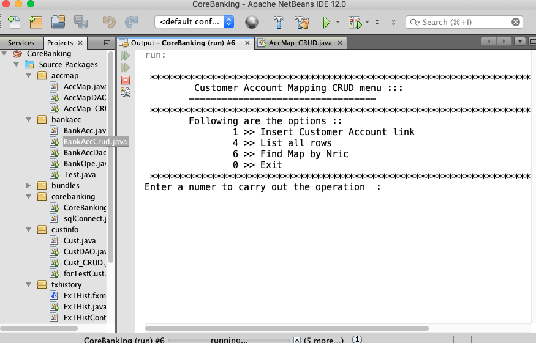
* 201129_bankAccCrud.png 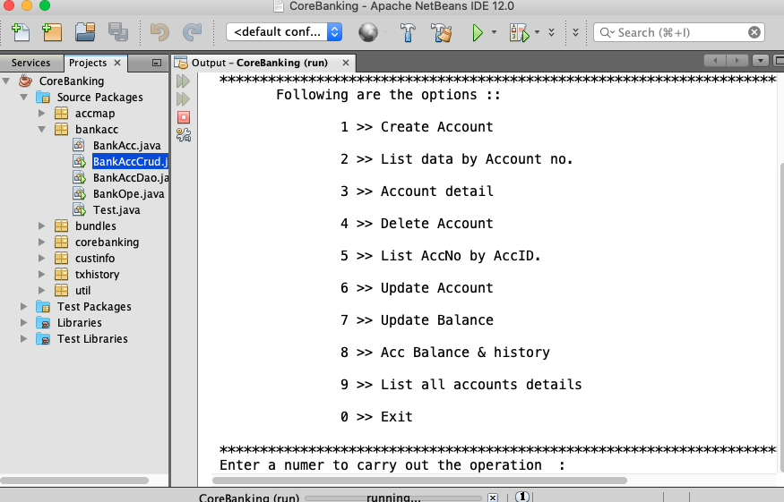
* 201129_bankacc1.png 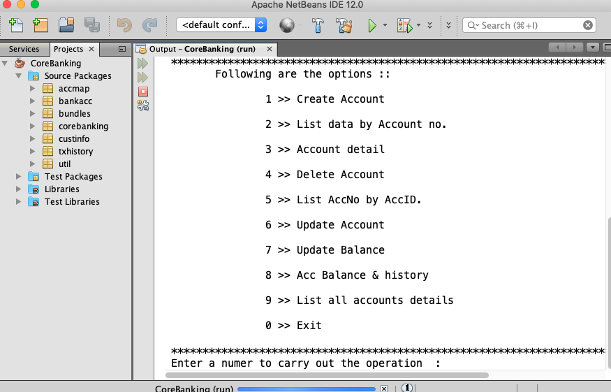
* 201129_bankacc2.png 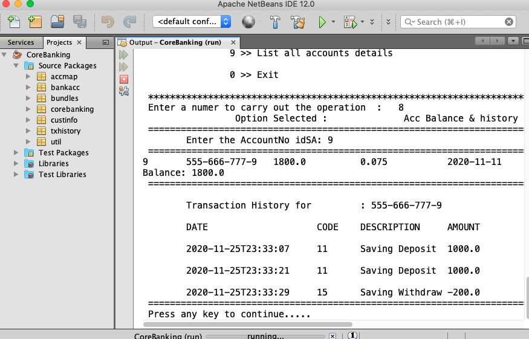
* 201129_bankacc3.png 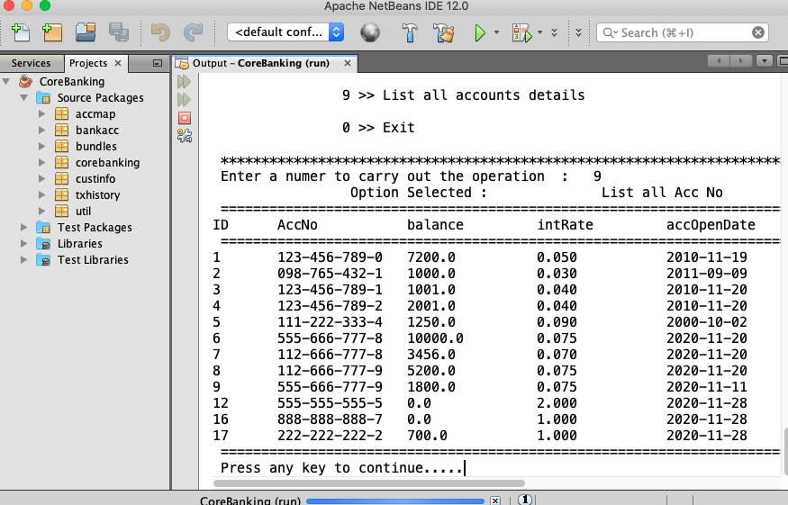
* 201129_corebanking1.png 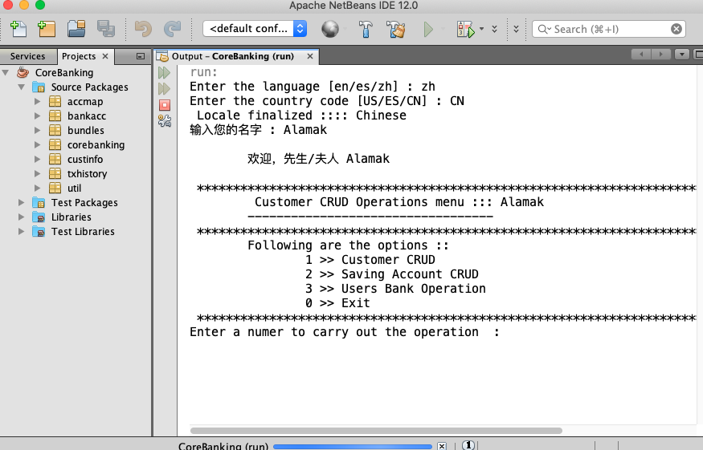
* 201129_corebanking2.png 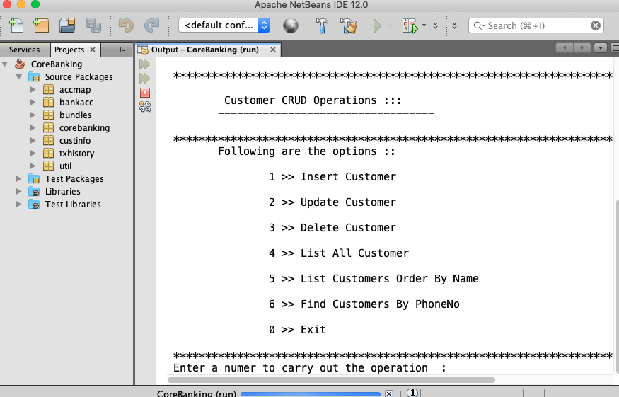
* 201129_corebanking3.png 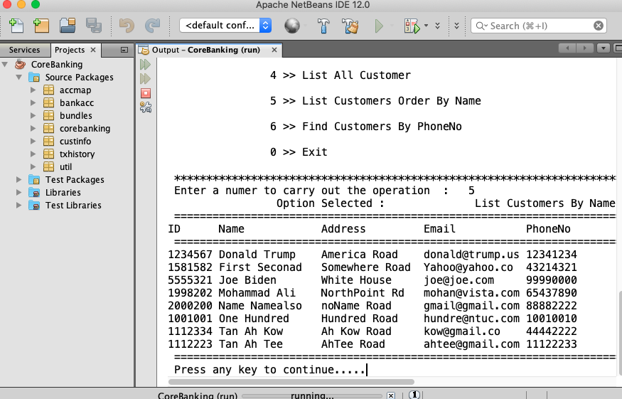
* 201129_history1.png 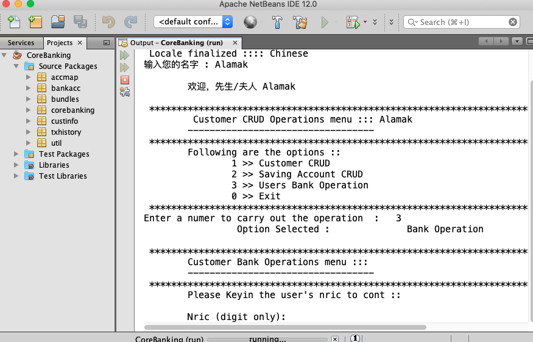
* 201129_history2.png 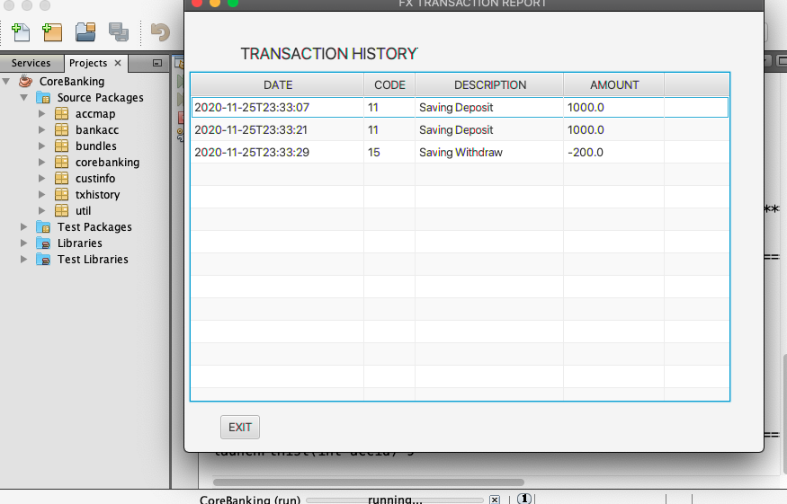
* 201129_language1.png 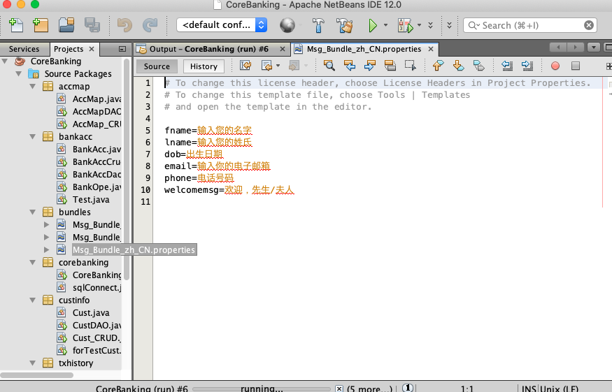

---
