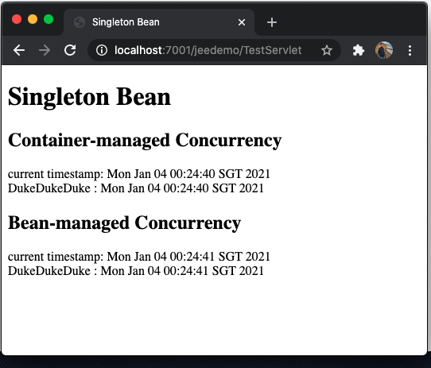

### Singleton

index.jsp
``` jsp
    <body>
         <h1>EJB : Singleton</h1>   
        
        <a href="/jeedemo/TestServlet">Call bean</a>
    </body>
```
MySingleton.java
``` java

@Startup
@Singleton
public class MySingleton {

    StringBuilder builder;

    @PostConstruct
    private void postConstruct() {
        System.out.println("MS_CMC postConstruct");
        builder = new StringBuilder();
    }

    @Lock(LockType.READ)
    public String readSomething(String bid) {
        try {
            for (int i = 0; i <= 10; i++) {
                Thread.sleep(100);
                System.out.println(bid + " : Read Op : " + new Date());
            }
        } catch (Exception e) {
            System.out.println(" Thread Interrupted ");
        }
        return "current timestamp: " + new Date();
    }

    @Lock(LockType.WRITE)
    public String writeSomething(String something) {
        builder.append(something);
        try {
            Thread.sleep(100);
               System.out.println(" : Write  Op : " + new Date());
        } catch (Exception e) {
            System.out.println(" Thread Interrupted ");
        }

        return builder.toString() + " : " + new Date();
    }
}

```
console
``` terminal
<04-Jan-2021 00:24:03,505 o'clock SGT> <Warning> <Socket> <BEA-000449> <Closing the socket, as no data read from it on 0:0:0:0:0:0:0:1:55,692 during the configured idle timeout of 5 seconds.> 
bean1 : Read Op : Mon Jan 04 00:24:39 SGT 2021
bean1 : Read Op : Mon Jan 04 00:24:39 SGT 2021
bean1 : Read Op : Mon Jan 04 00:24:39 SGT 2021
bean1 : Read Op : Mon Jan 04 00:24:39 SGT 2021
bean1 : Read Op : Mon Jan 04 00:24:40 SGT 2021
bean1 : Read Op : Mon Jan 04 00:24:40 SGT 2021
bean1 : Read Op : Mon Jan 04 00:24:40 SGT 2021
bean1 : Read Op : Mon Jan 04 00:24:40 SGT 2021
bean1 : Read Op : Mon Jan 04 00:24:40 SGT 2021
bean1 : Read Op : Mon Jan 04 00:24:40 SGT 2021
bean1 : Read Op : Mon Jan 04 00:24:40 SGT 2021
 : Write  Op : Mon Jan 04 00:24:40 SGT 2021
bean2 : Read Op : Mon Jan 04 00:24:40 SGT 2021
bean2 : Read Op : Mon Jan 04 00:24:40 SGT 2021
bean2 : Read Op : Mon Jan 04 00:24:41 SGT 2021
bean2 : Read Op : Mon Jan 04 00:24:41 SGT 2021
bean2 : Read Op : Mon Jan 04 00:24:41 SGT 2021
bean2 : Read Op : Mon Jan 04 00:24:41 SGT 2021
bean2 : Read Op : Mon Jan 04 00:24:41 SGT 2021
bean2 : Read Op : Mon Jan 04 00:24:41 SGT 2021
bean2 : Read Op : Mon Jan 04 00:24:41 SGT 2021
bean2 : Read Op : Mon Jan 04 00:24:41 SGT 2021
bean2 : Read Op : Mon Jan 04 00:24:41 SGT 2021
 : Write Op : Mon Jan 04 00:24:41 SGT 2021
<04-Jan-2021 00:24:43,500 o'clock SGT> <Warning> <Socket> <BEA-000449> <Closing the socket, as no data read from it on 0:0:0:0:0:0:0:1:55,700 during the configured idle timeout of 5 seconds.> 

```
TestServlet.java
``` java
@WebServlet(urlPatterns = { "/TestServlet" })
public class TestServlet extends HttpServlet {

    @Inject
    MySingleton bean1;
    @Inject
    MySingletonBeanManagedConcurrency bean2;


    protected void processRequest(HttpServletRequest request, HttpServletResponse response)
        throws ServletException, IOException {
        response.setContentType("text/html;charset=UTF-8");
        try (PrintWriter out = response.getWriter()) {
            out.println("<!DOCTYPE html>");
            out.println("<html>");
            out.println("<head>");
            out.println("<title>Singleton Bean</title>");
            out.println("</head>");
            out.println("<body>");
            out.println("<h1>Singleton Bean</h1>");
            out.println("<h2>Container-managed Concurrency</h2>");
            out.println(bean1.readSomething("bean1") + "<br>");
            out.println(bean1.writeSomething("Duke") + "<br>");
            out.println("<h2>Bean-managed Concurrency</h2>");
            out.println(bean2.readSomething("bean2") + "<br>");
            out.println(bean2.writeSomething("Duke"));
            out.println("</body>");
            out.println("</html>");
        }
    }

```
Browser
``` terminal
Singleton Bean
Container-managed Concurrency
current timestamp: Mon Jan 04 00:24:40 SGT 2021
DukeDukeDuke : Mon Jan 04 00:24:40 SGT 2021
Bean-managed Concurrency
current timestamp: Mon Jan 04 00:24:41 SGT 2021
DukeDukeDuke : Mon Jan 04 00:24:41 SGT 2021
```
210104ChanSingleton.png 

---
