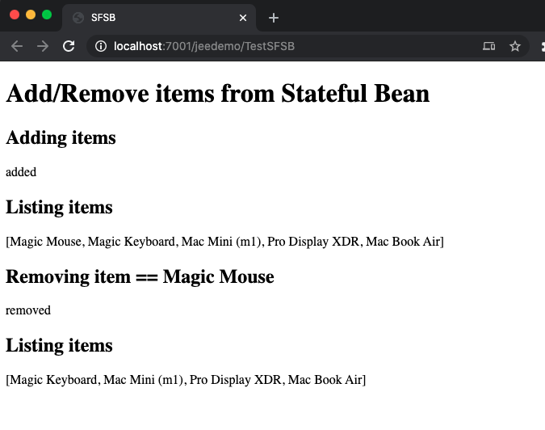

### S F S B

testSFSB.java
``` java
@WebServlet(name = "TestSFSB", urlPatterns = {"/TestSFSB"})
public class TestSFSB extends HttpServlet {

      @EJB
    CartLocal bean;

    protected void processRequest(HttpServletRequest request, HttpServletResponse response)
            throws ServletException, IOException {
         response.setContentType("text/html;charset=UTF-8");
        
        try (PrintWriter out = response.getWriter()) {
            out.println("<!DOCTYPE html>");
            out.println("<html>");
            out.println("<head>");
            out.println("<title>SFSB</title>");
            out.println("</head>");
            out.println("<body>");
            out.println("<h1>Add/Remove items from Stateful Bean</h1>");
            out.println("<h2>Adding items</h2>");
            bean.addItem("Magic Mouse");
            bean.addItem("Magic Keyboard");
            bean.addItem("Mac Mini (m1)");
            bean.addItem("Pro Display XDR");
            bean.addItem("Mac Book Air");
            out.println("added");
            out.println("<h2>Listing items</h2>");
            out.println(bean.getItems());
            out.println("<h2>Removing item == Magic Mouse</h2>");
            bean.removeItem("Magic Mouse");
            out.println("removed");
            out.println("<h2>Listing items</h2>");
            out.println(bean.getItems());
            out.println("</body>");
            out.println("</html>");
        }
    }
```
Cart.java
``` java
@Stateful
public class Cart implements CartLocal {

    List <String> items;
    
    public Cart() {
        items = new ArrayList<>();
    }


    @Override
    public void addItem(String item) {
        items.add(item);
    }

    @Override
    public void removeItem(String item) {
        items.remove(item);
    }

    @Override
    public List<String> getItems() {
        return items;
    }

    @Remove
    public void remove() {
        items = null;
    }
}
```
CartLocal.java
``` java
@Local
public interface CartLocal {

    void addItem(String item);

    void removeItem(String item);

    List<String> getItems();

    void remove();
    
}
```

browser
``` terminal
Add/Remove items from Stateful Bean
Adding items
added
Listing items
[Magic Mouse, Magic Keyboard, Mac Mini (m1), Pro Display XDR, Mac Book Air]
Removing item == Magic Mouse
removed
Listing items
[Magic Keyboard, Mac Mini (m1), Pro Display XDR, Mac Book Air]
```
210104ChanSFSB.png 

---
