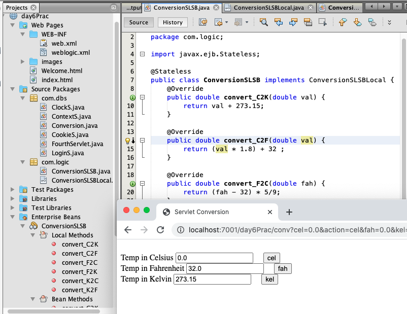

### Conversion via Stateless Session Bean 

210103day6_conv.png 


    NetBeans > New > Session Bean
    EJB Name: ConversionSLSB
    Package: com.logic
    Create Interface: Local
    > Finish

ConversionSLSB.java
``` java
    @Override
    public double convert_C2K(double val) {
        return val + 273.15;
    }
    
    @Override
    public double convert_C2F(double val) {
        return (val * 1.8) + 32 ;
    }

    @Override
    public double convert_F2C(double fah) {
        return (fah - 32) * 5/9;
    }

    @Override
    public double convert_F2K(double fah) {
        return (fah - 32) * 5/9 + 273.15;
    }

    @Override
    public double convert_K2C(double kel) {
        return (kel - 273.15);
    }

    @Override
    public double convert_K2F(double kel) {
        return (kel -273.15) * 9/5 + 32;
    }
```
    > Expose method in local business interface ConversiionSLSBLocal

---
    Netbeans > New > Servlet 
    Class Name: Conversion
    Package: com.dbs
    > Add informationto deployment descriptor (web.xml)

Conversion.java
``` java
    double cel, fah, kel;

    @EJB
    ConversionSLSBLocal conv;
    ...
            String celStr = request.getParameter("cel");
            String fahStr = request.getParameter("fah");
            String kelStr = request.getParameter("kel");
            String act = request.getParameter("action");

            if (act == null) {
                cel = fah = kel = 0.0;
            } else if (act.equals("cel")) {
                cel = Double.parseDouble(celStr);
                fah = conv.convert_C2F(cel);
                kel = conv.convert_C2K(cel);
            } else if (act.equals("fah")) {
                fah = Double.parseDouble(fahStr);
                cel = conv.convert_F2C(fah);
                kel = conv.convert_F2K(fah);
            } else if (act.equals("kel")) {
                kel = Double.parseDouble(kelStr);
                cel = conv.convert_K2C(kel);
                fah = conv.convert_K2F(kel);
            }
            ...
            out.println("<body>");
            out.println("     \n"
                    + "        <form action='conv' method='get'>\n"
                    + "                        <br> Temp in Celsius    <input type='text' name='cel' value='"
                    + cel + "'> &nbsp;&nbsp;&nbsp; <input type='submit' name='action' value='cel' />\n"
                    + "                        <br> Temp in Fahrenheit <input type='text' name='fah' value='"
                    + fah + "'> &nbsp;&nbsp;&nbsp; <input type='submit' name='action' value='fah'/>\n"
                    + "                        <br> Temp in Kelvin     <input type='text' name='kel' value='"
                    + kel + "'> &nbsp;&nbsp;&nbsp; <input type='submit' name='action' value='kel'/>\n"
                    + "        </form>");
            out.println("</body>");
```
web.xml
``` xml
    <servlet-mapping>
        <servlet-name>Conversion</servlet-name>
        <url-pattern>/conv</url-pattern>
    </servlet-mapping>
```
index.html
``` html
        <a href="conv"> Go to Conversion ... </a>
```


> Clean and build

reference to javaEE/day6Prac
