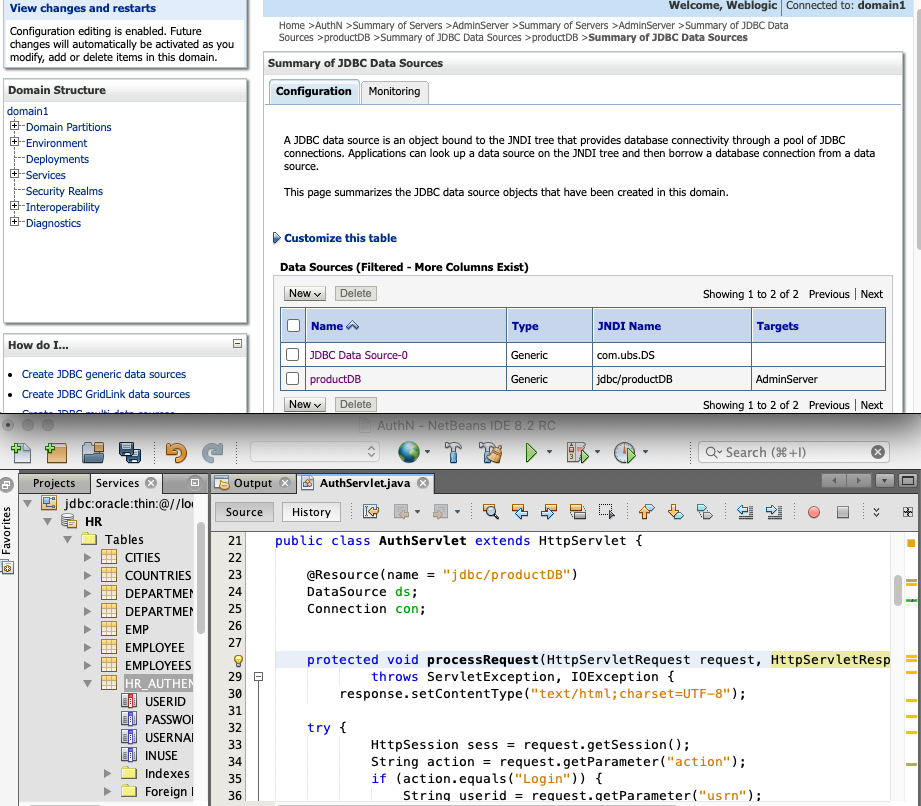

``` console
antw@Mac-mini day7_AuthenTbl % ls -R1
201222_AuthN.png
AuthServlet.java
WEB-INF
footer.jsp
header.jsp
home.jsp
images
index.html
login.jsp

./WEB-INF:
web.xml
weblogic.xml

./images:
Duke.svg.png
antw@Mac-mini day7_AuthenTbl % 
```
#### http://192.168.1.239:7001/AuthN/login.jsp
some issues on displaying on console

web.xml
> Pages > Welcome Files: login.jsp

login.jsp
``` jsp
<jsp:include page="header.jsp"/>
<form action="AuthServlet" method="POST">
    <%= request.getAttribute("status") != null ? "User Already Logged in " + request.getAttribute("status"): "" %>
    <br>Enter Username : <input type="text" name="usrn" /> <%= request.getAttribute("error") != null ? "Invalid Credentials" : ""%>
    <br>Enter Password :  <input type="text" name="pwd" /> <%= request.getAttribute("error") != null ? "Invalid Credentials" : ""%>
    <br> &nbsp; &nbsp; &nbsp; <input type="reset" value="Reset" /> 
        &nbsp; &nbsp; &nbsp; <input type="submit" name="action" value="Login" />  
</form>
<jsp:include page="footer.jsp"/>
```
header.jsp
``` jsp
                Welcome <% if (session.getAttribute("user") == null) {
                        out.println("Guest");
                    } else {
                        out.println(session.getAttribute("user").toString());
                    }%>
```

201222_AuthN.png 


---
webLogic Server > Data Sources > productDB > Connection Pool
```
  JNDI Name: jdbc/productDB
  
  URL: jdbc:oracle:thin:@//localhost:1521/orcl
  Driver: oracle.jdbc.OracleDriver
  Properties: user=hr
```
201228_ADataSource.png 

web.xml
> Servlets > URL Patterns: /AuthServlet

AuthServlet.java
``` java
public class AuthServlet extends HttpServlet {
    
    @Resource(name = "jdbc/productDB")
    DataSource ds;
    Connection con;
...
    try {
            HttpSession sess = request.getSession();
            String action = request.getParameter("action");
            if (action.equals("Login")) {
                String userid = request.getParameter("usrn");
                String pwd = request.getParameter("pwd");
                if (checkIfLoggedIn(userid)) {
                    request.setAttribute("status", userid);
                    request.getRequestDispatcher("login.jsp").forward(request, response);
                    ...
                    
    protected boolean checkIfLoggedIn(String userid) throws SQLException {
        Connection con = ds.getConnection();
        String stmt = "SELECT INUSE from HR.HR_AUTHEN where USERID='" + userid + "'";
        System.out.println(" CheckIf Logged In :: " + stmt);
        Statement st = con.createStatement();
        ResultSet rs = st.executeQuery(stmt);
        if (rs.next()) {
            if (rs.getInt(1) == 1) {
                System.out.println(" User already logged in.. so exiting :: " + rs.getInt(1));
                con.close();
                return true;
            }
        }
        con.close();
        return false;
    }
    
    ...

```


