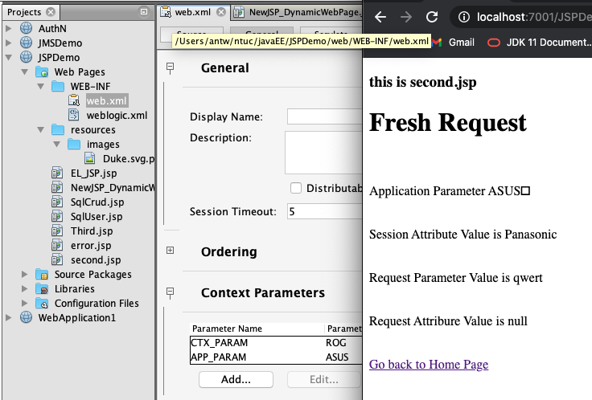
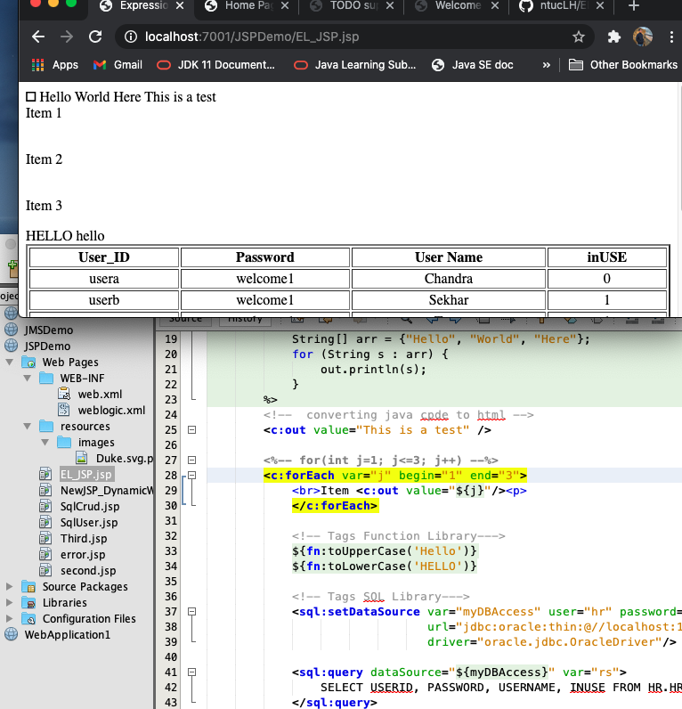
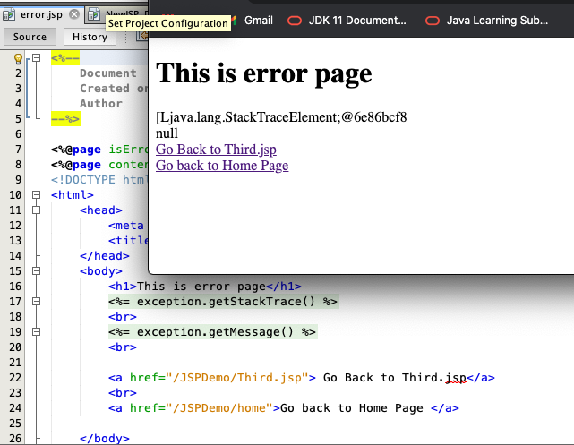
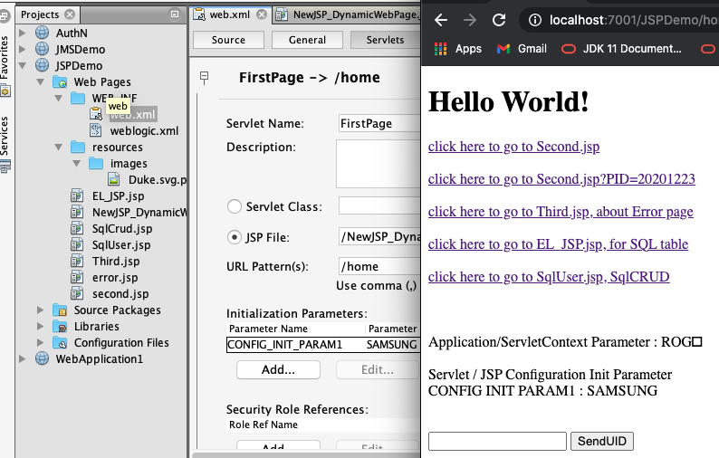
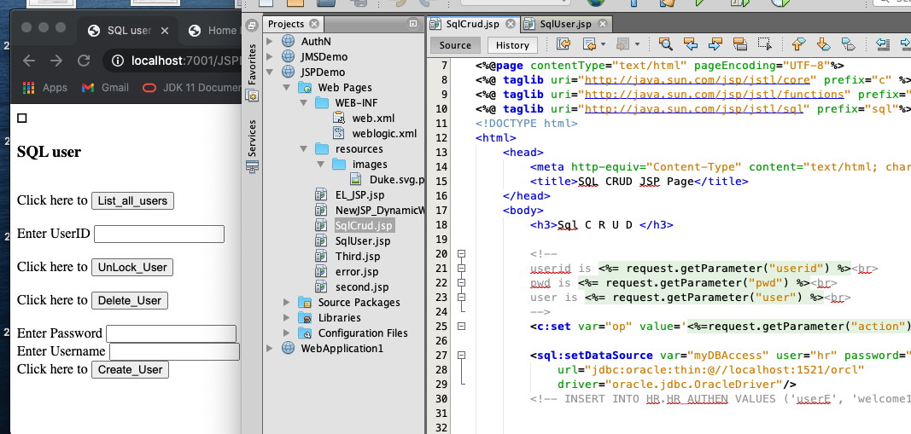

``` console
antw@Mac-mini day8_JspDemo % ls -R1
img
src
web

./img:
201226JsoDemo_second.png
201226JspDemo_ELjsp.png
201226JspDemo_error.png
201226JspDemo_home.png
201226_JspDemo_CRUD.png

./src:
conf
java

./src/conf:
MANIFEST.MF

./src/java:

./web:
EL_JSP.jsp
NewJSP_DynamicWebPage.jsp
SqlCrud.jsp
SqlUser.jsp
Third.jsp
WEB-INF
error.jsp
resources
second.jsp

./web/WEB-INF:
web.xml
weblogic.xml

./web/resources:
images

./web/resources/images:
Duke.svg.png
antw@Mac-mini day8_JspDemo % 
```

201226JsoDemo_second.png 

201226JspDemo_ELjsp.png 

201226JspDemo_error.png 

201226JspDemo_home.png 

201226_JspDemo_CRUD.png 
