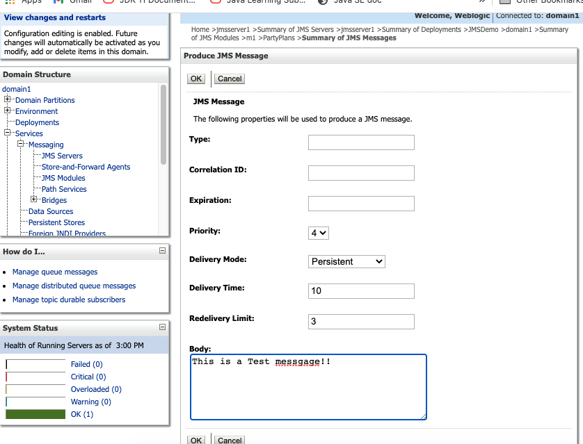
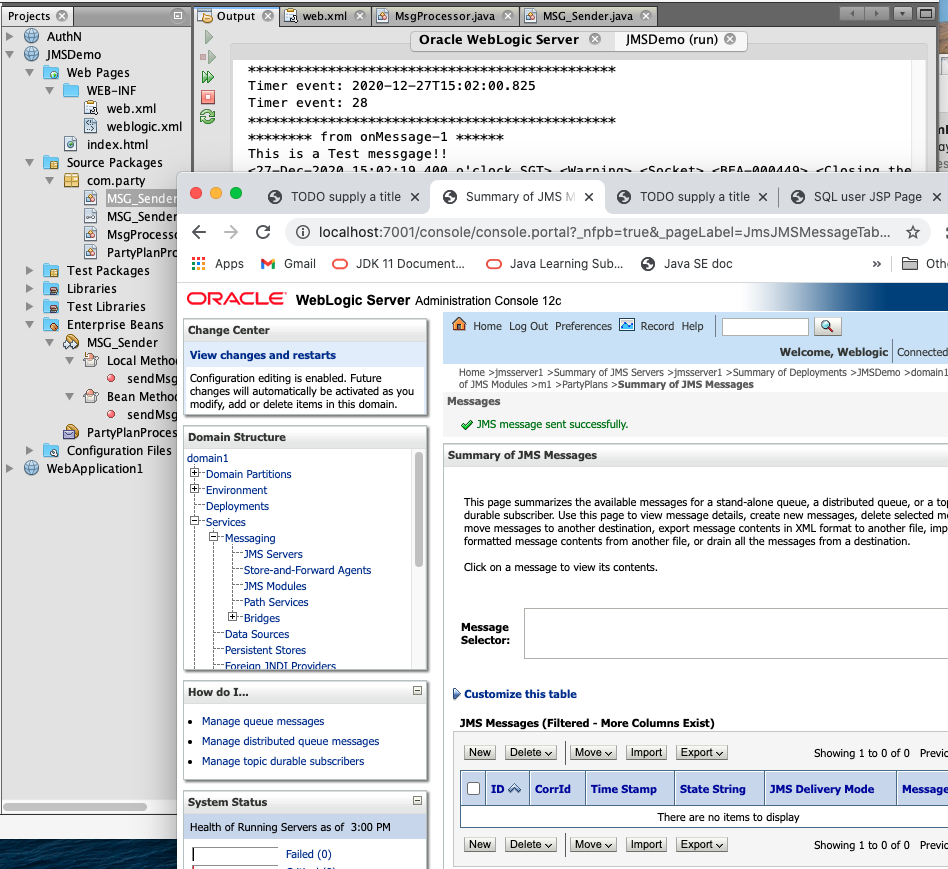
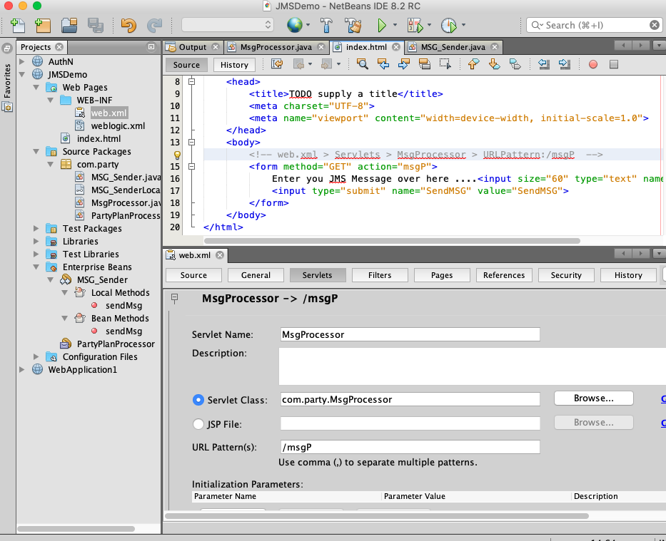

``` console
antw@Mac-mini day9_JMSDemo % ls -R1
images
party
web

./images:
201227JmsDemo_Console.png
201227JmsDemo_TestMsg1.png
201227JmsDemo_TestMsg2.png
201227_JmsDemo_msgP.png

./party:
MSG_Sender.java
MSG_SenderLocal.java
MsgProcessor.java
PartyPlanProcessor.java

./web:
WEB-INF
index.html

./web/WEB-INF:
web.xml
weblogic.xml
antw@Mac-mini day9_JMSDemo % 
```

201227JmsDemo_Console.png 

201227JmsDemo_TestMsg1.png 

201227JmsDemo_TestMsg2.png 

201227_JmsDemo_msgP.png 
