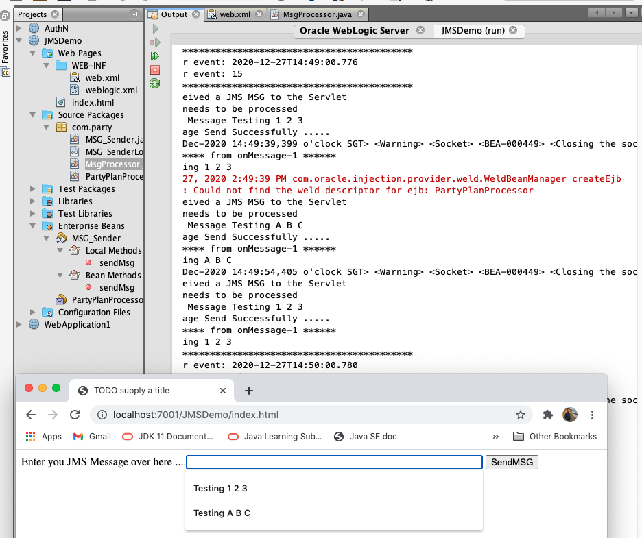

``` console
antw@Mac-mini day9_JMSDemo % ls -R1
images
party
web

./images:
201227JmsDemo_Console.png
201227JmsDemo_TestMsg1.png
201227JmsDemo_TestMsg2.png
201227_JmsDemo_msgP.png

./party:
MSG_Sender.java
MSG_SenderLocal.java
MsgProcessor.java
PartyPlanProcessor.java

./web:
WEB-INF
index.html

./web/WEB-INF:
web.xml
weblogic.xml
antw@Mac-mini day9_JMSDemo % 
```
PartyPlanProcessor.java
``` java
/*
Netbeans > New File > Enterprise JavaBeans > Message-Driven Bean 
> Server Destination = com.party.Q

To check on Message_Driven EJB:
Home > Deployments > JMSDemo > PartyPlanProcessor >  Monitoring
only after deploy
*/
@MessageDriven(activationConfig = {
    @ActivationConfigProperty(propertyName = "destinationLookup", propertyValue = "com.party.Q"),
    @ActivationConfigProperty(propertyName = "destinationType", propertyValue = "javax.jms.Queue")
})
...
        try {
            System.out.println(message.getBody(String.class));
```

201227JmsDemo_TestMsg1.png 

201227JmsDemo_TestMsg2.png 

---
index.html
``` html
            Enter you JMS Message over here ....<input size="60" type="text" name="jms_messsage">
            <input type="submit" name="SendMSG" value="SendMSG">
```
> MsgProcessor.java
``` java
        String jmsMSG = request.getParameter("jms_messsage");
        ...
        response.sendRedirect("index.html");
```

201227JmsDemo_Console.png 

201227_JmsDemo_msgP.png 
