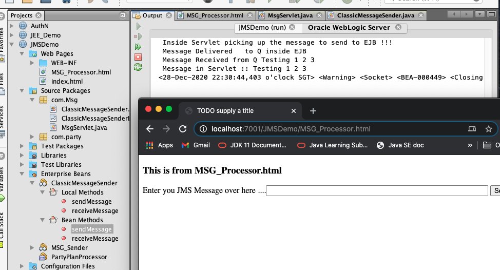

MSH_Processor.html

ClassicMessageSender.java

ClassicMessageSenderLocal.java

MsgServlet

---
``` 
to create new JNDI Name
    Domain Structure > Services > Messaging > JMS Modules > m1 > 
    > New > Queue > 
        Name: SyncQ
        JNDI Name: com.party.syncQ

        Create a New Subdeployment > SyncQ > Target: jmsserver1 > Finished
```
201228WebLogic.png 

ClassicMessageSender.java
```
Enterprise JavaBeans > Session Beans:
    ClassicMessageSender
    Package: com.web
    Session Type: Stateless
    Create Interface: Local
```
``` java
@Stateless
public class ClassicMessageSender implements ClassicMessageSenderLocal {
    @Inject
    JMSContext context;

    @Resource(lookup = "com.party.syncQ")
    Destination queue;

    @Override
    public void sendMessage(String msg) throws JMSException {
        JMSProducer producer = context.createProducer();
        producer.setProperty("toRcv", "r2");
        producer.setTimeToLive(10000);
        producer.send(queue, msg);
        System.out.println(" Message Delivered   to Q inside EJB");
    }

    @Override
    public String receiveMessage() throws Exception {
        JMSConsumer consumer = context.createConsumer(queue, "toRcv='r2'");
        Message message = consumer.receiveNoWait();
        if (message != null) {
            String msg = message.getBody(String.class);
            System.out.println(" Message Received from Q " + msg);
            return msg;
        }
        return null;
    }
}
```
ClassicMessageSenderLocal.java
``` java
    void sendMessage(String msg) throws JMSException;

    String receiveMessage() throws Exception;
```
MsgServlet.java
``` java
@WebServlet(name = "MsgServlet", urlPatterns = {"/ms"})
public class MsgServlet extends HttpServlet {

    @EJB
    ClassicMessageSenderLocal cmsl;
    ...
            String msg = request.getParameter("jms_messsage");
            System.out.println(" Inside Servlet picking up the message to send to EJB !!! ");
            cmsl.sendMessage(msg);
            System.out.println(" Message in Servlet :: " + cmsl.receiveMessage());
            ...
        response.sendRedirect("MSG_Processor.html");
```
MSG_Processor.html
``` html
        <form method="GET" action="ms">
            Enter you JMS Message over here ....<input size="60" type="text" name="jms_messsage">
            <input type="submit" name="SendMSG" value="SendMSG">
        </form>
```

201228JmsDemoMsg.png 

