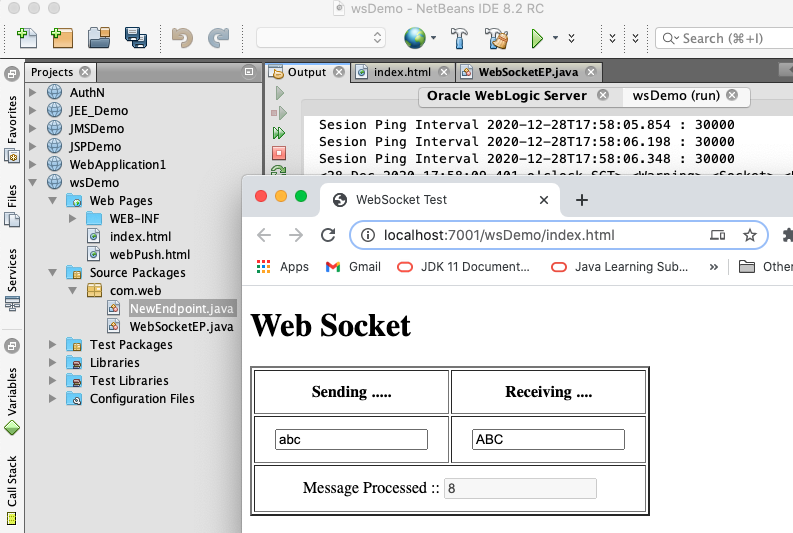
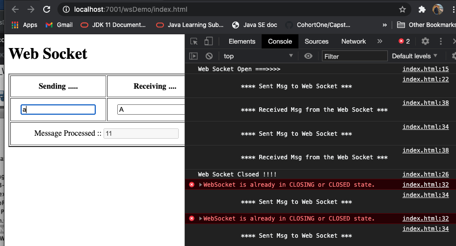
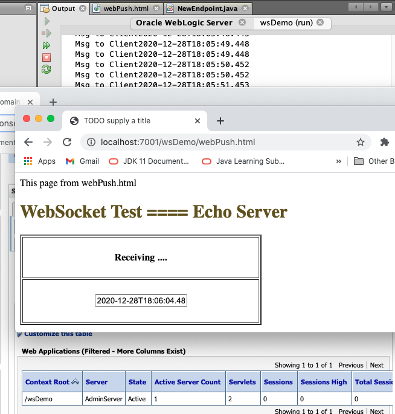

#### Web Socket

``` console
antw@Mac-mini dayA_webSocket % ls -R1
Websocket.html
com
img
web

./com:
web

./com/web:
NewEndpoint.java
WebSocketEP.java

./img:
201228wsDemo_WebSocket.png
201228wsDemo_webPush.png

./web:
WEB-INF
index.html
webPush.html

./web/WEB-INF:
web.xml
weblogic.xml
antw@Mac-mini dayA_webSocket % 
```
---

echo test: 
https://www.websocket.org/echo.html

New File > Web, WebSocket Endpoint 
  Class Name: WebSocketEndpoint
  Package: com.web
  WebSocket URL: /wsep

WebSocketEP.java
``` java
@ServerEndpoint("/wsep")
public class WebSocketEP {
    private static int msgCounter=0;
    @OnMessage
    public String onMessage(Session session, String message) {
        return message.toUpperCase() + ":" + msgCounter++;
    }
```
index.html
``` html
var wsUri = "ws://localhost:7001/wsDemo/wsep";

    function init() {
        websocket = new WebSocket(wsUri);
        websocket.onopen = function (evt) { onOpen(evt) };
        websocket.onclose = function (evt) { onClose(evt) };
        websocket.onmessage = function (evt) { onMessage(evt) };
        websocket.onerror = function (evt) { onError(evt) };
        console.log("Web Socket Open ===>>>>  ");
    }
...
    function onKeyUP(evt) {
        var msg = document.getElementById('sendMsg').value;
        websocket.send(msg);
        console.log(" \n\t\t\t**** Sent Msg to Web Socket *** \n\n")
    }

    function onMessage(evt) {
        console.log(" \n\t\t\t**** Received Msg from the Web Socket *** \n\n")
        var un = (evt.data+"").split(":");
        document.getElementById('rcvMsg').value = un.shift();
        document.getElementById('cntr').value = un.shift();
    }
    ...
    init();
```
201228wsDemo_WebSocket.png 

201228wsDemo_console.png 

---

http://localhost:7001/wsDemo/webPush.html

NewEndpoint.java
``` java
@ServerEndpoint("/endpoint")
public class NewEndpoint {
    @OnMessage
    public String onMessage(Session session, String message) throws Exception {
        while (true) {
            for (Session sess : session.getOpenSessions()) {
                if (sess.isOpen()) {
                    message = LocalDateTime.now().toString();
                    sess.getBasicRemote().sendText(message);
                    Thread.sleep(1000);
                }
            }
        }
    }
}
```

webPush.html
``` html
            var wsUri = "ws://localhost:7001/WSDemo/endpoint";

            function init() {
                websocket = new WebSocket(wsUri);
                websocket.onopen = function (evt) { onOpen(evt) };
                websocket.onclose = function (evt) { onClose(evt) };
                websocket.onmessage = function (evt) { onMessage(evt) };
                websocket.onerror = function (evt) { onError(evt) };
                console.log("Web Socket Open ===>>>>  ");
            }
            ...
            function onMessage(evt) {
                console.log(" \n\t\t\t**** Received Msg from the Web Socket *** \n\n")
                document.getElementById('rcvMsg').value = evt.data;
            }
            ...
            init();
```

201228wsDemo_webPush.png 

---
