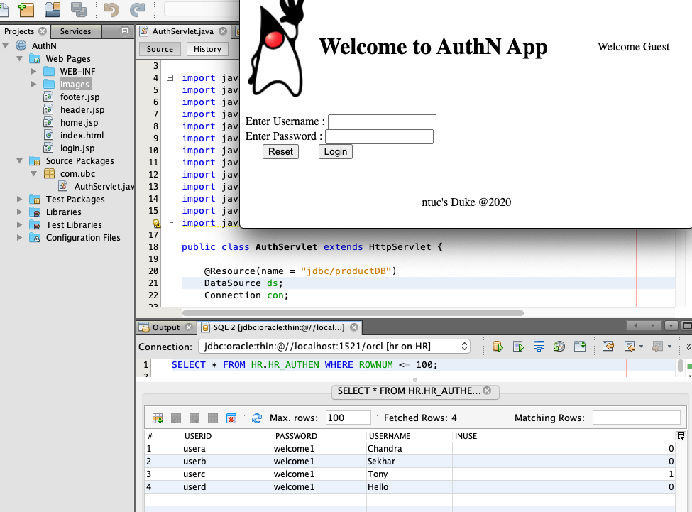
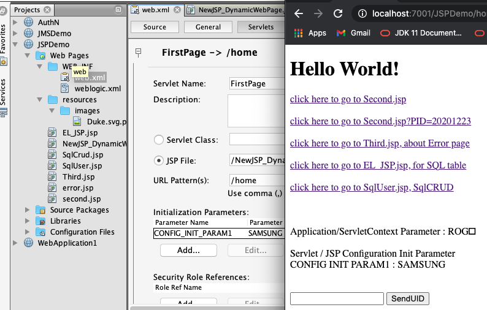

ntuc Java E E
===
[top]: topOfThePage

| topics | Lession | Folder | img |
| ---: | --- | --- | --- |
|  01 install software | Day 1 | [ day1_software.md ]( /mDjavaEE/day1_software.md) |  |
|  02 sessions | Day 2 | [ day2_sessions.md ]( /mDjavaEE/day2_sessions.md) |  |
|  03 EA3 | Day 2 | [ StockTicker.java ](/mDjavaEE/EA3/EA1-EJB1/src/java/com/ubs/StockTicker.java) |  |
|  04 EA3 | Day 2 | [ firstServlet.java ](/mDjavaEE/EA3/EA1-WEB1/src/java/com/ubs/firstServlet.java) |  |
|  05 Lab 3 | Day 3 | [ day3_labs3 ]( /mDjavaEE/day3_labs3) |  |
|  06 Lab 4 | Day 4 | [ day4_labs4 ]( /mDjavaEE/day4_labs4) |  |
|  07 Web | Day 6 | [ day5_web ]( /mDjavaEE/day5_web) |  |
|  08 EJB Conversion | Day 6 | [ day6_EJBConvn ]( /mDjavaEE/day6_EJBConvn) |  |
|  09 Session Cookies | Day 6 | [ day6_session_cookies ]( /mDjavaEE/day6_session_cookies) |  |
|  10 Authentication  | Day 7 | [ day7_AuthenTbl ]( /mDjavaEE/day7_AuthenTbl) |  |
|  11 JSP Calculator | Day 7 | [ day7_JspCalculator ]( /mDjavaEE/day7_JspCalculator) |  |
|  12 JSP Demo   | Day 8 | [ day8_JspDemo ]( /mDjavaEE/day8_JspDemo) |  |
|  13 JMS Message | Day 9 | [ day9_JMSDemo ]( /mDjavaEE/day9_JMSDemo) |  |
|  14 JMS Demo   | Day A | [ dayA_JMSDemo ]( /mDjavaEE/dayA_JMSDemo) |  |
|  15 Web Socket | Day A | [ dayA_webSocket ]( /mDjavaEE/dayA_webSocket) |  |
|  16 chandra | Day A | [ chandra ]( /mDjavaEE/chandra) |  |

[:top: Top](#top)

---
[**myNote**](mynote.md)

---
