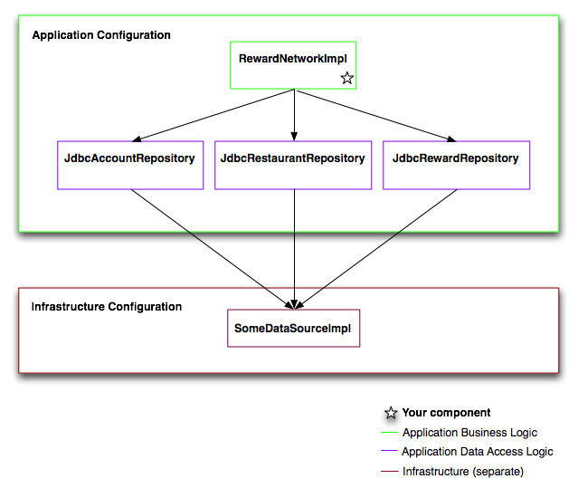

### RewardsConfig.java

12-javaconfig-dependency-injection-solution

reward-network-system-diagram.png 

``` java
@Configuration
public class RewardsConfig {
	private DataSource dataSource;

	// As this is the only constructor, @Autowired is not needed.
	public RewardsConfig(DataSource dataSource) {
		this.dataSource = dataSource;
	}
		
	@Bean
	public RewardNetwork rewardNetwork(){
		return new RewardNetworkImpl(
			accountRepository(), 
			restaurantRepository(), 
			rewardRepository());
	}
	
	@Bean
	public AccountRepository accountRepository(){
		JdbcAccountRepository repository = new JdbcAccountRepository();
		repository.setDataSource(dataSource);
		return repository;
	}
	
	@Bean
	public RestaurantRepository restaurantRepository(){
		JdbcRestaurantRepository repository = new JdbcRestaurantRepository();
		repository.setDataSource(dataSource);
		return repository;
	}
	
	@Bean
	public RewardRepository rewardRepository(){
		JdbcRewardRepository repository = new JdbcRewardRepository();
		repository.setDataSource(dataSource);
		return repository;
	}
	
}
```
