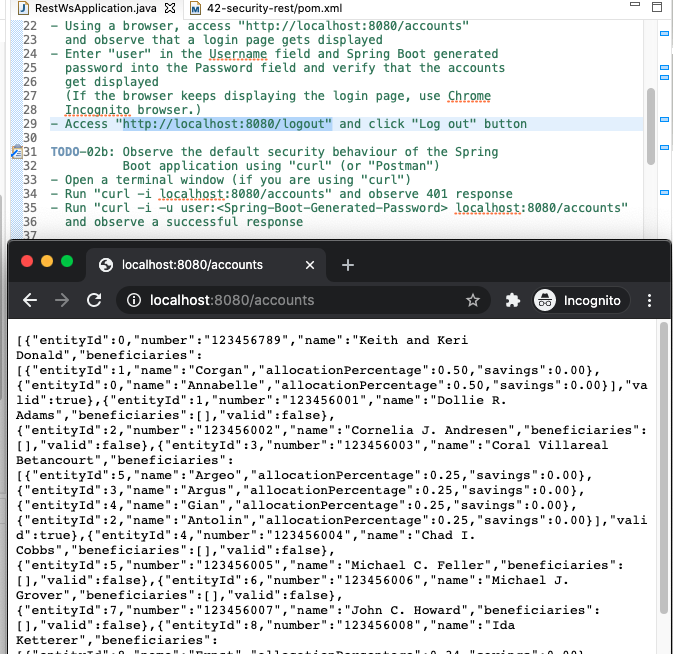
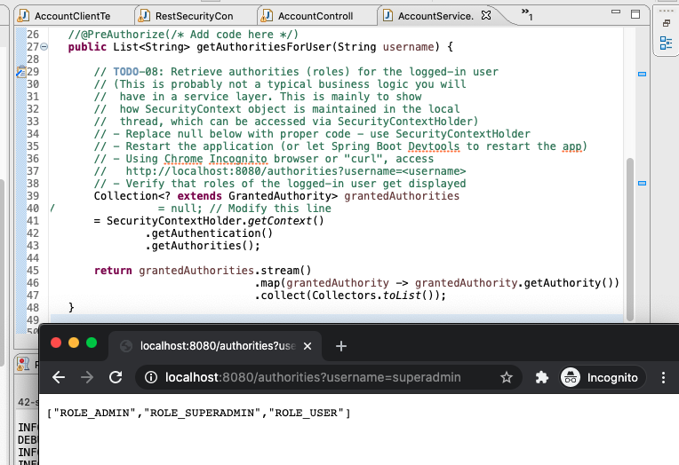
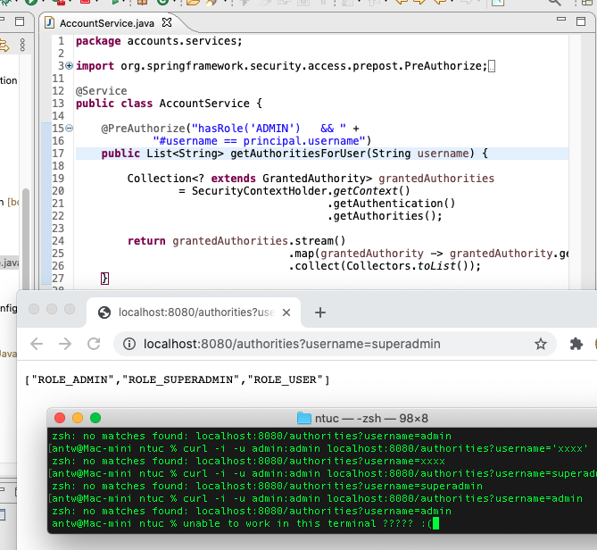

Securing REST Application with Spring Security
---
### Purpose
In this lab you will gain experience with using Spring Security to secure the REST application through authentication and authorization.

### Learning Outcomes
What you will learn:

How to implement authentication

How to restrict access to URLs and/or HTTP methods

How to test secured application

Specific subjects you will gain experience with:

Spring Security and the `WebSecurityConfigurerAdapter`
You will be using the *42-security-rest* project.

Estimated time to complete: 45 minutes.

### Use Case
Implement authentication and authorization against REST application
### Quick Instructions
If you are already knowledgeable with the lesson concepts, you may consider jumping right to the code, and execute the lab by following the embedded TODO comments (tasks). Instructions on how to view them are here.

If you aren’t sure, try the TODO instructions first and refer to the lab instructions by TODO number (below) if you need more help.

### Instructions
The RestWsApplication you built in the previous lab is not secured. You are going to secure it through authentication and authorization.

### Explore default behaviour of Spring Boot Security
#### TODO-01 : Verify the presence of Spring security dependencies

When Spring Boot sees `spring-boot-starter-security` on the classpath, it will set up default authentication and authorization - it will set up a single user and all endpoints are secured.

The `spring-security-test` dependency provides testing support.

#### TODO-02a : Observe the default security behaviour of the Spring Boot application using a browser

Spring Boot application relies on Spring Security’s content-negotiation strategy to determine whether to use Basic authentication or Form-based authentication.

When you are using a browser, Spring Boot application will use Form-based authentication.

* Using Chrome Incognito browser, access http://localhost:8080/accounts and observe that a login page gets displayed

* Enter user in the Username field and Spring Boot generated password into the Password field and verify that the accounts get displayed (If the browser keeps displaying the login page, make sure to use Chrome Incognito browser.)

Password output to stdout

Figure 1: Password output to stdout

* Access http://localhost:8080/logout and click Log out button

#### TODO-02b : Observe the default security behaviour of the Spring Boot application using curl command

When you are sending a REST request using `curl` command, Spring Boot application will use Basic authentication.

When you are sending a REST request without valid username/password pair, the application will respond with 401 Unauthorized.

* Open a terminal window
* Run "curl -i localhost:8080/accounts" and observe 401 Unauthorized response
* Run "curl -i -u user:<Spring-Boot-Generated-Password> localhost:8080/accounts" and observe a successful response
### Enable Web Security
Spring Boot's default setup is deliberately minimal. It is not intended for production. Instead you should configure you own security rules using a class that extends `WebSecurityConfigurerAdapter` class.

#### TODO-03 : Import security configuration class

The `SecurityConfig` class, which is located under `config` package, needs to be explicitly imported since it will not be found through component-scanning from the `accounts` package.

### Configure authentication and authorization
Since Web security is enabled, we are ready to configure authentication and authorization.

#### TODO-04 : Configure authorization

The most common form of authorization (access control) is through the usage of roles.

You are going define 3 roles - `USER`, `ADMIN`, and `SUPERADMIN` with the following access control rules:

* Allow DELETE on the /accounts resource (or any sub-resource) for "SUPERADMIN" role only
* Allow POST or PUT on the /accounts resource (or any sub-resource) for "ADMIN" or "SUPERADMIN" role only
* Allow GET on the /accounts resource (or any sub-resource) for all roles - "USER", "ADMIN", "SUPERADMIN"
#### TODO-05 : Configure authentication

Here you are going to set up in-memory `UserDetailsService` and define three users with corresponding set of roles assigned.

* `user/user` with `USER` role
* `admin/admin` with `USER` and `ADMIN` roles
* `superadmin/superadmin` with `USER`, `ADMIN`, and `SUPERADMIN`
#### TODO-06a : Perform security testing against MVC layer

Now You are going to test if the security configuration works against MVC layer using @WebMvcTest and @WithMockUser annotations.

The tests covers the following scenarios:

* Using an invalid user credential to perform any operation should result in `401 Unauthorized` response
* Using USER role, you can only perform read operation
* Using ADMIN role, you can perform create/update operation
* Using SUPERADMIN role, you can perform delete operation
Most tests already provided.
Make sure you understand what each test is meant to verify.

#### TODO-06b: Write a test that verifies that a user with USER role is not permitted to perform create operation

This is an opportunity for you to write a simple security test code.

#### TODO-07a: Perform security testing against a running server

Now You are going to test if the security configuration works using end-to-end testing against the applcation running over the embedded server.

The tests cover the similar set of scenarios mentioned above.

#### TODO-07b: Write a test that verifies that user/user is not permitted to create a new Account

### Retrieve authorities (roles) for the logged-in user
Once authentication is successful, security context is being maintained in the ThreadLocal during the processing of a request.

This allows any method in the call stack in the same thread of execution can access the security context even if the security context is not explicitly passed around as an argument to those methods.

Using a ThreadLocal in this way is quite safe if care is taken to clear the thread after the present principal’s request is processed. Of course, Spring Security takes care of this for you automatically so there is no need to worry about it.

You are going to access the security context via SecurityContextHolder class.

#### TODO-08: Retrieve authorities (roles) for the logged-in user

Use `SecurityContextHolder` class to get Security context, which in turn can be used to get `Authentication` object, which is then used to get authorties.

An example code might look like following:
``` java
Collection<? extends GrantedAuthority> grantedAuthorities
        = SecurityContextHolder.getContext()
                               .getAuthentication()
                               .getAuthorities();
```
### Implement method security
#### TODO-09: Add method security annotation to a method

Here you are going to use method security so that the method will be invoked only when both of the following conditions are met:

The logged-in user belongs to ADMIN role
The value of the username request parameter of the request URL matches the value of the principal's username.
This condition can be specified using SpEL (Spring Expression language).
An example could be either
``` java
@PreAuthorize("hasRole('ADMIN')   && " +
               "#username == principal.username")
```
or
``` java
@PreAuthorize("hasRole('ADMIN')   && " +
               "#username == authentication.name")
```
#### TODO-10: Enable global method security

The method security needs to be abled via `@EnableGlobalMethodSecurity` annotation. The prePostEnabled attribute needs to be set to true in order to use `@PreAuthorize` annotation.

An example code is as following:
``` java
@EnableGlobalMethodSecurity(prePostEnabled = true)
```
(Note that this annotation is not needed for Spring Boot application.)

#### TODO-11: Test the method security using a browser or `curl`

Now let's see if the method security works against a running application.

* Re-run this application

* Use `user/user` credential to access the method, and verify the application returns `403 Forbidden` response since user/user does belong to neither ADMIN nor SUPERADMIN role.
``` console
curl -i -u user:user http://localhost:8080/authorities?username=user
```
* Use admin/admin and verify that the roles are displayed successfully
``` console
curl -i -u admin:admin http://localhost:8080/authorities?username=admin
```
* Use superadmin/superadmin and verify that the roles are displayed successfully
``` console
curl -i -u superadmin:superadmin http://localhost:8080/authorities?username=superadmin
```
#### TODO-12a: Perform method security testing

The `AccountServiceMethodSecurityTest` class contains tests that you are going to use for performing method security testing.

#### TODO-12b: Write a test that verifies that getting authorities using `http://localhost:8080/authorities?username=superadmin` with `superadmin/superadmin` credential should return three roles `ROLE_SUPERADMIN`, `ROLE_ADMIN`, and `ROLE_USER`.

This is an opportunity for you to write a test code.

### Create custom UserDetailsService (Optional)
Do the remaining steps only if you have extra time.

#### TODO-13: Create custom `UserDetailsService`

Note that it needs to implement `loadUserByUsername` method of the `UserDetailsService `interface.

The custom U`serDetailsService` maintains `UserDetails` of two users:

        * mary/mary with USER role and
        * joe/joe with USER and ADMIN role
Typically you would use some kind of persistence storage for maintaining user data but in this lab, for the sake of simplicity, you are going to just return hard-coded UserDetails object given a username.

#### TODO-14: Add authentication based upon the custom `UserDetailsService`

Now you are going to add authentication based upon the custom UserDetailsService using AuthenticationManagerBuilder object.
``` java
auth.userDetailsService(new CustomUserDetailsService(passwordEncoder));
```
So now there are 5 users configured - user/user, admin/admin, superadmin/superadmin, mary/mary, and joe/joe.

#### TODO-15: Verify that the newly added custom UserDetailsService works

Since the custom UserDetailsService maintains UserDetails on two users, mary/mary and joe/joe, you can now verify that you can access a secured resource using the identity of one of these two users.
``` console
curl -i -u mary:mary http://localhost:8080/accounts/0
```
``` console
curl -i -u joe:joe http://localhost:8080/accounts/0
```
#### TODO-16: Perform security testing for the two users added through custom UserDetailsService

### Create custom AuthenticationProvider (Optional)
#### TODO-17: Create custom `uthenticationProvider`

Note that it needs to implement AuthenticationProvider interface.

Typically you will use a custom authentcation system for the verification of the passed identity.

In this lab, we are just faking it so that it handles a user with the following identity.

* spring/spring with ROLE_ADMIN role
#### TODO-18: Add authentication based upon the custom `AuthenticationProvider`

Now you are going to add authentication based upon the custom `AuthenticationProvider` using `AuthenticationManagerBuilder` object.
``` java
auth.authenticationProvider(new CustomAuthenticationProvider());
```
So now there are 6 users configured - `user/user`, `admin/admin`, `superadmin/superadmin`, `mary/mary`, `joe/joe`, and `spring/spring`.

#### TODO-19: Verify that the newly added custom `AuthenticationProvider` works

Since the custom AuthenticationProvider can validate the identity of spring/spring, you can now verify that you can access a secured resource using it.
``` console
curl -i -u spring:spring http://localhost:8080/accounts/0
```
#### TODO-20: Perform security testing for the user added through custom AuthenticationProvider

### Summary
In this lab, we secured Spring REST application with authentication and auhtorization.

We also secured a service-layer method using method security.

Finally we configured custom `UserDetailsService` and `AuthenticationProvider`.

Congratulations, you are done with the lab!

---


210108Spring42-02a.png 


#### todo-02b
``` yaml

Last login: Fri Jan  8 16:29:19 on ttys000
antw@Mac-mini ~ % curl -i localhost:8080/accounts
HTTP/1.1 401 
Set-Cookie: JSESSIONID=FDD98590BB1BBE4871F5F2DFC49C4D51; Path=/; HttpOnly
WWW-Authenticate: Basic realm="Realm"
X-Content-Type-Options: nosniff
X-XSS-Protection: 1; mode=block
Cache-Control: no-cache, no-store, max-age=0, must-revalidate
Pragma: no-cache
Expires: 0
X-Frame-Options: DENY
Content-Type: application/json
Transfer-Encoding: chunked
antw@Mac-mini ~ % curl -i -u user:560820df-c5f2-4933-8ed1-6c4e1facbda2 localhost:8080/accounts
HTTP/1.1 200 
Set-Cookie: JSESSIONID=42A3C32B00575D8EB60A385A9F0D0E54; Path=/; HttpOnly
X-Content-Type-Options: nosniff
X-XSS-Protection: 1; mode=block
Cache-Control: no-cache, no-store, max-age=0, must-revalidate
Pragma: no-cache
Expires: 0
X-Frame-Options: DENY
Content-Type: application/json
Transfer-Encoding: chunked
Date: Fri, 08 Jan 2021 15:17:23 GMT

[{"entityId":0,"number":"123456789","name":"Keith and Keri Donald","beneficiaries":
[{"entityId":0,"name":"Annabelle","allocationPercentage":0.50,"savings":0.00},
{"entityId":1,"name":"Corgan","allocationPercentage":0.50,"savings":0.00}],"valid":true},
{"entityId":1,"number":"123456001","name":"Dollie R. Adams","beneficiaries":[] ....

```

210110Spring42-08.png 

210110Spring42-11.png 

#### todo-15
``` console
antw@Mac-mini ~ % curl -i -u mary:mary http://localhost:8080/accounts/0
HTTP/1.1 200 
Set-Cookie: JSESSIONID=D63B4EB0E54AEBB64FE8CAFA4ECC55F7; Path=/; HttpOnly
X-Content-Type-Options: nosniff
X-XSS-Protection: 1; mode=block
Cache-Control: no-cache, no-store, max-age=0, must-revalidate
Pragma: no-cache
Expires: 0
X-Frame-Options: DENY
Content-Type: application/json
Transfer-Encoding: chunked
Date: Sun, 10 Jan 2021 05:53:17 GMT

{"entityId":0,"number":"123456789","name":"Keith and Keri Donald","beneficiaries":
[{"entityId":0,"name":"Annabelle","allocationPercentage":0.50,"savings":0.00},
{"entityId":1,"name":"Corgan","allocationPercentage":0.50,"savings":0.00}],"valid":true}%                                                
antw@Mac-mini ~ % curl -i -u joe:joe http://localhost:8080/accounts/0
HTTP/1.1 200 
Set-Cookie: JSESSIONID=AFAE5F554715C5E2DA2F9FC0E188B973; Path=/; HttpOnly
X-Content-Type-Options: nosniff
X-XSS-Protection: 1; mode=block
Cache-Control: no-cache, no-store, max-age=0, must-revalidate
Pragma: no-cache
Expires: 0
X-Frame-Options: DENY
Content-Type: application/json
Transfer-Encoding: chunked
Date: Sun, 10 Jan 2021 05:53:48 GMT

{"entityId":0,"number":"123456789","name":"Keith and Keri Donald","beneficiaries":
[{"entityId":1,"name":"Corgan","allocationPercentage":0.50,"savings":0.00},
{"entityId":0,"name":"Annabelle","allocationPercentage":0.50,"savings":0.00}],"valid":true}
% antw@Mac-mini ~ % 

```


#### todo-19
``` console
antw@Mac-mini ~ % curl -i -u spring:spring http://localhost:8080/accounts/0
HTTP/1.1 401 
WWW-Authenticate: Basic realm="Realm"
X-Content-Type-Options: nosniff
X-XSS-Protection: 1; mode=block
Cache-Control: no-cache, no-store, max-age=0, must-revalidate
Pragma: no-cache
Expires: 0
X-Frame-Options: DENY
Set-Cookie: JSESSIONID=79860537A9BCC4A5C1F065099CC0BC70; Path=/; HttpOnly
WWW-Authenticate: Basic realm="Realm"
Content-Length: 0
Date: Sun, 10 Jan 2021 06:02:38 GMT

antw@Mac-mini ~ % 
```

browser
``` yaml
{
   "entityId": 0,
   "number": "123456789",
   "name": "Keith and Keri Donald",
   "beneficiaries": [
      {
         "entityId": 0,
         "name": "Annabelle",
         "allocationPercentage": 0.5,
         "savings": 0
      },
      {
         "entityId": 1,
         "name": "Corgan",
         "allocationPercentage": 0.5,
         "savings": 0
      }
   ],
   "valid": true
}
```
using json formatter: http://www.freeformatter.com/json-formatter.html#ad-output
