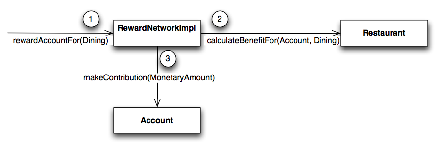

## Reward Dining: The Course Reference Domain

### Purpose
The labs in this course teach key concepts in the context of a problem domain. 
The *Reward Dining* application provides a real-world context for applying the techniques you have learned to develop useful business applications.

This section provides an overview of the domain and the applications you will be working on within it.

### Domain Overview
The Domain is called *Reward Dining*. The idea is that customers can save money every time 
they eat at one of the restaurants participating in the network - a "*Frequent Flyer*" program
for restaurants.

For example, Keith would like to save money for his children's education. Every time he dines at a restaurant participating in the network, a contribution is made to his account.

Papa Keith dines at a restaurant in the Reward Network

**Figure 1: Papa Keith dines at a restaurant in the Reward Network**

The account contribution (reward) will be shared by his two children Annabelle and Corgan. Thus Annabelle gets a fund to help her with her college fees:

A percentage of his dining amount goes to daughter Annabelle's college savings

Figure 2: Daughter Annabelle gets Contributions to her College Fund
 
### Reward Dining Domain Applications
This next section provides an overview of the applications in the Reward Dining domain that you will be working on in this course.

#### The Rewards Application
The "rewards" application rewards an account for dining at a restaurant participating in the reward network. A reward takes the form of a monetary contribution to an account that is distributed among the account's beneficiaries. Here is how this application is used:

1. When they are hungry, members dine at participating restaurants using their regular credit cards.

2. Every two weeks, a file containing the dining credit card transactions made by members during that period is generated. A sample of one of these files is shown below:

AMOUNT  |  CREDIT_CARD_NUMBER  |  MERCHANT_NUMBER  |  DATE
--------|----------------------|--------------------|--------
100.00  | 1234123412341234    | 1234567890      | 12/29/2010
49.67   | 1234123412341234    | 0234567891      | 12/31/2010
100.00  | 1234123412341234    | 1234567890      | 01/01/2010
27.60   | 2345234523452345    | 3456789012      | 01/02/2010

**Figure 3: Example Dining Records**

3. A standalone `DiningBatchProcessor` application reads this file and submits each Dining record to the rewards application for processing.

#### Public Application Interface
The `RewardNetwork` is the central interface clients such as the `DiningBatchProcessor` use to invoke the application:
``` java
    public interface RewardNetwork {
        RewardConfirmation rewardAccountFor(Dining dining);
    }
```
**Figure 4: The RewardNetwork Service**

It is the only *service-layer* component in the application.

A `RewardNetwork` rewards an account for dining by making a monetary contribution to the account that is in turn distributed among the account's beneficiaries. The sequence diagram below shows a client's interaction with the application illustrating this process:

A client calling the RewardNetwork to reward an account for dining.


**Figure 5: A client calling the RewardNetwork to reward an account for dining**

In this example, the account with credit card *1234123412341234* is rewarded for a spending *$100.00* 
at a restaurant with Merchant ID *1234567890* on 29th December 2018 (date is in North American date format).

The confirmed reward, number 9831, takes the form of an *$8.00* account contribution distributed evenly among beneficiaries Annabelle and her brother Corgan.

#### Internal Application Implementation ####
Internally, the `RewardNetwork` implementation delegates to domain objects to carry out 
a `rewardAccountFor(Dining)` transaction. 
Classes exist for the two central domain concepts of the application: `Account` and `Restaurant`.

- A `Restaurant` is responsible for calculating the benefit eligible to an account for a dining.
- An `Account` is responsible for distributing the benefit among its beneficiaries as a "contribution".

This flow is shown below:

Objects working together to carry out the  use case.


**Figure 6: Objects working together to carry out the `rewardAccountFor(Dining)` use case**

The `RewardNetwork` asks the `Restaurant` to calculate how much benefit to award, then contributes that amount to the Account.

For convenience the `rewards-common` project contains a number of helper classes:

- `MonetaryAmount` wraps a `BigDecimal` and holds an amount to 2 decimal places.
- `Percentage` wraps a `BigDecimal` and holds a percentage to 2 decimal places.
#### Supporting Reward Network Components
Account and restaurant information are stored in a persistent form inside a relational database. 
The `RewardNetwork` implementation delegates to supporting data access components 
called 'Repositories' to load `Account` and `Restaurant` objects from their relational representations.

- An `AccountRepository` is used to find an `Account` by its credit card number
- A `RestaurantRepository` is used to find a `Restaurant` by its merchant number.
- A `RewardRepository` is used to track confirmed reward transactions for accounting purposes. It holds the same data as the `RewardConfirmation` in the diagram (Figure 5) above.

A `Dining` record contains:
- Customer's credit-card number
- Merchant id of the restaurant
- Amount paid for the meal
- Date the customer dined (unused in our simple implementation)

The full `rewardAccountFor(Dining)` sequence incorporating these repositories is:

- Fetch the `Account` from the `AccountRepository`
- Fetch the `Restaurant` from `RestaurantRepository`
- Determine the Reward contribution (an instance of MonetaryAmount) using `Restaurant.calculateBenefitFor(Account, Dining)`
- Update the account beneficiaries using `Account.makeContribution(MonetaryAmount)`
- Save modified Account information using `AccountRepository.updateBeneficiaries(Account)`
- Create a `RewardConfirmation` using the `RewardRepository`

### Reward Dining Database Schema
The Reward Dining applications use a database with this schema:

The Reward Dining database schema 

**Figure 7: The Reward Dining database Schema**

In most of the labs, a test database is provided for you. 
It is populated with test data by running scripts 
in `00-rewards-common/src/main/resources/rewards/testdb`. They are available as classpath resources.

There are two scripts:

- `schema.sql` - creates the necessary tables, and
- `data.sql` - adds test data (several accounts and a single restaurant)

---
