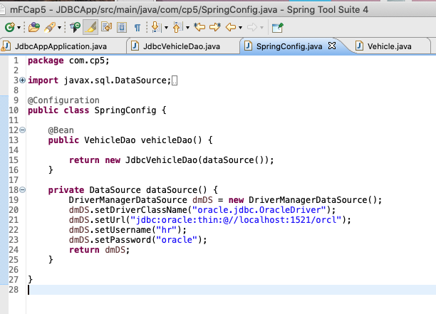
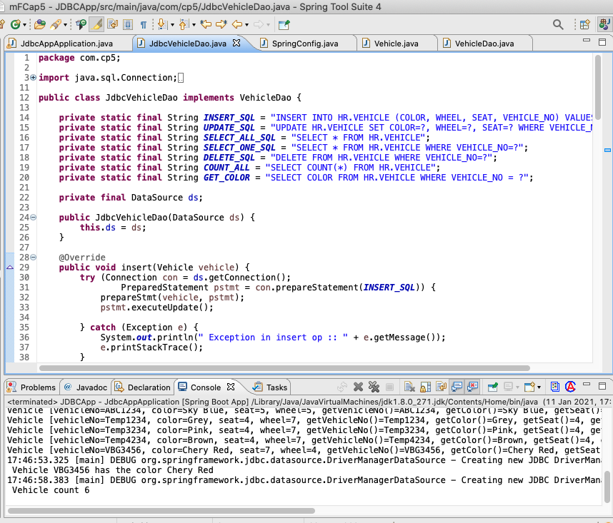
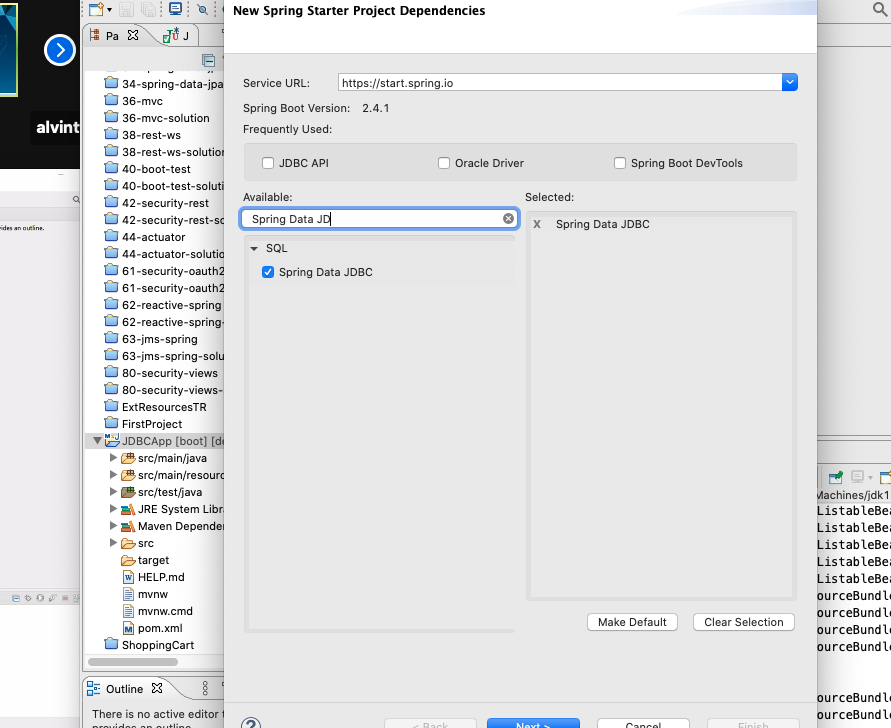

Spring JDBC
---

210111JdbcConfig.png 

210111JdbcVeDAO.png 

210111depemdency.png


JdbcAppApplication.java
``` java
@SpringBootApplication
public class JdbcAppApplication {

	public static void main(String[] args) {

		ApplicationContext context = new AnnotationConfigApplicationContext(SpringConfig.class);

		VehicleDao vDao = context.getBean(VehicleDao.class);

		Vehicle vehicle1 = new Vehicle("Temp1234", "Grey", 4, 7);
		Vehicle vehicle2 = new Vehicle("Temp2234", "Yellow", 4, 7);
		Vehicle vehicle3 = new Vehicle("Temp3234", "Pink", 4, 7);
		Vehicle vehicle4 = new Vehicle("Temp4234", "Brown", 4, 7);
		vDao.insert(Arrays.asList(vehicle1, vehicle2, vehicle3, vehicle4));

		Vehicle v = new Vehicle("VBG3456", "Chery Red", 7, 4);
//		Vehicle v = new Vehicle("ABC1234", "Sky Blue", 5, 5);

//		vDao.insert(v);
//		System.out.println(" Inserted Vehicle " + v);
//		
//		vDao.update(v);
//		System.out.println(" vehicle updated" + v);
//		
//		vDao.delete(v.getVehicleNo());
//		System.out.println(" vehicle deleted" + v)

		vDao.findByVehicleNo(v.getVehicleNo());
		System.out.println(" vehicle " + v);

		List<Vehicle> vehicles = vDao.findAll();
		vehicles.forEach(System.out::println);

		System.out.println(" Vehicle VBG3456 has the color " + vDao.getColor("VBG3456"));

		System.out.println(" Vehicle count " + vDao.getVehicleCount());
	}

```

idbcVehickeDao.java
``` java
public class JdbcVehicleDao implements VehicleDao {

	private static final String INSERT_SQL = "INSERT INTO HR.VEHICLE (COLOR, WHEEL, SEAT, VEHICLE_NO) VALUES (?,?,?,?)";
	private static final String UPDATE_SQL = "UPDATE HR.VEHICLE SET COLOR=?, WHEEL=?, SEAT=? WHERE VEHICLE_NO=?";
	private static final String SELECT_ALL_SQL = "SELECT * FROM HR.VEHICLE";
	private static final String SELECT_ONE_SQL = "SELECT * FROM HR.VEHICLE WHERE VEHICLE_NO=?";
	private static final String DELETE_SQL = "DELETE FROM HR.VEHICLE WHERE VEHICLE_NO=?";
	private static final String COUNT_ALL = "SELECT COUNT(*) FROM HR.VEHICLE";
	private static final String GET_COLOR = "SELECT COLOR FROM HR.VEHICLE WHERE VEHICLE_NO = ?";

	private final DataSource ds;

	public JdbcVehicleDao(DataSource ds) {
		this.ds = ds;
	}

	@Override
	public void insert(Vehicle vehicle) {
		try (Connection con = ds.getConnection(); PreparedStatement pstmt = con.prepareStatement(INSERT_SQL)) {
			prepareStmt(vehicle, pstmt);
			pstmt.executeUpdate();

		} catch (Exception e) {
			System.out.println(" Exception in insert op :: " + e.getMessage());
			e.printStackTrace();
		}

	}

	private void prepareStmt(Vehicle vehicle, PreparedStatement pstmt) throws SQLException {
		pstmt.setString(1, vehicle.getColor());
		pstmt.setInt(2, vehicle.getWheel());
		pstmt.setInt(3, vehicle.getSeat());
		pstmt.setString(4, vehicle.getVehicleNo());
	}

	@Override
	public void insert(Iterable<Vehicle> vehicles) {
		// TODO Auto-generated method stub
		vehicles.forEach(this::insert);

	}

	@Override
	public void delete(String vehicleNo) {
		try (Connection con = ds.getConnection(); PreparedStatement ps = con.prepareStatement(DELETE_SQL)) {
			ps.setString(1, vehicleNo);
			ps.executeUpdate();
		} catch (SQLException e) {
			throw new RuntimeException(e);
		}

	}

	@Override
	public void update(Vehicle vehicle) {
		try (Connection con = ds.getConnection(); PreparedStatement ps = con.prepareStatement(UPDATE_SQL)) {
			prepareStmt(vehicle, ps);
			ps.executeUpdate();
		} catch (SQLException e) {
			throw new RuntimeException(e);
		}
	}

	@Override
	public Vehicle findByVehicleNo(String vehicleNo) {
		try (Connection con = ds.getConnection(); PreparedStatement ps = con.prepareStatement(SELECT_ONE_SQL)) {
			ps.setString(1, vehicleNo);
			Vehicle vehicle = null;
			try (ResultSet rs = ps.executeQuery()) {
				if (rs.next())
					vehicle = toVehicle(rs);
			}
			return vehicle;
		} catch (Exception e) {
			throw new RuntimeException(e);
		}
	}

	private Vehicle toVehicle(ResultSet rs) throws Exception {

		return new Vehicle(rs.getString("VEHICLE_NO"), rs.getString("COLOR"), rs.getInt("SEAT"), rs.getInt("WHEEL"));
	}

	@Override
	public List<Vehicle> findAll() {
		try (Connection con = ds.getConnection(); PreparedStatement ps = con.prepareStatement(SELECT_ALL_SQL)) {
			List<Vehicle> vehicles = new ArrayList<>();
			try (ResultSet rs = ps.executeQuery()) {
				while (rs.next())
					vehicles.add(toVehicle(rs));
			}
			return vehicles;
		} catch (Exception e) {
			throw new RuntimeException(e);
		}
	}

	@Override
	public String getColor(String vehicleNo) {
		try (Connection con = ds.getConnection(); PreparedStatement ps = con.prepareStatement(GET_COLOR)) {
			ps.setString(1, vehicleNo);
			String color = null;
			try (ResultSet rs = ps.executeQuery()) {
				if (rs.next())
					color = rs.getString("COLOR");
			}
			return color;
		} catch (Exception e) {
			throw new RuntimeException(e);
		}

	}

	@Override
	public int getVehicleCount() {
		try (Connection con = ds.getConnection(); PreparedStatement ps = con.prepareStatement(COUNT_ALL)) {

			int count = 0;
			try (ResultSet rs = ps.executeQuery()) {
				if (rs.next())
					count = rs.getInt(1);
			}
			return count;
		} catch (Exception e) {
			throw new RuntimeException(e);
		}
	}
}
```

SpringConfig.java
``` java
@Configuration
public class SpringConfig {
	
	@Bean
	public VehicleDao vehicleDao() {
		
		return new JdbcVehicleDao(dataSource());
	}

	private DataSource dataSource() {
		DriverManagerDataSource dmDS = new DriverManagerDataSource();
		dmDS.setDriverClassName("oracle.jdbc.OracleDriver");
		dmDS.setUrl("jdbc:oracle:thin:@//localhost:1521/orcl");
		dmDS.setUsername("hr");
		dmDS.setPassword("oracle");
		return dmDS;
	}

}

```

Vehicle.java
``` java
public class Vehicle {
	private String vehicleNo;
	private String color;
	private int seat;
	private int wheel;

	public Vehicle() {

	}

	public Vehicle(String vehicleNo, String color, int seat, int wheel) {
		super();
		this.vehicleNo = vehicleNo;
		this.color = color;
		this.seat = seat;
		this.wheel = wheel;
	}

	@Override
	public String toString() {
		return "Vehicle [vehicleNo=" + vehicleNo + ", color=" + color + ", seat=" + seat + ", wheel=" + wheel
				+ ", getVehicleNo()=" + getVehicleNo() + ", getColor()=" + getColor() + ", getSeat()=" + getSeat()
				+ ", getWheel()=" + getWheel() + "]";
	}

	public String getVehicleNo() {
		return vehicleNo;
	}
 ...   
```
VehicleDao.java
``` java
public interface VehicleDao {
	
	public void insert(Vehicle vehicle);
	public void insert(Iterable<Vehicle> vehicle);
	public void delete(String vehicleNo);
	public void update(Vehicle vehicle);
	public Vehicle findByVehicleNo(String vehicleNo);
	public List<Vehicle> findAll();
	public String getColor(String vehicleNo);
	public int getVehicleCount();

}

```

210111C-console.txt
``` console
... - Creating shared instance of singleton bean 'springConfig'
... - Creating shared instance of singleton bean 'vehicleDao'
... - Loaded JDBC driver: oracle.jdbc.OracleDriver
... - Creating new JDBC DriverManager Connection to [jdbc:oracle:thin:@//localhost:1521/orcl]
... - Creating new JDBC DriverManager Connection to [jdbc:oracle:thin:@//localhost:1521/orcl]
... - Creating new JDBC DriverManager Connection to [jdbc:oracle:thin:@//localhost:1521/orcl]
... - Creating new JDBC DriverManager Connection to [jdbc:oracle:thin:@//localhost:1521/orcl]
... - Creating new JDBC DriverManager Connection to [jdbc:oracle:thin:@//localhost:1521/orcl]
 vehicle Vehicle [vehicleNo=VBG3456, color=Chery Red, seat=7, wheel=4, getVehicleNo()=VBG3456, getColor()=Chery Red, getSeat()=7, getWheel()=4]
... - Creating new JDBC DriverManager Connection to [jdbc:oracle:thin:@//localhost:1521/orcl]
Vehicle [vehicleNo=Temp2234, color=Yellow, seat=4, wheel=7, getVehicleNo()=Temp2234, getColor()=Yellow, getSeat()=4, getWheel()=7]
Vehicle [vehicleNo=ABC1234, color=Sky Blue, seat=5, wheel=5, getVehicleNo()=ABC1234, getColor()=Sky Blue, getSeat()=5, getWheel()=5]
Vehicle [vehicleNo=Temp1234, color=Grey, seat=4, wheel=7, getVehicleNo()=Temp1234, getColor()=Grey, getSeat()=4, getWheel()=7]
Vehicle [vehicleNo=Temp3234, color=Pink, seat=4, wheel=7, getVehicleNo()=Temp3234, getColor()=Pink, getSeat()=4, getWheel()=7]
Vehicle [vehicleNo=Temp4234, color=Brown, seat=4, wheel=7, getVehicleNo()=Temp4234, getColor()=Brown, getSeat()=4, getWheel()=7]
Vehicle [vehicleNo=VBG3456, color=Chery Red, seat=7, wheel=4, getVehicleNo()=VBG3456, getColor()=Chery Red, getSeat()=7, getWheel()=4]
... - Creating new JDBC DriverManager Connection to [jdbc:oracle:thin:@//localhost:1521/orcl]
 Vehicle VBG3456 has the color Chery Red
... - Creating new JDBC DriverManager Connection to [jdbc:oracle:thin:@//localhost:1521/orcl]
 Vehicle count 6
```


