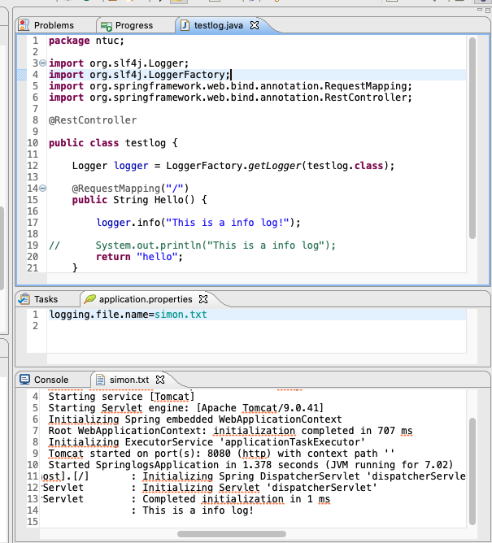

### Spring Log

210118screen.png 

#### SpringlogsApplication.java
``` java
@SpringBootApplication
public class SpringlogsApplication {

	public static void main(String[] args) {
		SpringApplication.run(SpringlogsApplication.class, args);
	}
}
```

#### testlog.java
``` java
@RestController

public class testlog {

	Logger logger = LoggerFactory.getLogger(testlog.class);

	@RequestMapping("/")
	public String Hello() {

		logger.info("This is a info log!");

//		System.out.println("This is a info log");
		return "hello";
	}

	@RequestMapping("/something")
	public String DoSomething() {
		return "something";
	}

}
```

#### application.properties
```
 logging.level.ntuc.testlog=INFO
logging.file.name=simon.txt
 
```

### console
after http://localhost:8080/
``` console

... ntuc.SpringlogsApplication               : Starting SpringlogsApplication using Java 11.0.8 on Mac-mini.local with PID 3706 (/Users/antw/ntuc/mFCap5/Springlogs/target/classes started by antw in /Users/antw/ntuc/mFCap5/Springlogs)
... ntuc.SpringlogsApplication               : No active profile set, falling back to default profiles: default
... o.s.b.w.embedded.tomcat.TomcatWebServer  : Tomcat initialized with port(s): 8080 (http)
... o.apache.catalina.core.StandardService   : Starting service [Tomcat]
... org.apache.catalina.core.StandardEngine  : Starting Servlet engine: [Apache Tomcat/9.0.41]
... o.a.c.c.C.[Tomcat].[localhost].[/]       : Initializing Spring embedded WebApplicationContext
... w.s.c.ServletWebServerApplicationContext : Root WebApplicationContext: initialization completed in 684 ms
... o.s.s.concurrent.ThreadPoolTaskExecutor  : Initializing ExecutorService 'applicationTaskExecutor'
... o.s.b.w.embedded.tomcat.TomcatWebServer  : Tomcat started on port(s): 8080 (http) with context path ''
... ntuc.SpringlogsApplication               : Started SpringlogsApplication in 1.313 seconds (JVM running for 6.836)
... o.a.c.c.C.[Tomcat].[localhost].[/]       : Initializing Spring DispatcherServlet 'dispatcherServlet'
... o.s.web.servlet.DispatcherServlet        : Initializing Servlet 'dispatcherServlet'
... o.s.web.servlet.DispatcherServlet        : Completed initialization in 1 ms
... ntuc.testlog                             : This is a info log!

```