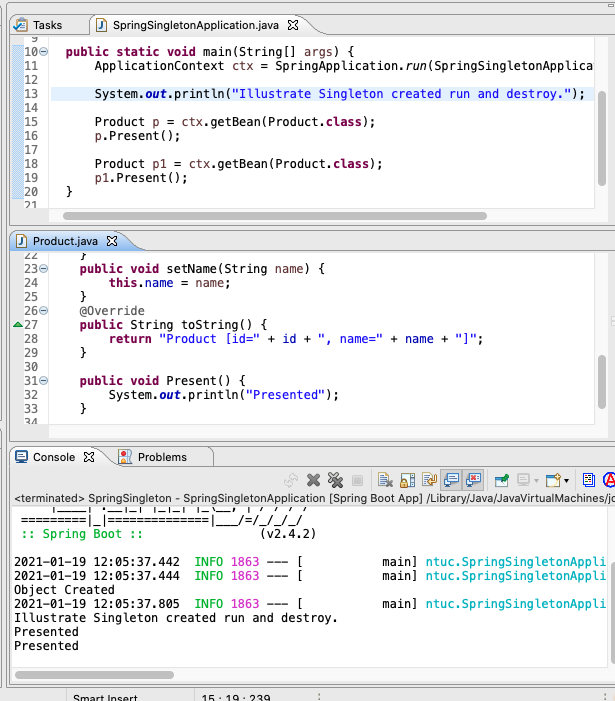

Singleton
===
[top]: topOfThePage

#### Product.java
``` java
@Component
public class Product {
	
	public Product() {
		System.out.println("Object Created");
	}
	
	private int id;
	private String name;
	
	@Autowired // byType
//	@Qualifier("simon")
	private Mobile mobile;
  
...
```

#### SpringSingletonApplication.java
``` java
@SpringBootApplication
public class SpringSingletonApplication {

	public static void main(String[] args) {
		ApplicationContext ctx = SpringApplication.run(SpringSingletonApplication.class, args);
		
//		System.out.println("Illustrate Singleton created run and destroy.");
		
		Product p = ctx.getBean(Product.class);
		p.Present();
		
		Product p1 = ctx.getBean(Product.class);
		p1.Present();
	}

}
```

210119SpringSingleton.png 

---
[:top: Top](#top)
