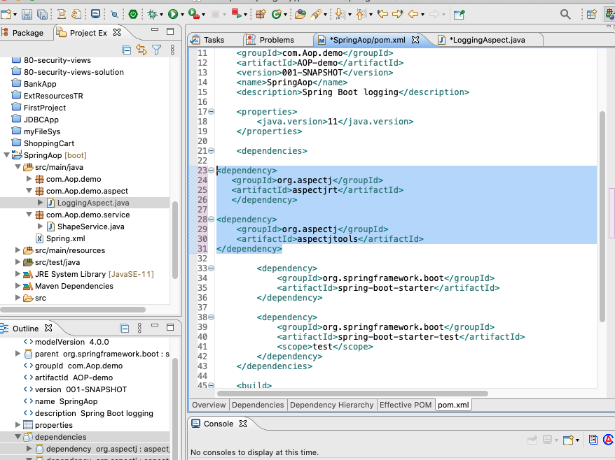

logger
===
[top]: topOfThePage


210119PomXml.png 


#### pom.xml
``` xml
	<dependencies>

<dependency>
   <groupId>org.aspectj</groupId>
   <artifactId>aspectjrt</artifactId>
   </dependency>
   
<dependency>
   	<groupId>org.aspectj</groupId>
   	<artifactId>aspectjtools</artifactId>
</dependency>
...
```

#### Spring.xml
``` xml
<?xml version="1.0" encoding="UTF-8"?>
<beans xmlns="http://www.springframework.org/schema/beans"
	xmlns:xsi="http://www.w3.org/2001/XMLSchema-instance"
	xmlns:aop="http://www.springframework.org/schema/aop"
	xsi:schemaLocation="http://www.springframework.org/schema/beans
   http://www.springframework.org/schema/beans/spring-beans-3.0.xsd 
   http://www.springframework.org/schema/aop 
   http://www.springframework.org/schema/aop/spring-aop-3.0.xsd ">

	<aop:aspectj-autoproxy/>

	<bean name="triangle" class="com.Aop.demo.Triangle">
		<property name="name" value="Triangle's name" />
	</bean>
...
	<bean name="shapeService"
		class="com.Aop.demo.service.ShapeService"  autowire="byName" />
	<bean name="loggingAspect" class="com.Aop.demo.aspect.LoggingAspect" />
	
</beans>
```

#### LoggingAspect.java
``` java
@Aspect
public class LoggingAspect {
	
	Logger logger = LoggerFactory.getLogger(SpringAopApplication.class);

	@Before("aspecttest()")
	public void SecondLogging() {
		System.out.println("Advice run Second time.");
	}
	@Pointcut("execution(public String getName())")
	public void aspecttest() {}	
}
```

#### SpringAopApplication.java
``` java
@SpringBootApplication
public class SpringAopApplication {

	public static void main(String[] args) {
		@SuppressWarnings("resource")
		ApplicationContext ctx = new ClassPathXmlApplicationContext("spring.xml");
		ShapeService shapeService =  ctx.getBean("shapeService", ShapeService.class);
		System.out.println(shapeService.getCircle().getName());
		System.out.println(shapeService.getTriangle().getName());
	}
...
```

---
[:top: Top](#top)