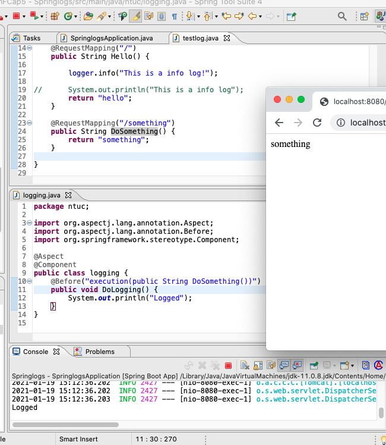

title
===
[top]: topOfThePage

#### application.properties
``` 
logging.level.ntuc.testlog=INFO
logging.file.name=simon.txt
```
#### logging.java
``` java
@Aspect
@Component
public class logging {
	@Before("execution(public String DoSomething())")
	public void DoLogging() {
		System.out.println("Logged");
	}
}
```

#### testlog.java
``` java
@RestController

public class testlog {

	Logger logger = LoggerFactory.getLogger(testlog.class);

	@RequestMapping("/")
	public String Hello() {

		logger.info("This is a info log!");

//		System.out.println("This is a info log");
		return "hello";
	}

	@RequestMapping("/something")
	public String DoSomething() {
		return "something";
	}

}
```


210119Springlog.png 

---
[:top: Top](#top)
