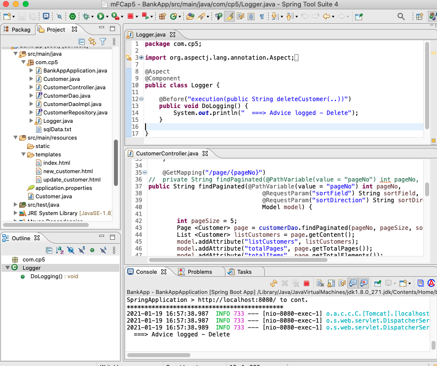

Aspect
===
[top]: topOfThePage

``` java
package com.cp5;

import javax.validation.Valid;
import org.aspectj.lang.annotation.Aspect;
import org.aspectj.lang.annotation.Before;
import org.springframework.stereotype.Component;
import org.springframework.validation.BindingResult;
import org.springframework.web.bind.annotation.ModelAttribute;
import org.springframework.web.bind.annotation.PathVariable;

@Aspect
@Component
public class Logger {
	
	@Before("execution(public String deleteCustomer(..))")
	public void deleteLog() {
		System.out.println("  ===> Advice logged - Delete");
	}

	@Before("execution(public String updateCustomer(..))")
	public void updateLog() {
		System.out.println("  ===> Advice logged - Update");
	}
}
```


210119HBankApp.png 

---
[:top: Top](#top)