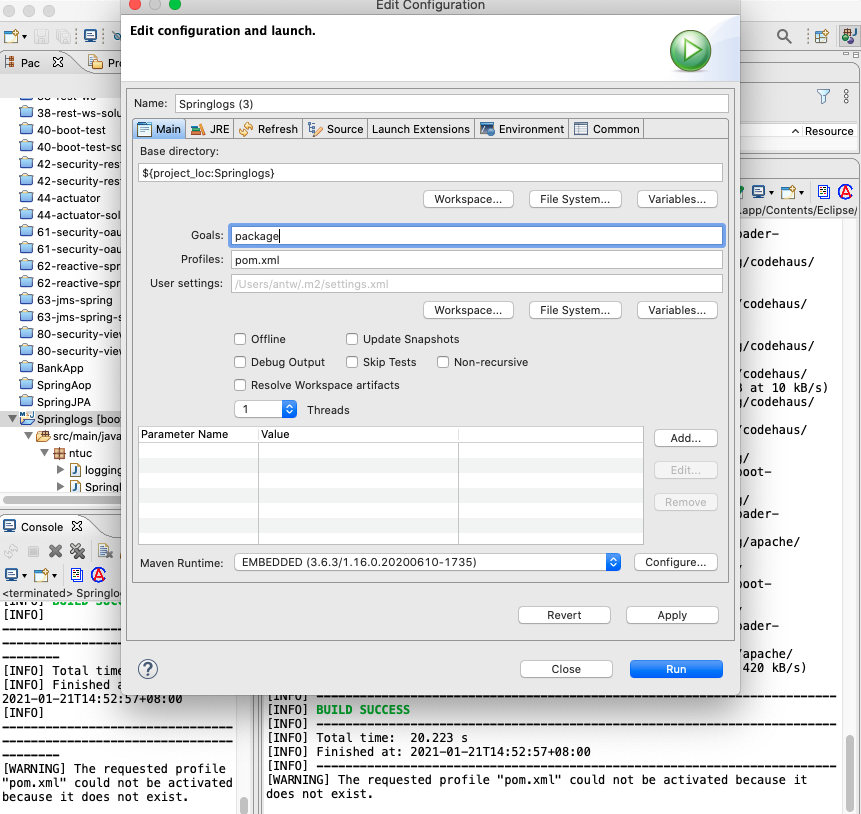

210121CreatingJar.png 

### Creating JAR from Spring

In STS, right-click the project and select ‘Run As’ - Maven Build

Run As > 5 Maven Build >  Goals, enter `package`, the word `package`

The rest leave as default, then click Run

#### console
``` concole
2021-02-23 12:22:01.933  INFO 1462 --- [           main] ntuc.SpringlogsApplicationTests          : Starting SpringlogsApplicationTests using Java 15.0.1 on Mac-mini.local with PID 1462 (started by antw in /Users/antw/ntuc/mFCap5/Springlogs)
2021-02-23 12:22:01.935  INFO 1462 --- [           main] ntuc.SpringlogsApplicationTests          : No active profile set, falling back to default profiles: default
2021-02-23 12:22:02.864  INFO 1462 --- [           main] o.s.s.concurrent.ThreadPoolTaskExecutor  : Initializing ExecutorService 'applicationTaskExecutor'
2021-02-23 12:22:03.085  INFO 1462 --- [           main] ntuc.SpringlogsApplicationTests          : Started SpringlogsApplicationTests in 6.347 seconds (JVM running for 7.099)
[INFO] Tests run: 1, Failures: 0, Errors: 0, Skipped: 0, Time elapsed: 7.018 s - in ntuc.SpringlogsApplicationTests
2021-02-23 12:22:03.443  INFO 1462 --- [extShutdownHook] o.s.s.concurrent.ThreadPoolTaskExecutor  : Shutting down ExecutorService 'applicationTaskExecutor'
[INFO] 
[INFO] Results:
[INFO] 
[INFO] Tests run: 1, Failures: 0, Errors: 0, Skipped: 0
[INFO] 
[INFO] 
[INFO] --- maven-jar-plugin:3.2.0:jar (default-jar) @ Log-Sample ---
[INFO] Building jar: /Users/antw/ntuc/mFCap5/Springlogs/target/Log-Sample-001-SNAPSHOT.jar
[INFO] 
[INFO] --- spring-boot-maven-plugin:2.4.2:repackage (repackage) @ Log-Sample ---
[INFO] Replacing main artifact with repackaged archive
[INFO] ------------------------------------------------------------------------
[INFO] BUILD SUCCESS
[INFO] ------------------------------------------------------------------------
[INFO] Total time:  9.374 s
[INFO] Finished at: 2021-02-23T12:22:04+08:00
[INFO] ------------------------------------------------------------------------
[WARNING] The requested profile "pom.xml" could not be activated because it does not exist.
```

### Running this JAR file


This Jar file at the project folder /target/<filename>.jar
eg. Log_Sample-001-SNAPPSHOT.jar 31.2MB

Run in Terminal
`java -jar <filename.jar>`

run as such, which also output to browser, localhost:8082
```
antw@Mac-mini target % java -version
java version "11.0.8" 2020-07-14 LTS
Java(TM) SE Runtime Environment 18.9 (build 11.0.8+10-LTS)
Java HotSpot(TM) 64-Bit Server VM 18.9 (build 11.0.8+10-LTS, mixed mode)

antw@Mac-mini target % java -jar Log-Sample-001-SNAPSHOT.jar --server.port=8082
``` 

**Ctrl-C**› in Terminal to quit the running. 
