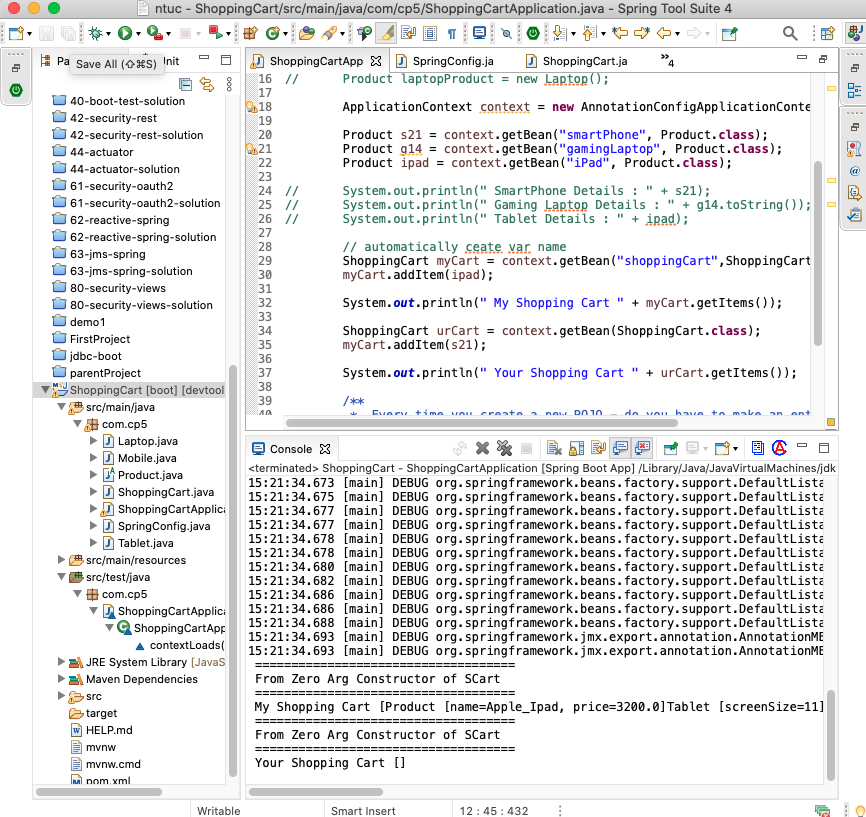
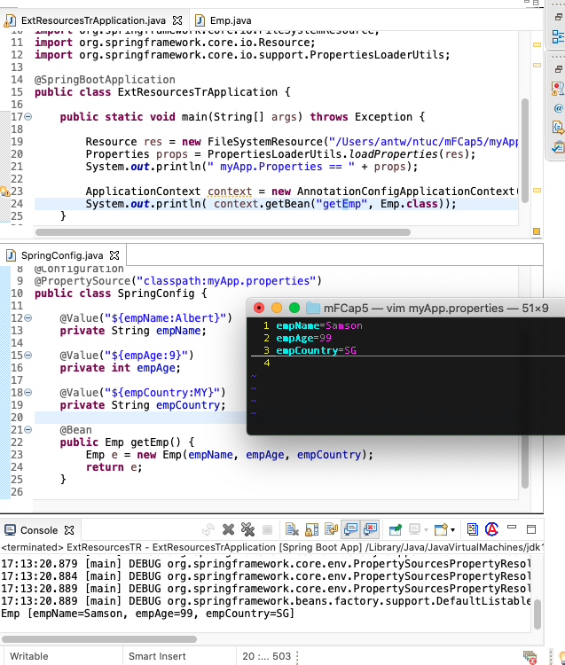
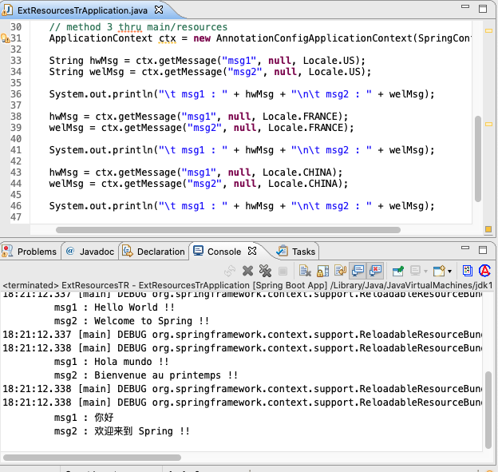
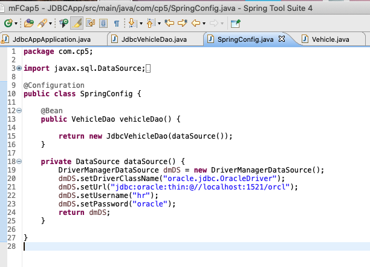
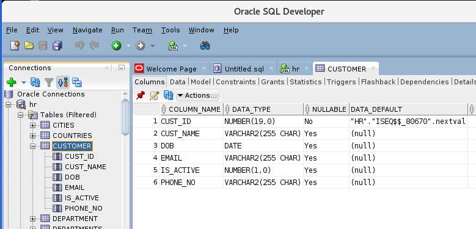
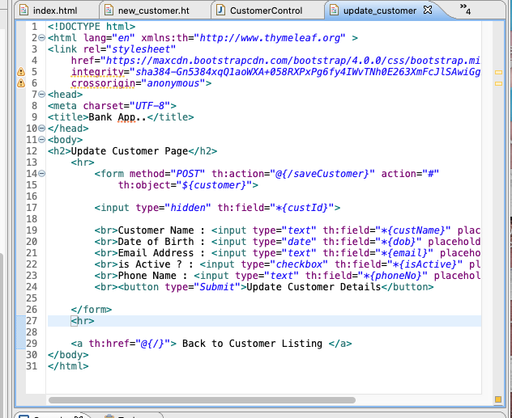
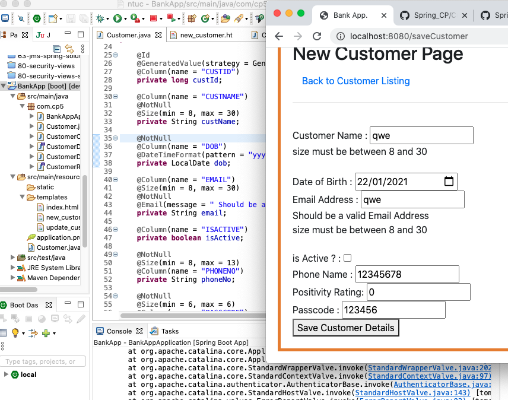
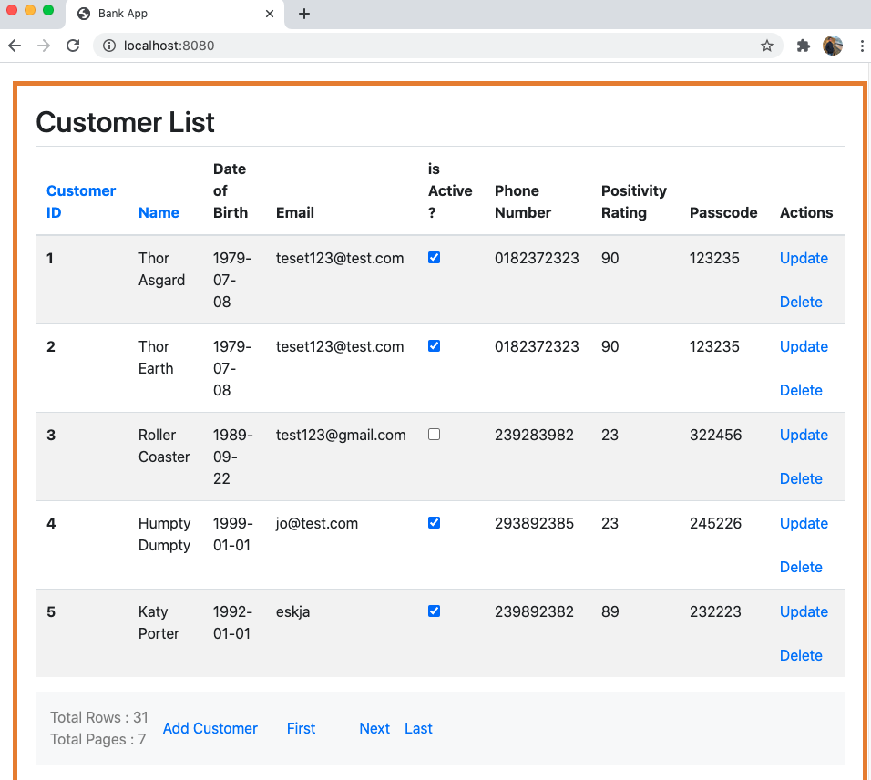
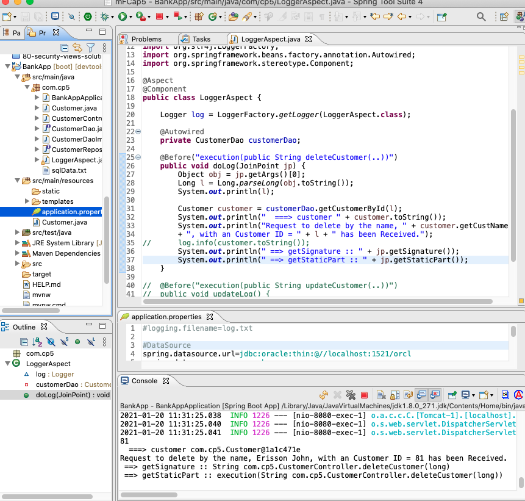
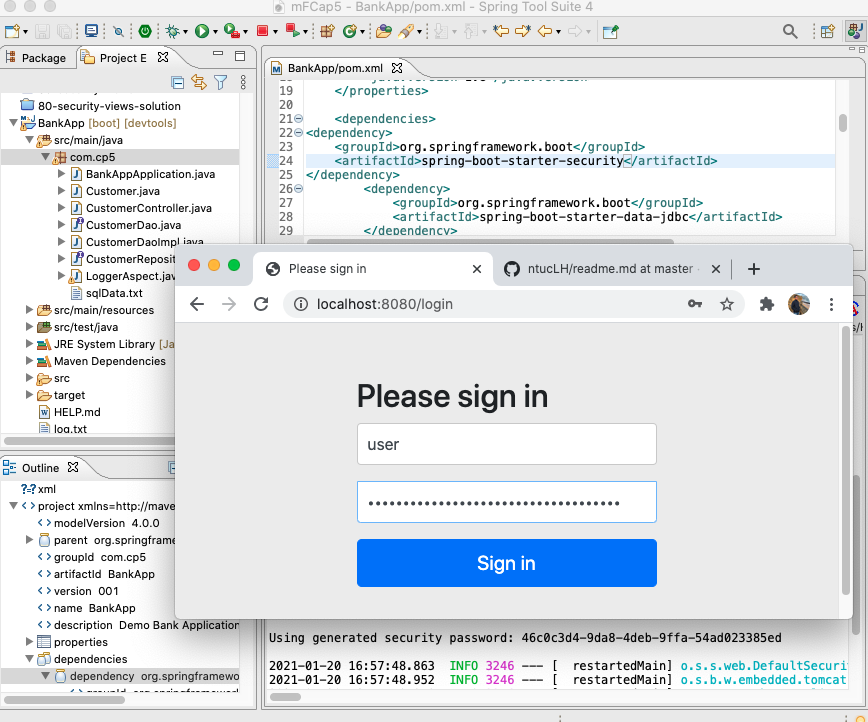

ntuc CapStone 5
===
[top]: topOfThePage

| topics | Lesson | Folder | img |
| ---: | --- | --- | --- |
| 01 | NewStarter | [ 210108NewStarter.md ](/mFCapStoneProj5/210108NewStarter.md) | --- |
| 02 | ApplicationContext | [ 210108ShoppingCart ](/mFCapStoneProj5/210108ShoppingCart)  | --- |
| 03 | @ComponentScan | [ 210108-2ShoppingCart ](/mFCapStoneProj5/210108-2ShoppingCart) |  |
| 04 | myApp.properties | [ 210108-3ExtResource ](/mFCapStoneProj5/210108-3ExtResource) |   |
| 05 | Msg Bundle | [ 210111A-4ExtResource ](/mFCapStoneProj5/210111A-4ExtResource) |  |
| 07 | Jdbs Sql setup | [ 210111B-JdbcCapp ](/mFCapStoneProj5/210111B-JdbcCapp) |  |
| 08 | Jdbs DAO | [ 210111C-JdbcApp ](/mFCapStoneProj5/210111C-JdbcApp) |  |
| 09 | SQL Dev | [ 210113A-BankApp ](/mFCapStoneProj5/210113A-BankApp) |  |
| 10 | get/deleteCust | [ 210113D-BankApp ](/mFCapStoneProj5/210113D-BankApp) |  |
| 11 | Sql Validation | [ 210114E-BankApp ](/mFCapStoneProj5/210114E-BankApp/) |  |
| 12 | Sort n Paginate | [ 210114F-BankApp ](/mFCapStoneProj5/210114F-BankApp) |  |
| 13 | Spring XML | [ 210119-SpringAop ](/mFCapStoneProj5/210119-SpringAop) |  |
| 14 | Aspect n Log | [ 210120J-BankApp ](/mFCapStoneProj5/210120J-BankApp) |  |
| 15 | Spring Password | [ 210120K-Password ](/mFCapStoneProj5/210120K-Password) |  |
| 16 | --- |  |  |
| 99 | --- |  |  |

[:top: Top](#top)

---
[**myNote**](mynote.md)

---
