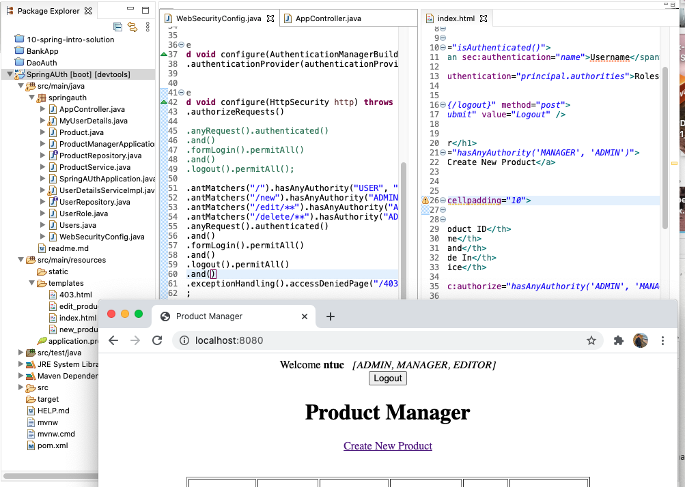
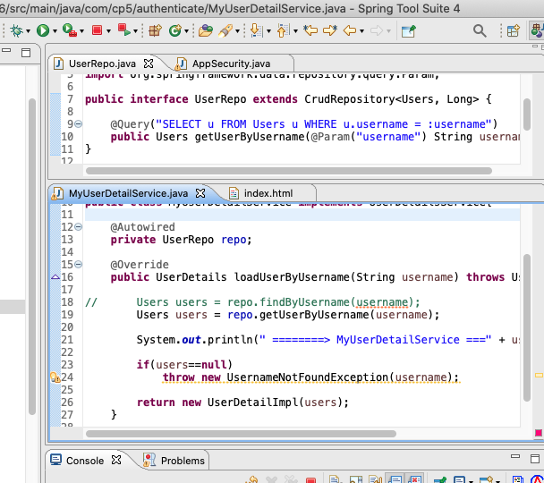

Users Roles Authenticatiom
===


[ index.html ]( /210127-SpringAUth/index.html)

[ WebSecurityConfig.java ]( /210127-SpringAUth/WebSecurityConfig.java)

210127SpringAuth.png 

210127SpringAuth.png 

210201for210127-SpringAUth.png 

#### index.html
``` html
<html 	xmlns:th="http://www.thymeleaf.org"
	xmlns:sec="https://www.thymeleaf.org/thymeleaf-extras-springsecurity5">
<head>
	...
<body>
	<div align="center">
		<div sec:authorize="isAuthenticated()">
			Welcome <b><span sec:authentication="name">Username</span></b> &nbsp;
			<i><span sec:authentication="principal.authorities">Roles</span></i>
		</div>

		<form th:action="@{/logout}" method="post">
			<input type="submit" value="Logout" />
		</form>

		<h1>Product Manager</h1>
		<div sec:authorize="hasAnyAuthority('MANAGER', 'ADMIN')">
			<a href="new">Create New Product</a>
		</div>

		<br />
		<br />
		<table border="1" cellpadding="10">
			<thead>
				<tr>
					<th>Product ID</th>
					<th>Name</th>
					<th>Brand</th>
					<th>Made In</th>
					<th>Price</th>

					<th sec:authorize="hasAnyAuthority('ADMIN', 'MANAGER')">Actions</th>

				</tr>
			</thead>
			<tbody>
				<tr th:each="product : ${listProducts}">
					<td th:text="${product.id}">Product ID</td>
					<td th:text="${product.name}">Name</td>
					<td th:text="${product.brand}">Brand</td>
					<td th:text="${product.madein}">Made in</td>
					<td th:text="${product.price}">Price</td>

					<td sec:authorize="hasAnyAuthority('ADMIN', 'Manager')"><a
						th:href="@{'/edit/' + ${product.id}}">Edit</a>
						&nbsp;&nbsp;&nbsp;&nbsp; <a sec:authorize="hasAuthority('ADMIN')"
						th:href="@{'/delete/' + ${product.id}}">Delete</a></td>
				</tr>
			</tbody>
		</table>
	</div>
</body>
```

#### WebSecurityConfig.java
``` java
@Configuration
@EnableWebSecurity
public class WebSecurityConfig extends WebSecurityConfigurerAdapter {

	@Bean
	public UserDetailsService userDetailsService() {
		return new UserDetailsServiceImpl();
	}
	
	@Bean
	public BCryptPasswordEncoder passwordEncoder() {
		return new BCryptPasswordEncoder();
	}
	
	@Bean
	public DaoAuthenticationProvider authenticationProvider() {
		DaoAuthenticationProvider authProvider = new DaoAuthenticationProvider();
		authProvider.setUserDetailsService(userDetailsService());
		authProvider.setPasswordEncoder(passwordEncoder());
		
		return authProvider;
	}

	@Override
	protected void configure(AuthenticationManagerBuilder auth) throws Exception {
		auth.authenticationProvider(authenticationProvider());
	}

	@Override
	protected void configure(HttpSecurity http) throws Exception {
		http.authorizeRequests()
		
//			.anyRequest().authenticated()
//			.and()
//			.formLogin().permitAll()
//			.and()
//			.logout().permitAll();
		
			.antMatchers("/").hasAnyAuthority("USER", "MANAGER", "EDITOR", "ADMIN")
			.antMatchers("/new").hasAnyAuthority("ADMIN", "MANAGER")
			.antMatchers("/edit/**").hasAnyAuthority("ADMIN", "EDITOR")
			.antMatchers("/delete/**").hasAuthority("ADMIN")
			.anyRequest().authenticated()
			.and()
			.formLogin().permitAll()
			.and()
			.logout().permitAll()
			.and()
			.exceptionHandling().accessDeniedPage("/403")
			;
	}
}
```

check on username role

``` sql
select username, name from users, users_roles, roles
where users.user_id = users_roles.user_id
and users_roles.role_id = roles.role_id;
```

note will auto generate table for Users, Roles, UserRole

SQL data for Users
``` sql
REM INSERTING into Sridhar.USERS
SET DEFINE OFF;
Insert into Sridhar.USERS (USERNAME,PASSWORD,ENABLED) values ('simon','$2y$12$PPrZxxCGwaOAtO/lqS5g3e6ft9Oi6tLN1mgwQuHu2y9bGVeG.pYMC',1);
Insert into Sridhar.USERS (USERNAME,PASSWORD,ENABLED) values ('ntuc','$2y$12$OlRxs83PvNA.LuDKQngubuZFWXKg4IBd19xyXt43KD9WQeNGx55VW',1);
Insert into Sridhar.USERS (USERNAME,PASSWORD,ENABLED) values ('password','$2y$12$FaKrkyaHn18dGpPUQ.md/ec86MTUuaAZyugfJ6YV8Qz2h/I06MLwm',1);

```

SQL data for Products
``` sqk
REM INSERTING into sridhar.PRODUCT
SET DEFINE OFF;
Insert into sridhar.PRODUCT (BRAND,MADEIN,NAME,PRICE) values ('PHILIPS','Singapore','Monitor',200);
Insert into sridhar.PRODUCT (BRAND,MADEIN,NAME,PRICE) values ('APPLE','USA','Mobile',900);
Insert into sridhar.PRODUCT (BRAND,MADEIN,NAME,PRICE) values ('APPLE','USA','Mac Mini',1200);
Insert into sridhar.PRODUCT (BRAND,MADEIN,NAME,PRICE) values ('APPLE','USA','testtest',0);
Insert into sridhar.PRODUCT (BRAND,MADEIN,NAME,PRICE) values ('SONY','MALAYSIA','Television',400);
Insert into sridhar.PRODUCT (BRAND,MADEIN,NAME,PRICE) values ('SUMSUNG','KOREA','Mobile',500);
Insert into sridhar.PRODUCT (BRAND,MADEIN,NAME,PRICE) values ('LENOVA','JAPAN','Monitor',300);
```

SQL data for Roles
``` SQL
REM INSERTING into SRIDHAR.ROLES
SET DEFINE OFF;
Insert into SRIDHAR.ROLES (NAME) values ('ADMIN');
Insert into SRIDHAR.ROLES (NAME) values ('MANAGER');
```

SQL data for UserRole
* Link UserID to RoleID

---

		Product.java - created SQL Product
		UserRole.java - created SQL Roles, id, name
		Users.java - created SQL Users, authentication &
		Users.java - created SQL Users_Roles
		
		AppController.java - return to html via RequestMapping
		
		compare between DaoAuth =:= SpringAuth
		
		SpringAUthApp   =:=  DaoAuthenticateApplication
		Users  			=:=  Users
		
		MyUserDetails	=:= UserDetailImpl
		AppController	=:=	UserControl

---
