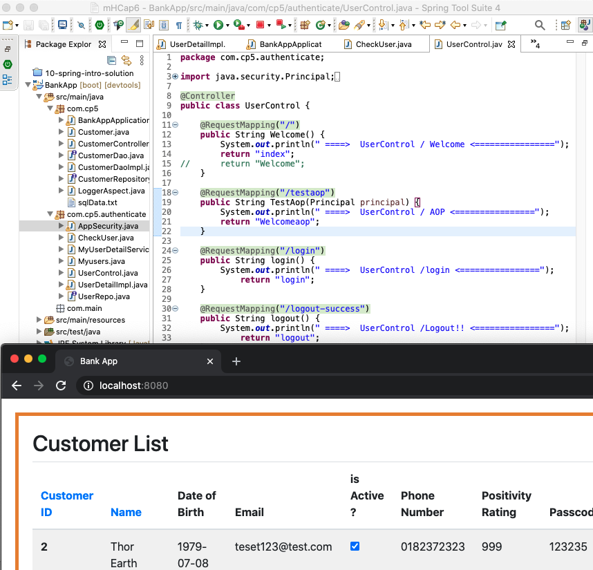

BankApp with SpringAuthentication
===

antw@Mac-mini BankApp % ls -R
``` console
HELP.md		mvnw		pom.xml		src
log.txt		mvnw.cmd	readme.md	target

./src:
main	test

./src/main:
java		resources

./src/main/java:
com

./src/main/java/com:
cp5	main

./src/main/java/com/cp5:
BankAppApplication.java	CustomerDao.java	LoggerAspect.java
Customer.java		CustomerDaoImpl.java	authenticate
CustomerController.java	CustomerRepository.java	sqlData.txt

./src/main/java/com/cp5/authenticate:
AppSecurity.java		UserControl.java
CheckUser.java			UserDetailImpl.java
MyUserDetailService.java	UserRepo.java
Myusers.java

./src/main/java/com/main:

./src/main/resources:
Customer.java		readme.md		templates
application.properties	static

./src/main/resources/static:
css	static

./src/main/resources/static/css:
main.css

./src/main/resources/static/static:
img

./src/main/resources/static/static/img:
logo.png

./src/main/resources/templates:
Welcome.html		index.html		new_customer.html
Welcomeaop.html		login.html		update_customer.html
error.html		logout.html

./src/test:
java

./src/test/java:
com

./src/test/java/com:
cp5

./src/test/java/com/cp5:
BankAppApplicationTests.java

./target:
classes		test-classes

./target/classes:
Customer.java		com			templates
META-INF		readme.md
application.properties	static

./target/classes/META-INF:
MANIFEST.MF	maven

./target/classes/META-INF/maven:
com.cp5

./target/classes/META-INF/maven/com.cp5:
BankApp

./target/classes/META-INF/maven/com.cp5/BankApp:
pom.properties	pom.xml

./target/classes/com/cp5:
BankAppApplication.class	CustomerRepository.class
Customer.class			LoggerAspect.class
CustomerController.class	authenticate
CustomerDao.class		sqlData.txt
CustomerDaoImpl.class

./target/classes/com/cp5/authenticate:
AppSecurity.class		UserControl.class
CheckUser.class			UserDetailImpl.class
MyUserDetailService.class	UserRepo.class
Myusers.class

./target/classes/com/main:

./target/classes/static:
css	static

./target/classes/static/css:
main.css

./target/classes/static/static:
img

./target/classes/static/static/img:
logo.png

./target/classes/templates:
Welcome.html		index.html		new_customer.html
Welcomeaop.html		login.html		update_customer.html
error.html		logout.html

./target/test-classes:
com

./target/test-classes/com:
cp5

./target/test-classes/com/cp5:
BankAppApplicationTests.class
antw@Mac-mini BankApp % 
```

antw@Mac-mini cp5 % ls -1
```
BankAppApplication.java
Customer.java
CustomerController.java
CustomerDao.java
CustomerDaoImpl.java
CustomerRepository.java
LoggerAspect.java
authenticate
sqlData.txt
```

authenticate
```
AppSecurity.java
CheckUser.java
MyUserDetailService.java
Myusers.java
UserControl.java
UserDetailImpl.java
UserRepo.java
```

resources
```
Customer.java
application.properties
readme.md
static
templates
```

templates
```
Welcome.html
Welcomeaop.html
error.html
index.html
login.html
logout.html
new_customer.html
update_customer.html
```

210127BankApp.png 

---
