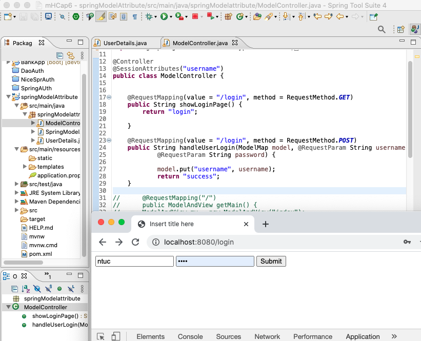

210201ModelAttribute.png 

210219modelAttribute 

#### ModelController.java
``` java
import org.springframework.stereotype.Controller;
import org.springframework.ui.ModelMap;
import org.springframework.web.bind.annotation.ModelAttribute;
import org.springframework.web.bind.annotation.RequestMapping;
import org.springframework.web.bind.annotation.RequestMethod;
import org.springframework.web.bind.annotation.RequestParam;
import org.springframework.web.bind.annotation.SessionAttributes;

@Controller
@SessionAttributes("username")
public class ModelController {
	
	@RequestMapping(value = "/login", method = RequestMethod.GET)
	public String showLoginPage() {
		return "login";
	}
	
	@RequestMapping(value = "/login", method = RequestMethod.POST)
	public String handleUserLogin(ModelMap model, @RequestParam String username,
			@RequestParam String email,
			@RequestParam String password) {
		
//			model.addAttribute("username", username); // also can?
			model.put("username", username);
			model.addAttribute("email", email);
			
			System.out.println("=====> size " + model.size());
			System.out.println("=====> toString " + model.toString());
			System.out.println("=====> username " + model.getAttribute("username"));
			System.out.println("=====> email " + model.getAttribute("email"));
			return "success";
	}
```

#### index.html
``` html
<body>
	<form action="/login" method="post">
		<input type="text" name="username" />
		<input type="password" name="password" />
		<input type="text" name="email" />
		<input type="submit" />
	</form>
</body>
```

#### console
``` console
=====> size 2
=====> toString {username=ntuc, email=erisson@ntuc.com}
=====> username ntuc
=====> email erisson@ntuc.com
```
