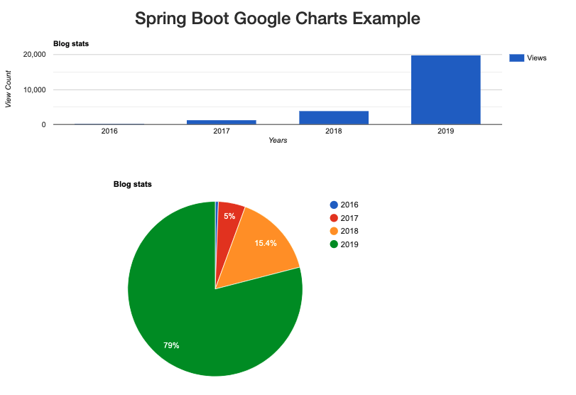

### Spring Boot Google Pie Graph
* Just only Pie Chart
* double charts
* Just only Bar Chart

210203SpringGraph.png 


---
## Just only Pie Chart
#### GoogleChartsController.java
``` java
import org.springframework.stereotype.Controller;
import org.springframework.ui.Model;
import org.springframework.web.bind.annotation.GetMapping;
@Controller
public class GoogleChartsController {

    @GetMapping("/")
    public String getPieChart(Model model) {
        Map<String, Integer> graphData = new TreeMap<>();
        graphData.put("2016", 147);
        graphData.put("2017", 1256);

        model.addAttribute("chartData", graphData);
        return "google-charts";
    }
```
#### google-charts.html
``` html
<title>Google Charts Example - Spring Boot</title>
<script
    src="https://ajax.googleapis.com/ajax/libs/jquery/3.4.1/jquery.min.js"></script>
<link rel="stylesheet"
    href="https://maxcdn.bootstrapcdn.com/bootstrap/3.4.1/css/bootstrap.min.css">
<script type="text/javascript"
    src="https://www.gstatic.com/charts/loader.js"></script>
</head>
<body>
    <div align="center" style="width: 1000px;">
        <h2>Spring Boot Google Pie Charts Example</h2>

        <div id="piechart" style="width: 450px; height: 250px;"></div>

    </div>
    <script th:inline="javascript">
        var real_data = /*[[${chartData}]]*/'noValue';
 
        $(document).ready(function() {
            google.charts.load('current', {
                packages : [ 'corechart', 'bar' ]
            });

            google.charts.setOnLoadCallback(drawPieChart);
        });
 
        function drawPieChart() {
            var data = new google.visualization.DataTable();
            data.addColumn('string', 'Year');
            data.addColumn('number', 'Views');
            Object.keys(real_data).forEach(function(key) {
                data.addRow([ key, real_data[key] ]);
            });
            var options = {
                title : 'Blog stats'
            };
            var chart = new google.visualization.PieChart(document
                    .getElementById('piechart'));
            chart.draw(data, options);
        }
        
```
---
### double charts
#### GoogleCartsController.java
``` java
	    @Controller
	    public class GoogleChartsController {
	     
	        @GetMapping("/")
	        public String getPieChart(Model model) {
	            Map<String, Integer> graphData = new TreeMap<>();
	            graphData.put("2016", 147);
	            graphData.put("2017", 1256);

	            Map<String, Integer> graphData2 = new TreeMap<>();
	            graphData2.put("2021", 33);
	            graphData2.put("2017", 1256);
	            
	            model.addAttribute("chartData", graphData);
	            model.addAttribute("chartData2", graphData2);
	            return "google-charts";
	        }
```
#### google-charts.html
``` html
<body>
    <div align="center"> <!-- style="width: 1000px;"> -->
        <h2>Spring Boot Google Pie Charts Example</h2>
	</div>
	<div class="form-row">
        <div class="form-group col-md-6" id="piechart" style="width: 450px; height: 250px;"></div>
        <div class="form-group col-md-6" id="piechart2" style="width: 450px; height: 250px;"></div>
    </div>
    <script th:inline="javascript">
		var real_data = /*[[${chartData}]]*/'noValue';
		var real_data2 = /*[[${chartData2}]]*/'noValue';
         
		$(document).ready(function() {
		    google.charts.load('current', {
		        packages : [ 'corechart', 'bar' ]
		    });
		
		    google.charts.setOnLoadCallback(drawPieChart);
		    google.charts.setOnLoadCallback(drawPieChart2);
		});
		
		function drawPieChart() {
		    var data = new google.visualization.DataTable();
		    data.addColumn('string', 'Year');
		    data.addColumn('number', 'Views');
		    Object.keys(real_data).forEach(function(key) {
		        data.addRow([ key, real_data[key] ]);
		    });
		    var options = {
		        title : 'Blog stats'
		    };
		    var chart = new google.visualization.PieChart(document
		            .getElementById('piechart'));
		    chart.draw(data, options);
		}
		
		function drawPieChart2() {
		    var data = new google.visualization.DataTable();
		    data.addColumn('string', 'Year');
		    data.addColumn('number', 'Views');
		    Object.keys(real_data2).forEach(function(key) {
		        data.addRow([ key, real_data2[key] ]);
		    });
		    var options = {
		        title : 'piechart2'
		    };
		    var chart = new google.visualization.PieChart(document
		            .getElementById('piechart2'));
		    chart.draw(data, options);
		}       
    </script>
</body>
```
---
## Just only Bar Chart
useing external js
#### GoogleChartsController.java
``` java
	        @GetMapping("/")
	        public String getPieChart(Model model) {
	            Map<String, Integer> graphData = new TreeMap<>();
	            graphData.put("2016", 147);
	            graphData.put("2017", 1256);
	            graphData.put("2018", 3856);
	            graphData.put("2019", 19807);
	            model.addAttribute("chartDataBar", graphData);
	            return "google-charts";
	        }
```
#### google-charts.html
``` html
<body>
    <div align="center" style="width: 1000px;">
        <h2>Spring Boot Google Charts Example</h2>
        <div id="chart_div"></div>

    </div>
    <script th:inline="javascript">
        var real_dataBar = /*[[${chartDataBar}]]*/'noValue';
    </script>
    <script th:src="@{/chartBar.js}"></script>

</body>
```
#### chartBar.js
``` js
		//alert(real_dataBar); // debugging

        $(document).ready(function() {
            google.charts.load('current', {
                packages : [ 'corechart', 'bar' ]
            });
            google.charts.setOnLoadCallback(drawColumnChart);

        });
 
        function drawColumnChart() {
            var data = new google.visualization.DataTable();
            data.addColumn('string', 'Year');
            data.addColumn('number', 'Views');
            Object.keys(real_dataBar).forEach(function(key) {
                data.addRow([ key, real_dataBar[key] ]);
            });
            var options = {
                title : 'Blog stats',
                hAxis : {
                    title : 'Years',
                },
                vAxis : {
                    title : 'View Count'
                }
            };
            var chart = new google.visualization.ColumnChart(document
                    .getElementById('chart_div'));
            chart.draw(data, options);
        }
```

---
##### 210413
ref: https://developers.google.com/chart

---
