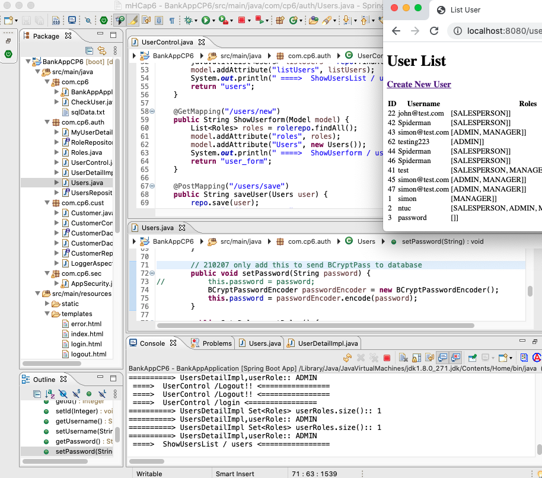

ManyToMany, set BCryptPassword
===

210207M2MBCrypt.png 

added in: 
- [MyUserDetailService.java](auth/MyUserDetailService.java)
- [RoleRepository.java](auth/RoleRepository.java)
- [Roles.java](auth/Roles.java)
- [UserControl.java](auth/UserControl.java) revised 
- [UserDetailImpl.java](auth/UserDetailImpl.java) revised
- [Users.java](auth/Users.java) revised
- [UsersRepository.java](auth/UsersRepository.java) revised


#### Users.java
``` java

		// was @ManyToMany
		// cascade , fetch added for IserDetailImpt/UserRole
		@ManyToMany(cascade = CascadeType.ALL, fetch = FetchType.EAGER)
		@JoinTable(
				name = "user_roles",
				joinColumns = @JoinColumn(name = "user_id"),
				inverseJoinColumns = @JoinColumn(name = "role_id")
				)
		
		private Set<Roles> userRoles = new HashSet<>();

		
		public Integer getId() {
			return id;
		}

		public void setId(Integer id) {
			this.id = id;
		}

		public String getUsername() {
			return username;
		}

		public void setUsername(String username) {
			this.username = username;
		}

		public String getPassword() {
			return password;
		}

		// 210207 only add this to send BCryptPass to database
		public void setPassword(String password) {
//			this.password = password;
			BCryptPasswordEncoder passwordEncoder = new BCryptPasswordEncoder();
			this.password = passwordEncoder.encode(password);
		}

		public Set<Roles> getRoles() {
			return userRoles;
		}

		public void setRoles(Set<Roles> userRoles) {
			this.userRoles = userRoles;
		}

		//
		public void addRole(Roles role) {
			this.userRoles.add(role);
		}
		
		public void removeRole(Roles role) {
			this.userRoles.remove(role);
		}
```


#### AppSecurity.java
``` java
package com.cp6.sec;

import org.springframework.beans.factory.annotation.Autowired;
import org.springframework.context.annotation.Bean;
import org.springframework.context.annotation.Configuration;
import org.springframework.security.authentication.AuthenticationProvider;
import org.springframework.security.authentication.dao.DaoAuthenticationProvider;
import org.springframework.security.config.annotation.web.builders.HttpSecurity;
import org.springframework.security.config.annotation.web.configuration.EnableWebSecurity;
import org.springframework.security.config.annotation.web.configuration.WebSecurityConfigurerAdapter;
import org.springframework.security.core.userdetails.UserDetailsService;
import org.springframework.security.crypto.bcrypt.BCryptPasswordEncoder;
import org.springframework.security.web.util.matcher.AntPathRequestMatcher;

...

	@Override
	protected void configure(HttpSecurity http) throws Exception {
		System.out.println("=======>>>>>>>>>>>>>>>>>>>> AppSecurity configure ..");
	
		http
			.csrf().disable()
			.authorizeRequests()
			.antMatchers("/login").permitAll()
			.antMatchers("/").hasAnyAuthority("USER", "MANAGER", "SALESPERSON", "ADMIN")
			.anyRequest().authenticated()
			.and()
			.formLogin()
			.loginPage("/login").permitAll()
			.and()
			.logout().invalidateHttpSession(true)
			.clearAuthentication(true)
			.logoutRequestMatcher(new AntPathRequestMatcher("/logout"))
			.logoutSuccessUrl("/logout-success").permitAll();

	}

```

#### UserControl.java
``` java
...
	@RequestMapping("/users")
	public String ShowUsersList(Model model) {
		java.util.List<Users> listUsers = repo.findAll();
		model.addAttribute("listUsers", listUsers);
		System.out.println(" ====>  ShowUsersList / users <================");
		return "users";
	}
	
	@GetMapping("/users/new")
	public String ShowUserform(Model model) {
		List<Roles> roles = rolerepo.findAll();
		model.addAttribute("roles", roles);
		model.addAttribute("Users", new Users());
		System.out.println(" ====>  ShowUserform / users/new <================");
		return "user_form";
	}
	
	@PostMapping("/users/save")
	public String saveUser(Users user) {
		repo.save(user);
		return "redirect:/users";
	}
	
	@GetMapping("/users/edit/{id}")
	public String ShowEditForm(@PathVariable("id") Integer id, Model model) {
		Users user =   repo.findById(id).get();
		model.addAttribute("Users", user);
		
		List<Roles> roles = rolerepo.findAll();
		model.addAttribute("roles", roles);
		
		return "user_form";
	}
	
	@GetMapping("/users/delete/{id}")
	public String deleteUser(@PathVariable("id") Integer id, Model model) {
		repo.deleteById(id);;
		
		return "redirect:/users";
		
	}
```

#### UserDetailImpl.java
``` java
	@Override
	public Collection<? extends GrantedAuthority> getAuthorities() {

		Set<Roles> userRoles = users.getRoles();
		System.out.println("==========> UsersDetailImpl Set<Roles> userRoles.size():: " + userRoles.size() );

		List<SimpleGrantedAuthority> authorities = new ArrayList<>();
		for (Roles userRole : userRoles) {
			System.out.println("==========> UsersDetailImpl,userRole:: " + userRole);
			authorities.add(new SimpleGrantedAuthority(userRole.getName()));
		}

		return authorities;
//		return Collections.singleton(new SimpleGrantedAuthority("NTUC"));
	}
```


---

