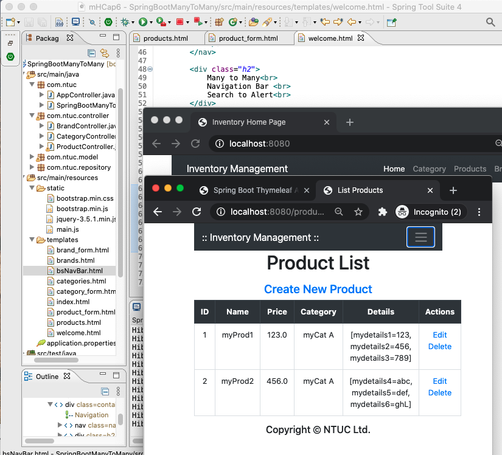

ManyToMany NavBar BootStrap
===

210208ManyToMany.png 

Directory arrangement


#### Category.java
``` java
@Entity
public class Category {
	
	@Id
	@GeneratedValue(strategy = GenerationType.IDENTITY)
	private Integer id;
	
	@Column(length = 45, nullable = false, unique=true)
	private String name;
	
//	@ManyToOne
//	@JoinColumn(name= "brand_id")
//	private Brands brand;
	

	@ManyToMany
	@JoinTable(
			name = "brands_categories",
			joinColumns = @JoinColumn(name = "category_id"),
			inverseJoinColumns = @JoinColumn(name = "brand_id")
			)
	
	private List<Brands> brand = new ArrayList<>();
```

#### Brands.java
``` java
@Entity
public class Brands {

	@Id
	@GeneratedValue(strategy = GenerationType.IDENTITY)
	private Integer id;
	
	@Column(length = 45, nullable = false, unique=true)
	private String name;
	
//	@OneToMany
//	@JoinColumn(name = "brand_id")
//	private List<Category> categories = new ArrayList<>();

	@ManyToMany
	@JoinTable(
			name = "brands_categories",
			joinColumns = @JoinColumn(name = "brand_id"),
			inverseJoinColumns = @JoinColumn(name = "category_id")
			)	

	private List<Category> categories = new ArrayList<>();
```

#### Products.java
``` java
@Entity
public class Products {
	
	@Id
	@GeneratedValue(strategy = GenerationType.IDENTITY)
	private Integer id;
	
	@Column(length = 150, nullable = false, unique=true)
	private String name;
	private float price;
	
	@ManyToOne
	@JoinColumn(name= "category_id")
	private Category category;
	
	@OneToMany(mappedBy ="product", cascade = CascadeType.ALL)
	private List<ProductDetails> details = new ArrayList<>();

```

#### ProductDetails.java 
``` java
@Entity
@Table(name="product_details")
public class ProductDetails {
	
	@Id
	@GeneratedValue(strategy = GenerationType.IDENTITY)
	private Integer id;
	
	@Column(length = 45, nullable = false)
	private String name;
	
	@Column(length = 45, nullable = false)
	private String value;
	
	@ManyToOne
	@JoinColumn(name="product_id")
	private Products product;
	
	public ProductDetails() {}

	public ProductDetails(Integer id, String name, String value, Products product) {
		this.id = id;
		this.name = name;
		this.value = value;
		this.product = product;
	}

	public ProductDetails( String name, String value, Products product) {
		this.name = name;
		this.value = value;
		this.product = product;
	}
```

#### pom.xml
``` xml
	<dependencies>
		<dependency>
			<groupId> org.webjars </groupId>
			<artifactId> bootstrap </artifactId>
			<version> 4.3.1</version> 
		</dependency>
		
		<dependency>
			<groupId> org.webjars </groupId>
			<artifactId> webjars-locator-core</artifactId>
		</dependency>
		
		<dependency>
			<groupId>org.springframework.boot</groupId>
			<artifactId>spring-boot-starter-data-jpa</artifactId>
		</dependency>
		<dependency>
			<groupId>org.springframework.boot</groupId>
			<artifactId>spring-boot-starter-thymeleaf</artifactId>
		</dependency>
		<dependency>
			<groupId>org.springframework.boot</groupId>
			<artifactId>spring-boot-starter-web</artifactId>
		</dependency>

		<dependency>
			<groupId>org.springframework.boot</groupId>
			<artifactId>spring-boot-devtools</artifactId>
			<scope>runtime</scope>
			<optional>true</optional>
		</dependency>
		<dependency>
			<groupId>com.oracle.database.jdbc</groupId>
			<artifactId>ojdbc8</artifactId>
			<scope>runtime</scope>
		</dependency>
		<dependency>
			<groupId>org.springframework.boot</groupId>
			<artifactId>spring-boot-starter-test</artifactId>
			<scope>test</scope>
		</dependency>
	</dependencies>
```

#### product.html
``` java
<!DOCTYPE html>
<html xmlns:th="http://www.thymeleaf.org">
<head>
<meta charset="ISO-8859-1">
<title>List Products</title>

<link rel="stylesheet" th:href="@{/bootstrap.min.css}">
<script th:src="@{/jquery-3.5.1.min.js}"></script>
<script th:src="@{/bootstrap.min.js}"></script>

</head>
<body>

	<div class="container text-center">

		<!-- Navigation -->
		<nav class="navbar navbar-expand-lg navbar-dark bg-dark static-top">
			<div class="container">

				<a class="navbar-brand" href="/">:: Inventory Management ::</a>
				<button class="navbar-toggler" type="button" data-toggle="collapse"
					data-target="#navbarResponsive" aria-controls="navbarResponsive"
					aria-expanded="false" aria-label="Toggle navigation">
					<span class="navbar-toggler-icon"></span>
				</button>

				<div class="collapse navbar-collapse" id="navbarResponsive">
					<ul class="navbar-nav ml-auto">
						<li class="nav-item active"><a class="nav-link" href="/">Home
								<span class="sr-only">(current)</span>
						</a></li>
						<li class="nav-item"><a class="nav-link"
							th:href="@{/categories}">Category</a></li>
						<li class="nav-item"><a class="nav-link"
							th:href="@{/products}">Products</a></li>
						<li class="nav-item"><a class="nav-link" th:href="@{/brands}">Brands</a></li>
						<!-- 						<form class="form-inline">
							<input type="search" class="form-control" placeholder="search"
								id="fieldkeyword" />
							<button class="btn btn-primary m-2" id="buttonSearch">
								Search</button>
						</form> -->
					</ul>
				</div>
			</div>
		</nav>

		<div>
			<div>
				<h1>Product List</h1>
			</div>
			<div class="p-2">
				<a class="h4" th:href="@{/products/new}">Create New Product</a>
			</div>
			<div>
				<table class="table table-bordered">
					<thead class="thead-dark">
						<tr>
							<th>ID</th>
							<th>Name</th>
							<th>Price</th>
							<th>Category</th>
							<th>Details</th>
							<th>Actions</th>
						</tr>
					</thead>
					<tbody>
						<th:block th:each="product : ${listProducts}">
							<tr>
								<td>[[${product.id}]]</td>
								<td>[[${product.name}]]</td>
								<td>[[${product.price}]]</td>
								<td>[[${product.category.name}]]</td>
								<td>[[${product.details}]]</td>
								<td><a th:href="@{'/products/edit/' + ${product.id}}">
										Edit </a> <a th:href="@{'/products/delete/' + ${product.id}}">
										Delete </a></td>

							</tr>
						</th:block>
					</tbody>
				</table>
			</div>

		</div>

		<div class="text-center m-3">
			<h5>Copyright &copy; NTUC Ltd.</h5>
		</div>
	</div>

	<Script>
</Script>
</body>

</html>
```


---