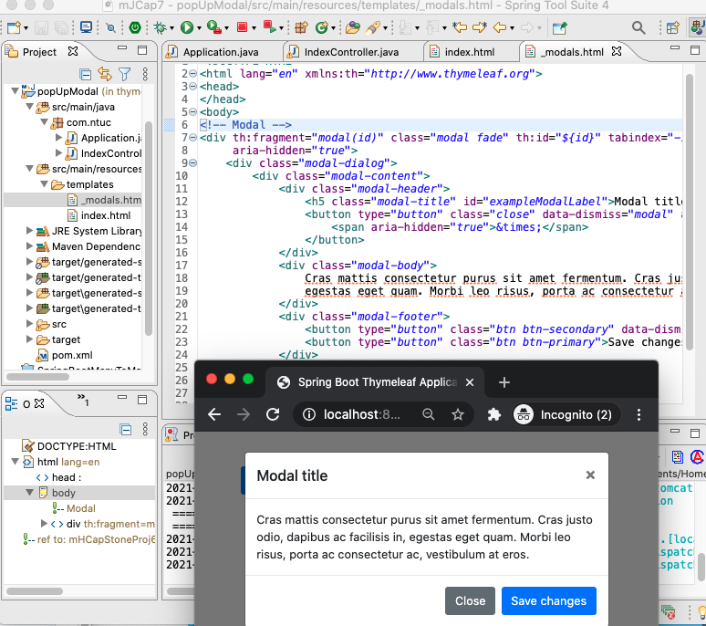

210225PopUpModal.png 

#### index.html
``` html
<body>

<div class="container">
    <div class="row mt-5">
        <div class="col">
            <!-- Button trigger modal -->
            <button type="button" class="btn btn-primary" data-toggle="modal" data-target="#exampleModal">
                Launch simple modal
            </button>

            <th:block th:replace="_modals :: modal('exampleModal')">modal</th:block>

        </div>
    </div>
</div>

<script th:src="@{/webjars/jquery/jquery.min.js}"></script>
<script th:src="@{/webjars/popper.js/umd/popper.min.js}"></script>
<script th:src="@{/webjars/bootstrap/js/bootstrap.min.js}"></script>

</body>
```
#### _modals.html
``` html
<body>
<!-- Modal -->
<div th:fragment="modal(id)" class="modal fade" th:id="${id}" tabindex="-1" role="dialog" aria-labelledby="exampleModalLabel"
     aria-hidden="true">
    <div class="modal-dialog">
        <div class="modal-content">
            <div class="modal-header">
                <h5 class="modal-title" id="exampleModalLabel">Modal title</h5>
                <button type="button" class="close" data-dismiss="modal" aria-label="Close">
                    <span aria-hidden="true">&times;</span>
                </button>
            </div>
            <div class="modal-body">
                Cras mattis consectetur purus sit amet fermentum. Cras justo odio, dapibus ac facilisis in,
                egestas eget quam. Morbi leo risus, porta ac consectetur ac, vestibulum at eros.
            </div>
            <div class="modal-footer">
                <button type="button" class="btn btn-secondary" data-dismiss="modal">Close</button>
                <button type="button" class="btn btn-primary">Save changes</button>
            </div>
        </div>
    </div>
</div>
</body>
```

