Thymeleaf Demos
===
ntuc CapStone 6  

[top]: topOfThePage

| topics | Lesson | Folder | img |
| ---: | --- | --- | --- |
| 01 | Date Range | [ thymeleaf-bootstrap-date-range-picker ](thymeleaf-bootstrap-date-range-picker) | 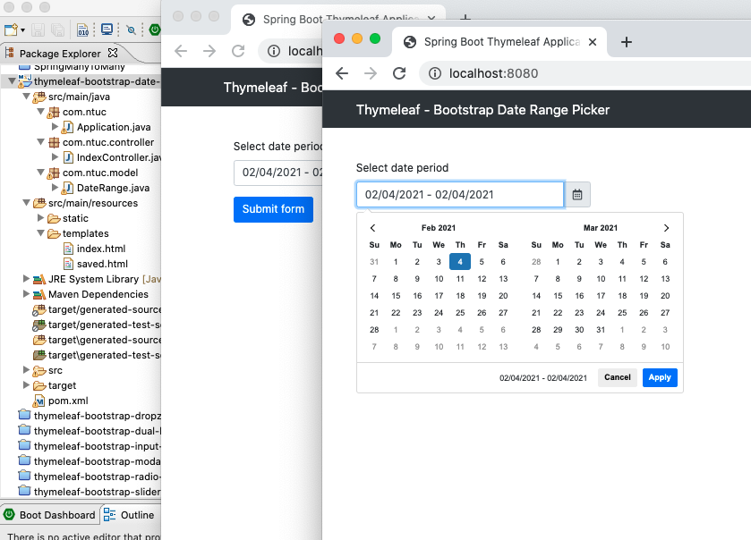 |
| 02 | Drop Zone | [ thymeleaf-bootstrap-dropzone ](/mFCapStoneProj6/thymeleaf-bootstrap-dropzone) | 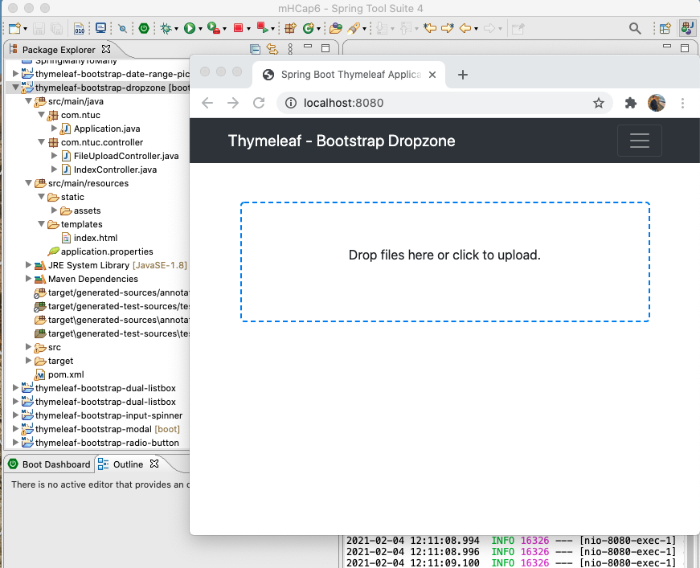 |
| 03 | Dual List Box | [ thymeleaf-bootstrap-dual-listbox ](/mFCapStoneProj6/thymeleaf-bootstrap-dual-listbox) | 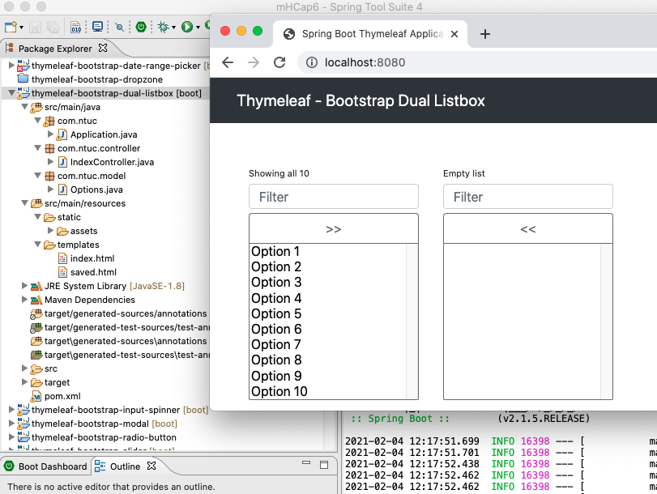 |
| 04 | Input Spinner | [ thymeleaf-bootstrap-input-spinner ](/mFCapStoneProj6/thymeleaf-bootstrap-input-spinner) | 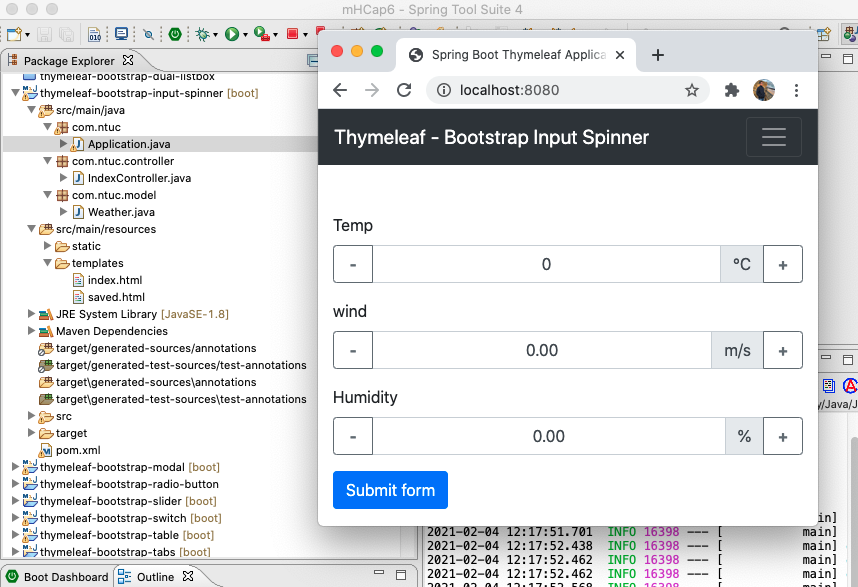 |
| 05 | Modal | [ thymeleaf-bootstrap-modal ](/mFCapStoneProj6/thymeleaf-bootstrap-modal) | 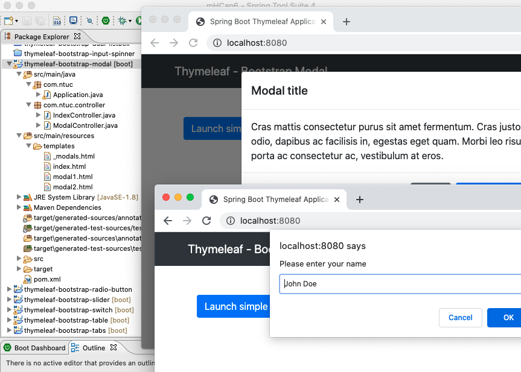 |
| 06 | Radio Button | [ thymeleaf-bootstrap-radio-button  ](/mFCapStoneProj6/thymeleaf-bootstrap-radio-button ) | 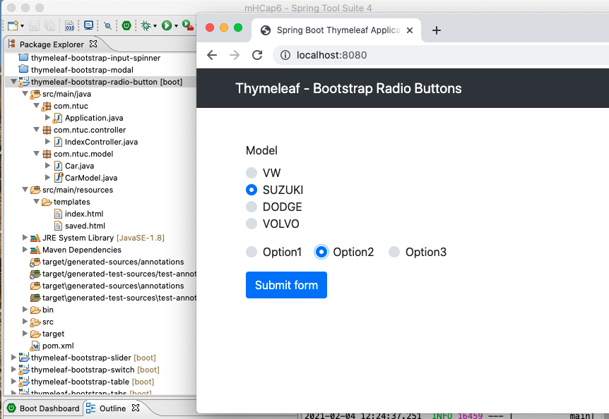 |
| 07 | Slider | [ thymeleaf-bootstrap-slider  ](/mFCapStoneProj6/thymeleaf-bootstrap-slider ) | 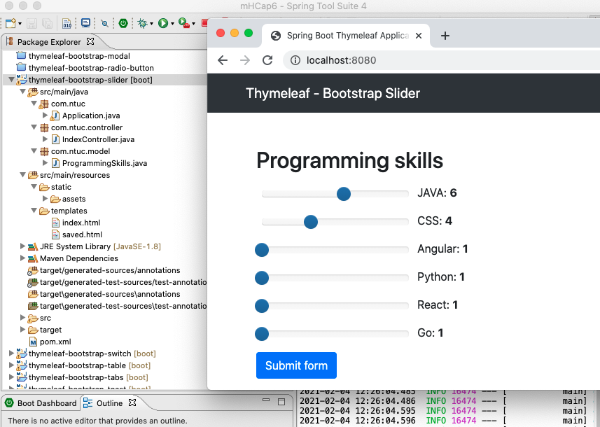 |
| 08 | Switch | [ thymeleaf-bootstrap-switch  ](/mFCapStoneProj6/thymeleaf-bootstrap-switch ) | 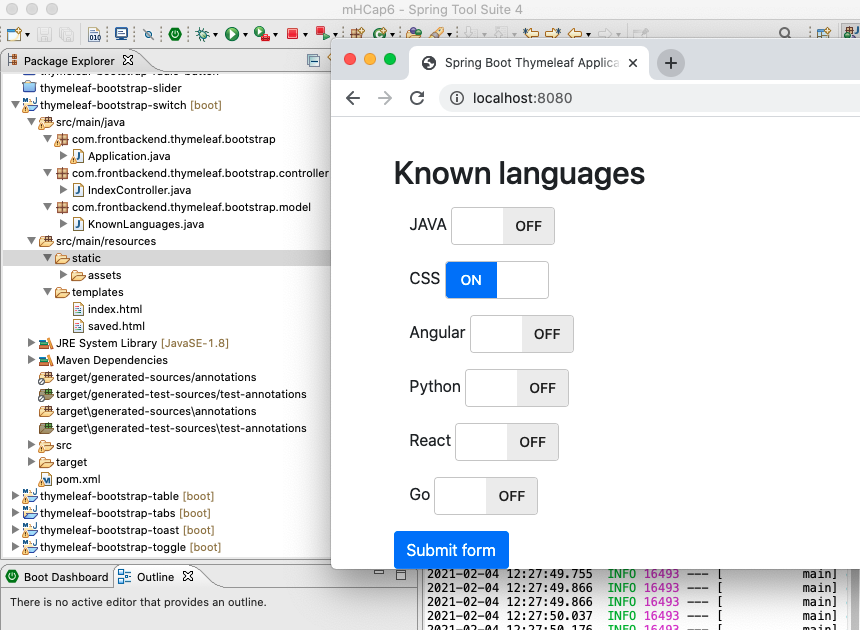 |
| 9 | Table | [ thymeleaf-bootstrap-table  ](/mFCapStoneProj6/thymeleaf-bootstrap-table ) | 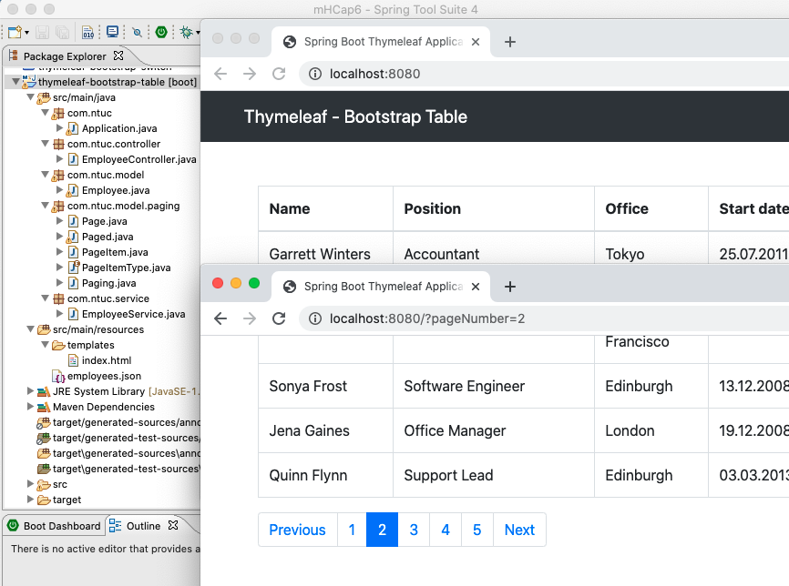 |
| 10 | Tabs | [ thymeleaf-bootstrap-tabs  ](/mFCapStoneProj6/thymeleaf-bootstrap-tabs ) | 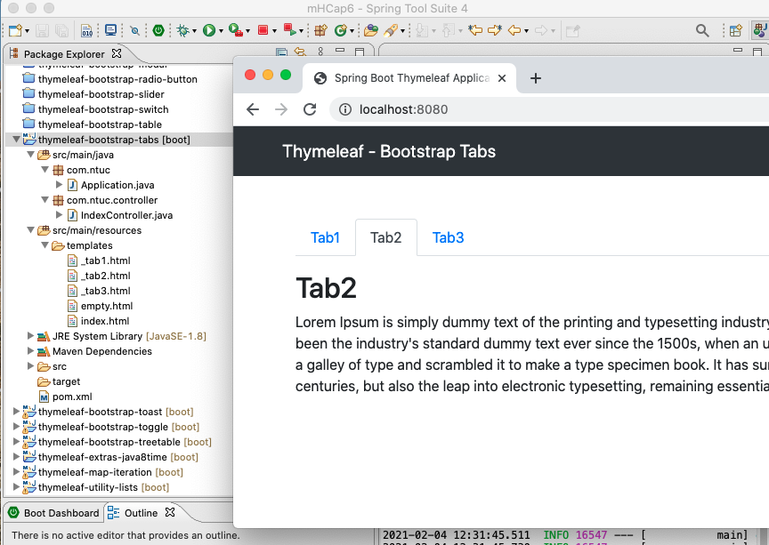 |
| 11 | Toast | [ thymeleaf-bootstrap-toast  ](/mFCapStoneProj6/thymeleaf-bootstrap-toast ) | 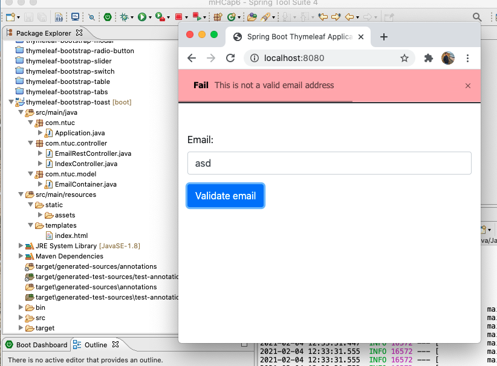 |
| 12 | Toggle | [ thymeleaf-bootstrap-toggle  ](/mFCapStoneProj6/thymeleaf-bootstrap-toggle ) | 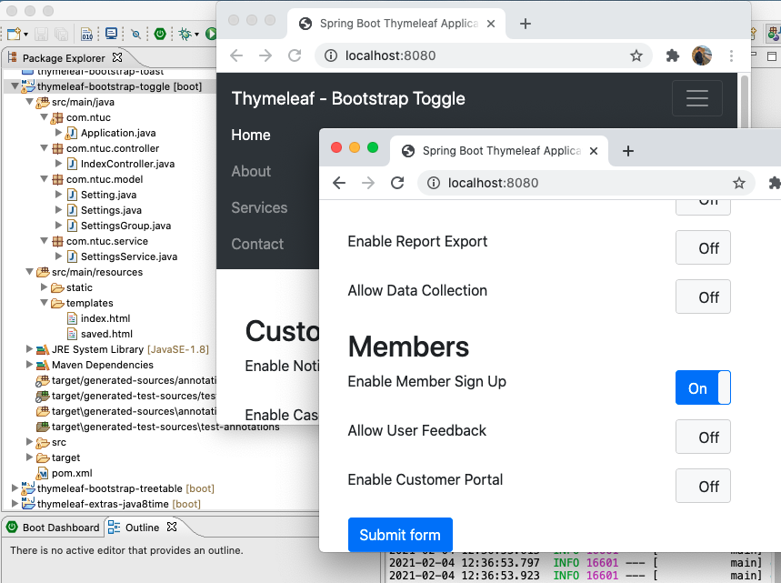 |
| 13 | Tree Table | [ thymeleaf-bootstrap-treetable  ](/mFCapStoneProj6/thymeleaf-bootstrap-treetable ) | 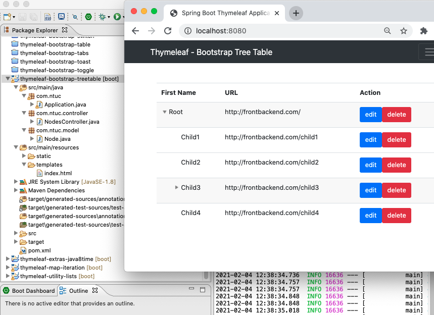 |
| 14 | Date Time | [ thymeleaf-extras-java8time  ](/mFCapStoneProj6/thymeleaf-extras-java8time ) | 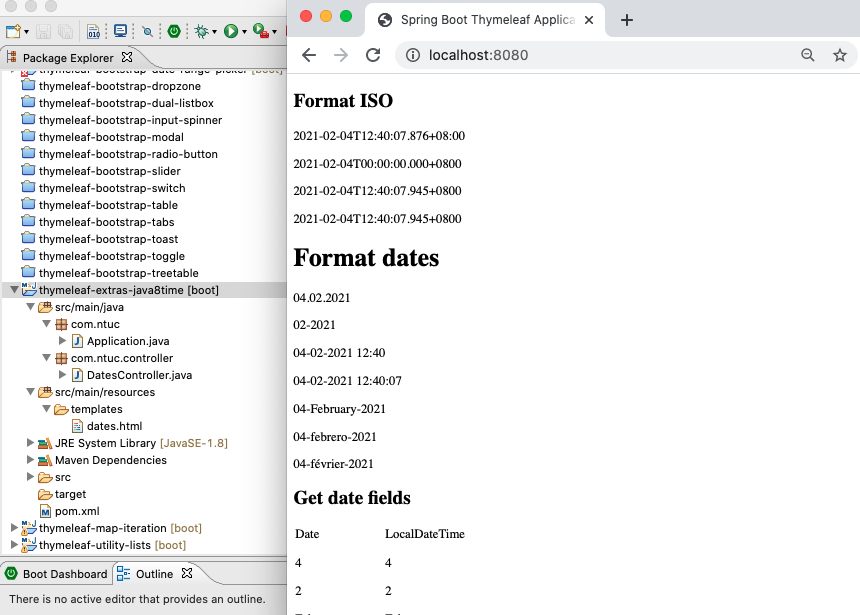 |
| 15 | Iteration | [ thymeleaf-map-iteration  ](/mFCapStoneProj6/thymeleaf-map-iteration ) | 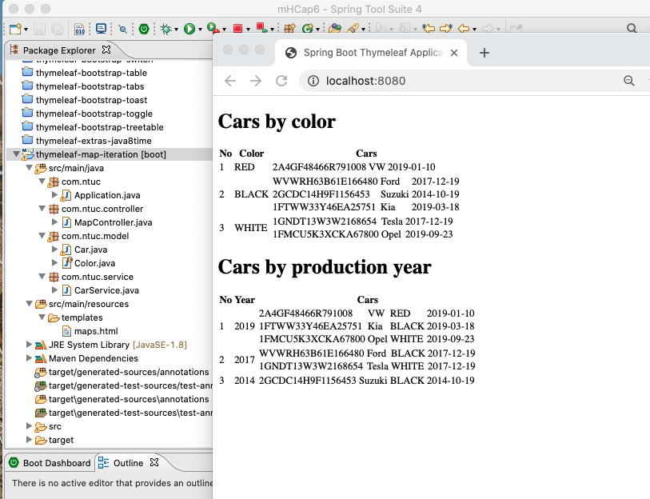 |
| 16 | List | [ thymeleaf-utility-lists  ](/mFCapStoneProj6/thymeleaf-utility-lists ) | 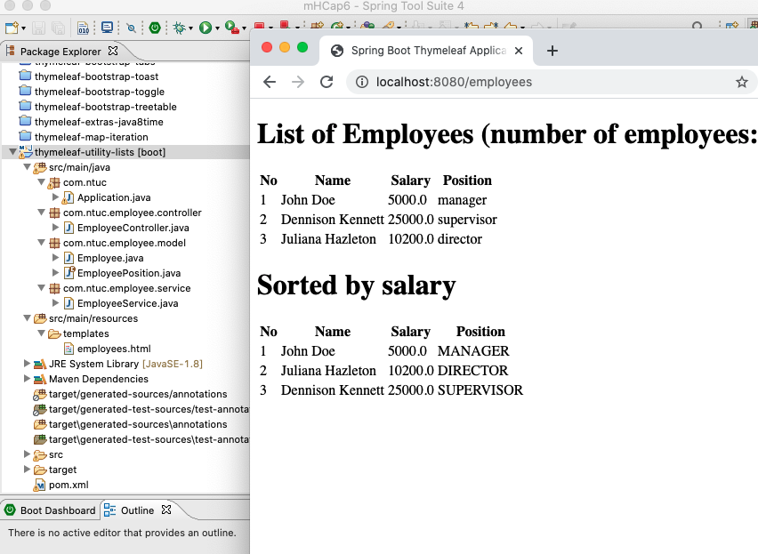 |
| 99 | --- |  |  |

[:top: Top](#top)

---
[**myNote**](mynote.md)

---
