ntuc CapStone 6
===
[top]: topOfThePage

| topics | Lesson | Folder | img |
| ---: | --- | --- | --- |
| 01 | BCrypt Authenticate | [ 210126-DaoAuthenticate ](/mFCapStoneProj6/210126-DaoAuthenticate) | 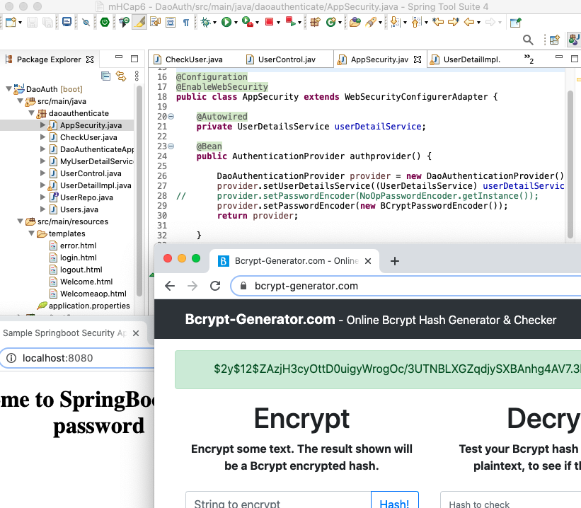 |
| 02 | Role Authenticate | [ 27-SpringAUth ](/mHCapStoneProj6/210127-SpringAUth)  |  |
| 03 | SpringAuthentication | [ 210127N-BankApp ](/mHCapStoneProj6/210127N-BankApp) |  |
| 04 | NiceAdmin template | [ 210128A-NiceSprAuth ](/mHCapStoneProj6/210128A-NiceSprAuth) | 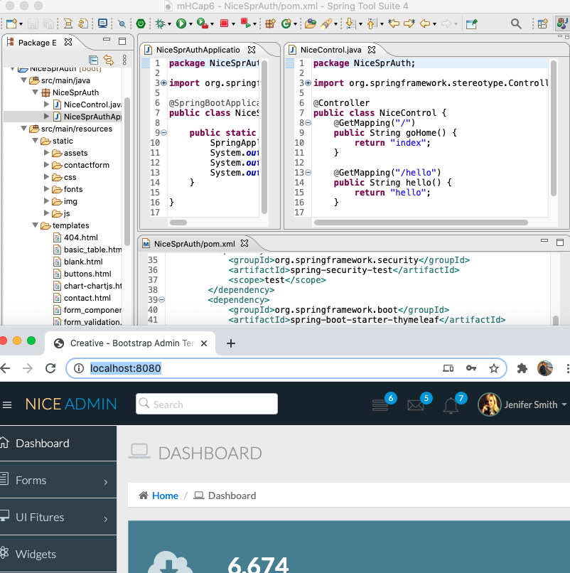 |
| 05 | NiceAdmin Login | [ 210129B-NiceSprAuth ](/mHCapStoneProj6/210129B-NiceSprAuth) | 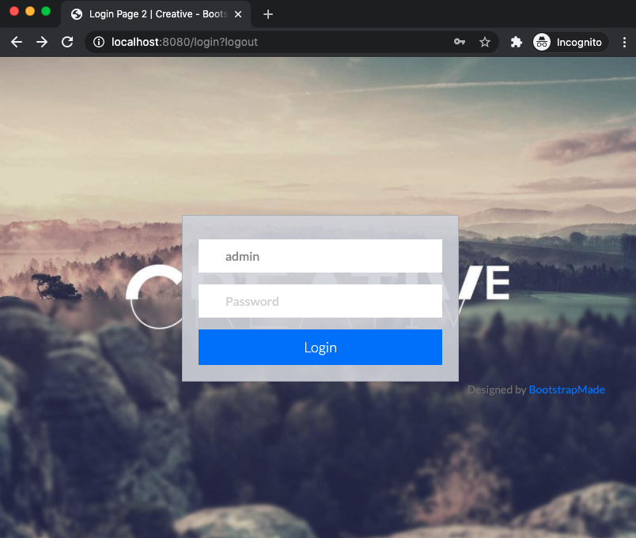 |
| 06 | BankApp Session ID | [ 210129P-BankApp ](/mHCapStoneProj6/210129P-BankApp ) | 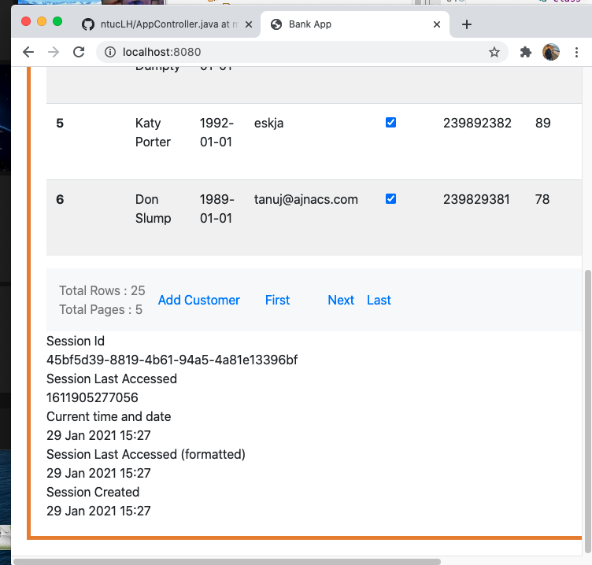 |
| 07 | Bean Scope | [ 210201SpringBeanScope ](/mHCapStoneProj6/210201SpringBeanScope) | 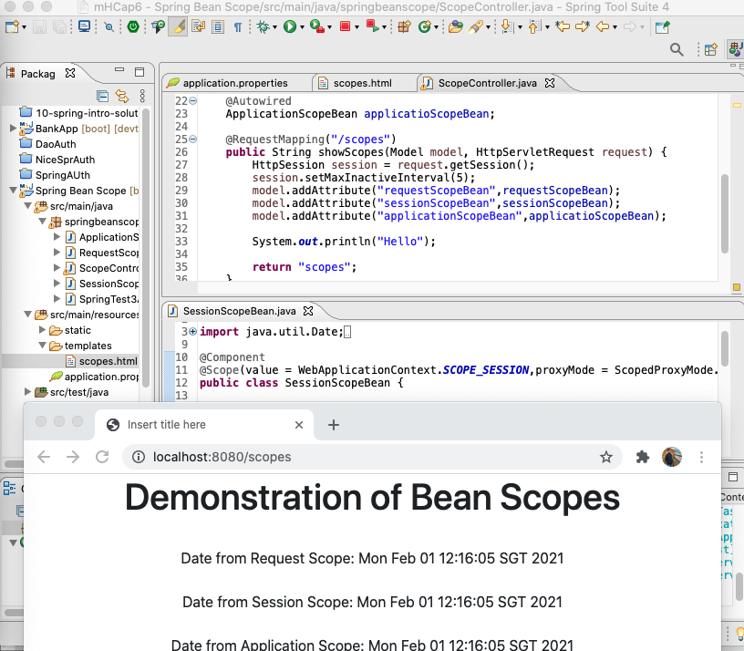 |
| 08 | Chat room | [ 210201Springbootchatrooms ](/mHCapStoneProj6/210201Springbootchatrooms) | 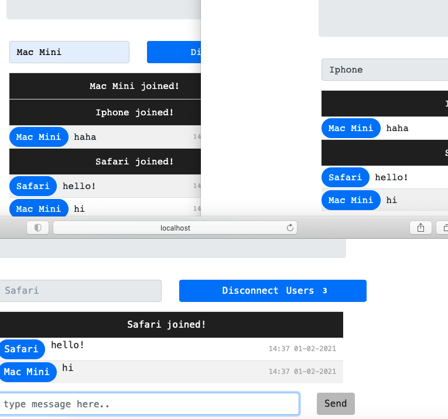 |
| 09 | ModelMap, RequestParam | [ 210201springModelAttribute ](/mHCapStoneProj6/210201springModelAttribute) | 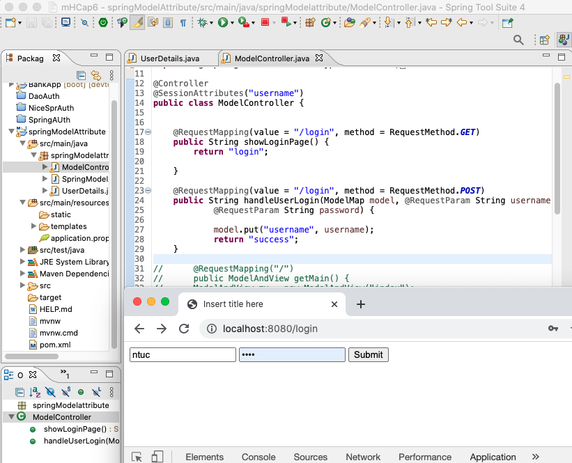 |
| 10 | Testing, JpaRepository | [ 210202SpringManyToMany ](/mHCapStoneProj6/210202SpringManyToMany) |  |
| 11 | ManyToMany BCryptPass | [ 210203Q-BankApp ](/mHCapStoneProj6/210203Q-BankApp) | 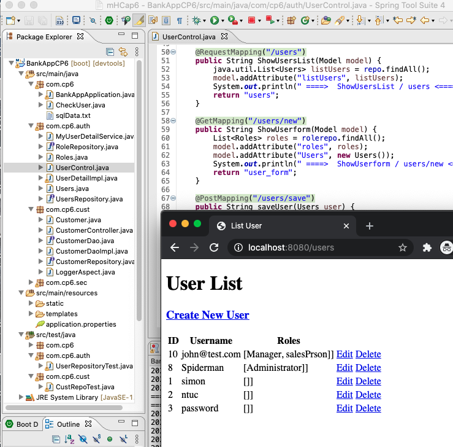 |
| 12 | Swagger | [ 210205BSwagger ](/mHCapStoneProj6/210205BSwagger) | 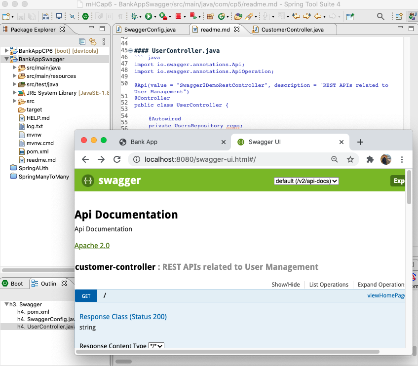 |
| 13 | M2M NavBar BootStrap | [ 210208B-SpringManyToMany ](/210208B-SpringManyToMany) | 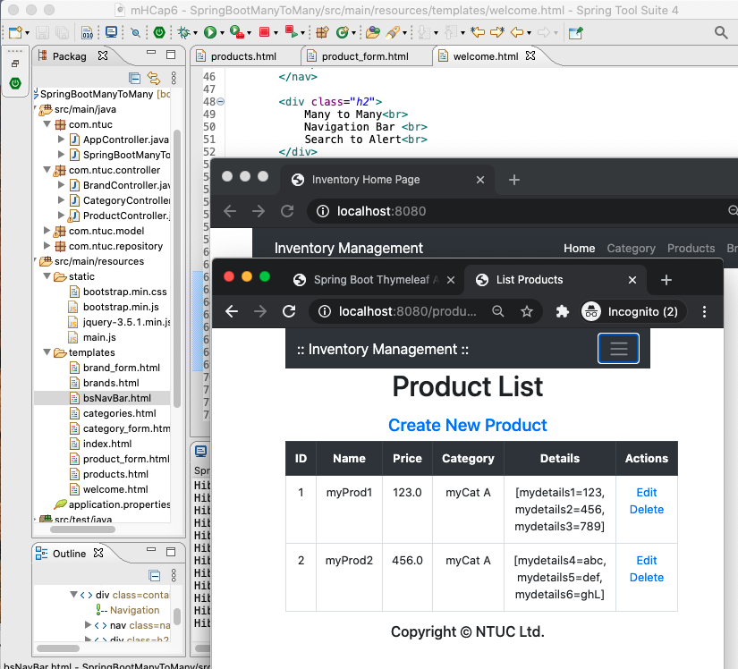 |
| 14 | Jquery Search | [ JqueryBSlocal ](/mHCapStoneProj6/JqueryBSlocal) | 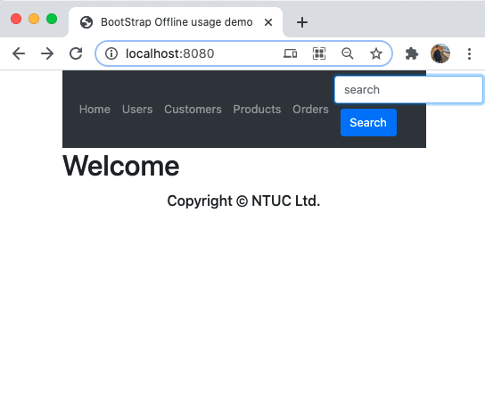 |
| 15 | Thymeleaf Template | [ ThymeleafDemos ](/mHCapStoneProj6/ThymeleafDemos) |  |
| 99 | --- |  |  |

[:top: Top](#top)

---
[**myNote**](mynote.md)

---
