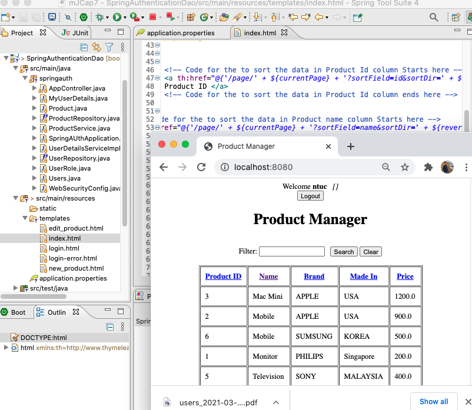

pagination sorting
===
[top]: topOfThePage


210302Pagination.png 

#### index.html
``` html
	<table border="1" cellpadding="10">
		<thead>
			<tr>
				<th>
						<!-- Code for the to sort the data in Product Id column Starts here --> 
						<a th:href="@{'/page/' + ${currentPage} + '?sortField=id&sortDir=' + ${reverseSortDir}}">	
						Product ID </a>
						<!-- Code for the to sort the data in Product Id column ends here -->
				</th>
				<th>
				<!-- Code for the to sort the data in Product name column Starts here -->
				<a th:href="@{'/page/' + ${currentPage} + '?sortField=name&sortDir=' + ${reverseSortDir}}">	
						Name </a>
				<!-- Code for the to sort the data in Product name column Starts here -->
				</th>
```


---
[:top: Top](#top)