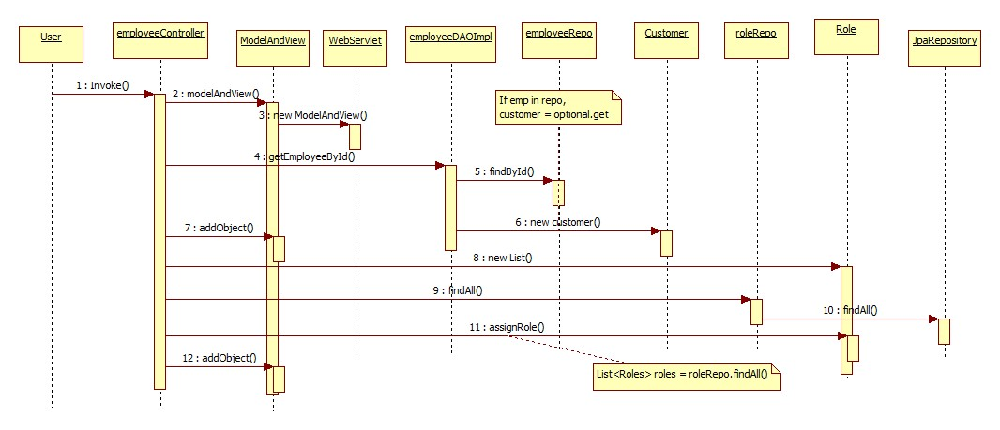

Sequence Diagram
===
[top]: topOfThePage


#### [ EmployeeController.java ](EmployeeController.java)
``` java
import org.springframework.web.servlet.ModelAndView;
...

	@GetMapping("/emp/edit/{empId}")
	public ModelAndView editEmployee(@PathVariable(value = "empId") long empId) {
		ModelAndView mav = new ModelAndView("employeeEdit");	
		Employee emp = employeeDao.getEmployeeById(empId);
		mav.addObject("employee", emp);		
		List<Role> roles = rolerepo.findAll();
		mav.addObject("roles", roles);
		log.info("=====> edit/{empId}: " + emp.getEmpId());
		return mav;
	}
```

SequenceDiagram1.jog 

#### EmployeeDaoImpl.java
``` java
	@Override
	public Employee getEmployeeById(long empId) {
		
		Optional <Employee> optional = employeeRepo.findById(empId);
		Employee customer = null;
		
		if(optional.isPresent())
			customer = optional.get();
		else
			throw new RuntimeException(" Employee not found for id :: " + empId);
		
		return customer;		
	}
```
#### RoleRepo.java
``` java
public interface RoleRepo extends JpaRepository<Role, Integer> {

}
```

---
[:top: Top](#top)
