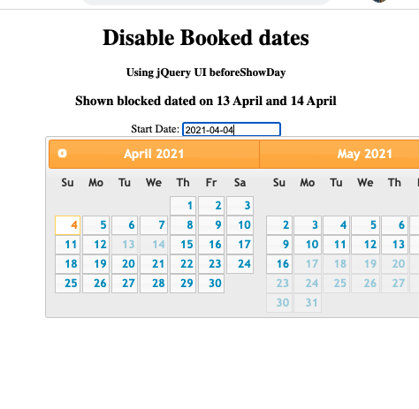

### Date Picker
210317DatePicker.png 

#### index.html
``` html
<!DOCTYPE html> 
<html xmlns:th="http://www.thymeleaf.org">
<head> 
	<link href= 
'https://ajax.googleapis.com/ajax/libs/jqueryui/1.12.1/themes/ui-lightness/jquery-ui.css'
		rel='stylesheet'> 
	<script src= 
"https://ajax.googleapis.com/ajax/libs/jquery/3.1.1/jquery.min.js"> 
	</script> 
	<script src= 
"https://ajax.googleapis.com/ajax/libs/jqueryui/1.12.1/jquery-ui.min.js"> 
	</script> 
</head> 

<body> 
	<center> 
		<h1>Disable Booked dates</h1> 
		<h4>Using jQuery UI beforeShowDay</h4>
		<h3>Shown blocked dated on 13 April and 14 April</h3>
	Start Date: 
	<input type="text" id="my_date_picker1"> 
	<script th:inline="javascript">
		$(document).ready(function() { 

			var cdate = new Date();
			
			var my_array = new Array('14/4/2021','13/4/2021','28/3/2021');

			$(function() { 
				$("#my_date_picker1").datepicker({ 
					dateFormat: 'yy-mm-dd', 
					//dateFormat: 'dd-mm-yy', 
					numberOfMonths:2,
					minDate: cdate,
					maxDate:60,
					defaultDate: cdate,
					beforeShowDay: my_check 
				}); 
			}); 

			function my_check(in_date) { 
				in_date = in_date.getDate() + '/' 
					+ (in_date.getMonth() + 1) + '/' + in_date.getFullYear(); 
 
				if (my_array.indexOf(in_date) >= 0) { 
					return [false, "notav", 'Not Available']; 
				} else { 
					return [true, "av", "available"]; 
				}
			} 
		}) 
	</script> 

</body> 
</html> 
```
#### blockdates.java
``` java
@Entity
@Table(name="booked_dates")
@Component
public class blockdates {
	@Id
	@DateTimeFormat(pattern="yyyy-MM-dd")
	private LocalDate bdate;

	public LocalDate getBdate() {
		return bdate;
	}

	public void setBdate(LocalDate bdate) {
		this.bdate = bdate;
	}
	
}

```
#### JsController.java
``` java
@Controller
public class JsController {

	@Autowired blockdates d;
	
	@Autowired bdatesRepository repo;
	
	@GetMapping("/")
	public String showMain(Model model) {
		List<blockdates> listdates = repo.findAll();

		model.addAttribute("listdates", listdates);

		return "index";
	}

}
```
#### bdatesRepository.java
```java
public interface bdatesRepository extends JpaRepository<blockdates, LocalDate> {
	 
}
```

#### application.properties
serve no purpose
```
spring.datasource.url=jdbc:oracle:thin:@//localhost:1521/ORCL
spring.datasource.username=sridhar
spring.datasource.password=sridhar

#spring.jackson.date-format=dd/mm/yyyy
#spring.jackson.date-format=yyyy/mm/dd

spring.jpa.hibernate.ddl-auto=update
#logging.level.root=info
```