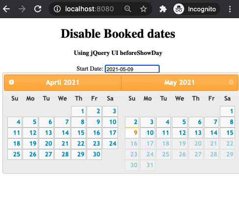

### Date Picker
210316DatePicker.png 

#### index.html
``` html
<!DOCTYPE html> 
<html xmlns:th="http://www.thymeleaf.org">
<head> 
	<link href= 
'https://ajax.googleapis.com/ajax/libs/jqueryui/1.12.1/themes/ui-lightness/jquery-ui.css'
		rel='stylesheet'> 
	<script src= 
"https://ajax.googleapis.com/ajax/libs/jquery/3.1.1/jquery.min.js"> 
	</script> 
	<script src= 
"https://ajax.googleapis.com/ajax/libs/jqueryui/1.12.1/jquery-ui.min.js"> 
	</script> 
</head> 

<body> 
	<center> 
		<h1>Disable Booked dates</h1> 
		<h4>Using jQuery UI beforeShowDay</h4> 
	Start Date: 
	<input type="text" id="my_date_picker1"> 
	<script th:inline="javascript">
		$(document).ready(function() { 

			var cdate = new Date();
			
			$(function() { 
				$("#my_date_picker1").datepicker({ 
					dateFormat: 'yy-mm-dd', 
					//dateFormat: 'dd-mm-yy', 
					numberOfMonths:2,
					minDate: cdate,
					maxDate:60,
					defaultDate: cdate,
					beforeShowDay: my_check 
				}); 
			}); 

			function my_check(in_date) { 
				in_date = in_date.getDate() + '/' 
				+ (in_date.getMonth() + 1) + '/' + in_date.getFullYear(); 
				//var my_array = new Array('3/4/2021', '14/4/2021','13/4/2021','28/3/2021');
				//var my_array = new Array('2021/4/4', '2021/4/14','2021/4/13','2021/3/28');
					var object = '[[${listdates}]]'
					var my_array = []
					
					my_array.push(object)
					//alert (my_array)
 
				if (my_array.indexOf(in_date) >= 0) { 
					return [false, "notav", 'Not Available']; 
				} else { 
					return [true, "av", "available"]; 
				}
			} 
		}) 
	</script> 

</body> 
</html> 

```
#### blockdates.java
``` java
<<<<<<< HEAD
@Entity
@Table(name="booked_dates")
@Component
public class blockdates {
	@Id
	@DateTimeFormat(pattern="yyyy-MM-dd")
	private LocalDate bdate;
	
=======
package com.ntuc;

import java.time.LocalDate;
import java.time.format.DateTimeFormatter;

import org.springframework.stereotype.Controller;
import org.springframework.ui.Model;
import org.springframework.web.bind.annotation.GetMapping;


@Controller
public class JsController {

	@GetMapping("/")
	public String showMain(Model model) {

		LocalDate abcDate1 = LocalDate.parse("2021-04-20");
		model.addAttribute("finalDates", finalDates(abcDate1, 10));
>>>>>>> 18473e01e44bdf9d524ba980947178108a10c250

	public LocalDate getBate() {
		return bdate;
	}

<<<<<<< HEAD
	public void setBdate(LocalDate bdate) {
		this.bdate = bdate;
	}
=======
	// formated dates for calender
	public static String[] finalDates(LocalDate startDate, Integer dayRange) {

		String[] finalDates= new String[dayRange]; // size up first
	
		DateTimeFormatter dTF; 
		dTF = DateTimeFormatter.ofPattern("d/M/yyyy");

		for(int i=0;i<dayRange;i++) {
			finalDates[i]=dTF.format(startDate.plusDays(i));
		}

		return finalDates;
		
	}

>>>>>>> 18473e01e44bdf9d524ba980947178108a10c250
}
```
#### application.properties
serve no purpose
```
spring.datasource.url=jdbc:oracle:thin:@//localhost:1521/ORCL
spring.datasource.username=sridhar
spring.datasource.password=sridhar

#spring.jackson.date-format=dd/mm/yyyy
spring.jackson.date-format=yyyy/mm/dd

spring.jpa.hibernate.ddl-auto=update
<<<<<<< HEAD
logging.level.root=info
```
=======
#logging.level.root=info
```
>>>>>>> 18473e01e44bdf9d524ba980947178108a10c250
