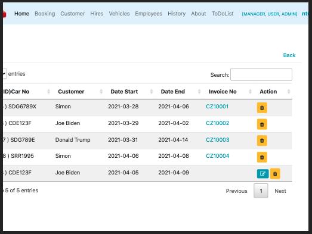

## Ternary operators 

### some thymeleaf exmaples

#### Thymeleaf Page Layouts
https://www.thymeleaf.org/doc/articles/layouts.html
``` java
@Controller
class HomeController {

    @GetMapping("/")
    String index(Principal principal) {
        return principal != null ? "home/homeSignedIn" : "home/homeNotSignedIn";
    }

}
```
``` html
            <li th:classappend="${module == 'home' ? 'active' : ''}">
              <a href="#" th:href="@{/}">Home</a>
            </li>
            <li th:classappend="${module == 'tasks' ? 'active' : ''}">
              <a href="#" th:href="@{/task}">Tasks</a>
            </li>

<div th:replace="fragments/footer :: ${#authentication.principal.isAdmin()} ? 'footer-admin' : 'footer'">
  &copy; 2016 The Static Templates
</div>

<div th:replace="${#authentication.principal.isAdmin()} ? ~{fragments/footer :: footer-admin} : ~{fragments/footer :: footer-admin}">
  &copy; 2016 The Static Templates
</div>
```
---
### tenary on listing
all rows need to be fill with value 

210403TenaryOpe.png 

#### hire.html
``` html
        <td th:text="${hire.dateEnd}" />
        <td><a th:href="@{'/inv/invoice/' + 
            ${ hire.casedone == true ? hire.invoice.invId : hire.hireId } }"> <!-- hire.hireId  is dummy -->
            [[${ hire.casedone == true ?  hire.invoice.invNo : "" } ]]</a>
        </td>
        <td>
            <a th:classappend="${hire.casedone != true ? 'btn btn-info btn-sm fa fa-edit' : hidden}"
            th:href="@{'/hireEdit/' + ${hire.hireId}}"> </a>

            <a class="btn btn-warning btn-sm delBtn" th:href="@{/hire/delete/{hireId}(hireId=${hire.hireId})}">
                <span class="fa fa-trash"></span></a>
        </td>

        <!-- <td> <a th:href="@{'/inv/invoice/' + ${hire.hireId}}">url</a> </td>  -->
        <!-- <td th:text="${ hire.casedone == true ?  hire.hireId : '' }" /> -->
    </tr>
```
#### HireController.java
``` java
	@GetMapping("/hire")
	public String viewHirePage(Model model) {
		List<Hire> listHires = hireDao.getAllHires();
		model.addAttribute("listHires", listHires);
		//Stream.of(listHires).forEach(s -> System.out.println("/n hire :: " + s));
		return "hire/hires";
	}
```
#### InvController.java
``` java
	@GetMapping("inv/invoice/{id}")
	public String showInvoice(@PathVariable("id") int id, Model model) {
		Invoice inv = invoiceDao.getInvoiceById(id);
		model.addAttribute("inv", inv);
		log.info("=====> inv/invoice/" + inv.getInvId());
		return "inv/invoice";
	}
```


