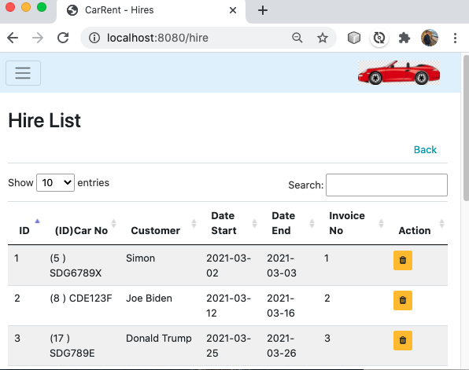

## BootStrap Table Pagination, Search

210401TableSearch.png 

#### hires.html
add table name in script,`$('.mydatatable').DataTable();`
``` html
	<div class = "container mb-3 mt-3">
		<table class="table table-striped mydatatable" id="table">
			<thead>
            ...
			<tbody>
            ...
		</table>
	</div>

	<div th:replace="common :: footer"></div>
	<!-- https://cdn.datatables.net/ --> <script>
		$('.mydatatable').DataTable();
	</script>
```
####  common.html
added in https://cdn.datatables.net/  ' js and css
``` html
<!-- ***** common footer  -->
<div  th:fragment="footer">
    <div class="text-center m-3 fixed-bottom" style="font-size: small;">Copyright &copy; CarZoom</div>

    <script src="https://code.jquery.com/jquery-3.3.1.min.js" type="text/javascript"></script>
    <script  src="https://cdnjs.cloudflare.com/ajax/libs/popper.js/1.14.7/umd/popper.min.js" type="text/javascript"></script>
    <script  src="https://stackpath.bootstrapcdn.com/bootstrap/4.3.1/js/bootstrap.min.js" type="text/javascript"></script>

    <script src="../static/main.js" type="text/javascript" th:src="@{/main.js}"></script>
    <script src="../static/nav.js" type="text/javascript" th:src="@{/nav.js}"></script>
    <!-- https://cdn.datatables.net/ -->
    <script  src="https://cdn.datatables.net/1.10.24/js/jquery.dataTables.min.js" type="text/javascript"></script>
</div>

<!-- ***** common header  -->
<div  th:fragment="header">
			<!-- Required meta tags -->
    <meta charset="utf-8">
    <meta name="viewport" content="width=device-width, initial-scale=1, shrink-to-fit=no">

    <!-- Bootstrap CSS -->
    <link href="https://stackpath.bootstrapcdn.com/bootstrap/4.3.1/css/bootstrap.min.css" rel="stylesheet"> </link>
	<link rel="stylesheet" href="https://stackpath.bootstrapcdn.com/font-awesome/4.7.0/css/font-awesome.min.css"> </link>
	<!-- https://cdn.datatables.net/ -->
	<link rel="stylesheet" href="https://cdn.datatables.net/1.10.24/css/jquery.dataTables.min.css"> </link>
	<style>
```
