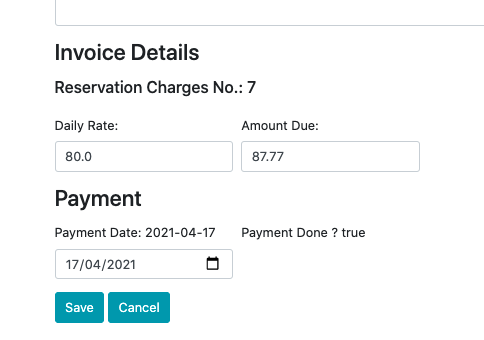

### request.getParameter
210406reqParam.png 

#### InvController.java
``` java
@PostMapping(value = "/inv/saveEdit")
public String saveInvEdit(@Valid @ModelAttribute("inv") Invoice inv, HttpServletRequest request) {	

        String invPaymtAmount = request.getParameter("invPaymtAmount");
        String invPaymtPaidDate = request.getParameter("invPaymtPaidDate");

        float amt = Float.parseFloat(invPaymtAmount);
        LocalDate pymtDate = LocalDate.parse(invPaymtPaidDate);

        InvPaymt invPaymt = new InvPaymt();
        invPaymt = inv.getInvPaymt();
        invPaymt.setAmount(amt);
        invPaymt.setPaidDate(pymtDate);

        invoiceDao.save(inv);
        invPaymtRepo.save(invPaymt);

        return "redirect:/inv/invoice/" + inv.getInvId() ;
}
```

#### invEdit.html
``` html
<form action="#" th:action="@{/inv/saveEdit}" th:object="${inv}" method="POST">
<div class = "container mb-3 mt-3">
<div class="form-row">
        <div class="form-row form-group col-md-4">
                <label hidden>Invoice/ invPaymnt ID: </label>
                <input type="text" th:field="*{invId}" readonly="readonly" hidden>
                <input type="text" th:field="*{invPaymt.invPaymtId}" readonly="readonly" hidden>
        </div>	
</div>

...

        <div class="form-group col-md-12">
                <h5>Reservation Charges No.: [[${inv.hireId}]]</h5>
                <input type="text" hidden  th:field="*{hireId}" readonly="readonly"/>
        </div>
        <div class="form-group col-md-4">
                <label>Daily Rate: </label>
                <input type="text" class="form-control"  th:field="*{rated}" required/>
        </div>
        <div class="form-group col-md-4">
                <label>Amount Due: </label>
                <input type="text" class="form-control" name="invPaymtAmount" th:value="${inv.invPaymt.amount}" required/>
        </div>
</div>

<div class="form-row">		
        <h3 class="form-group col-md-12">Payment</h3>
        <div class="form-group col-md-4">
                <label>Payment Date: [[${inv.invPaymt.paidDate}]]</label>
                <input type="date" class="form-control" name="invPaymtPaidDate" th:value="${inv.invPaymt.paidDate}" required/>
        </div>
        <div class="form-group col-md-6">
                <label>Payment Done ? [[${inv.paymtDone}]]</label>
                <input type="checkbox" th:field="*{paymtDone}" readonly="readonly" hidden/>
        </div>
</div>

 <button class="btn btn-info"  type="submit">Save</button>
 <a class="btn btn-info"  href="/hire">Cancel</a>
```
#### invoice.java
``` java
@Entity
public class Invoice {
	
	@Id
	@GeneratedValue(strategy = GenerationType.IDENTITY)
	@Column(name="INVID")
	private int invId;

        @OneToOne
        @JoinColumn(name = "invpaymtid")
	private InvPaymt invPaymt;
    
	@Column(name="invno", unique=true)
	private String invNo;

	@DateTimeFormat(pattern = "yyyy-MM-dd")
	@Column(name="dated")
	private LocalDate dated;

        ...

	private float rated;

	@Column(name="paymtdone")
	private boolean paymtDone;

	public Invoice() {
		super();
	}
	public int getInvId() {
		return invId;
	}

	public void setPaidDate(LocalDate paidDate) {
		this.invPaymt.setPaidDate(paidDate);
	}
	public LocalDate getPaidDate() {
		return this.invPaymt.getPaidDate();
	}
        ...
```
#### InvPaymt.java
``` java
@Entity
@Table(name = "invpaymt")
public class InvPaymt {
	
	@Id
	@GeneratedValue(strategy = GenerationType.IDENTITY)
	private int invPaymtId;

        //@OneToOne
        //@JoinColumn(name = "invid")
        //private Invoice invoice;
        private int invid;
    
	@Column(name = "paiddate")
	private LocalDate paidDate;
	
	private float amount;
	
	private boolean archive;

	private int entity;

	public InvPaymt() {
		super();
	}
        ...
```

