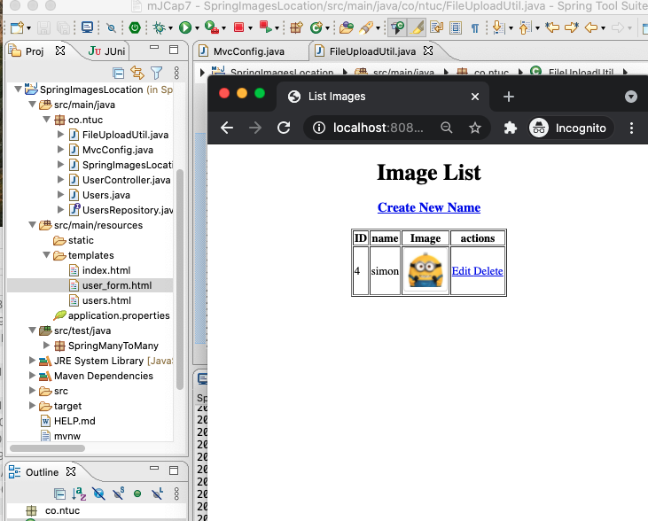

## MvcConfig 

210503mvcConfig.png 

#### MvcConfig.java
``` java
@Configuration
public class MvcConfig implements WebMvcConfigurer{
	@Override
    public void addResourceHandlers(ResourceHandlerRegistry registry) {
        exposeDirectory("user-photos", registry);
    }
     
    private void exposeDirectory(String dirName, ResourceHandlerRegistry registry) {
        Path uploadDir = Paths.get(dirName);
        String uploadPath = uploadDir.toFile().getAbsolutePath();

        if (dirName.startsWith("../")) dirName = dirName.replace("../", "");
         
        registry
        	.addResourceHandler("/" + dirName + "/**")
        	.addResourceLocations("file:"+ uploadPath + "/");
        	//.addResourceLocations("file:/"+ uploadPath + "/"); //was windows user?
        
        	System.out.println("\t====> "+"file:"+ uploadPath + "/");
    }
}
```
#### FileUploadUtil.java
``` java
public class FileUploadUtil {
	public static void saveFile(String uploadDir, String fileName,
        MultipartFile multipartFile) throws IOException {
        Path uploadPath = Paths.get(uploadDir);
         
        if (!Files.exists(uploadPath)) {
            Files.createDirectories(uploadPath);
        }
         
        try (InputStream inputStream = multipartFile.getInputStream()) {
            Path filePath = uploadPath.resolve(fileName);
            Files.copy(inputStream, filePath, StandardCopyOption.REPLACE_EXISTING);
        } catch (IOException ioe) {        
            throw new IOException("Could not save image file: " + fileName, ioe);
        }      
    }
}
```
#### UserController.java
``` java
@Controller
public class UserController {

	@Autowired
	private UsersRepository repo;

	@RequestMapping("/users")
	public String ShowUsersList(Model model) {
		java.util.List<Users> listUsers = repo.findAll();
		model.addAttribute("listUsers", listUsers);
		
		return "users";
	}
	
	@GetMapping("/users/new")
	public String ShowUserform(Model model) {
		model.addAttribute("Users", new Users());
		return "user_form";
	}

	@PostMapping("/users/save")
	public RedirectView saveUser(Users user, @RequestParam("image") MultipartFile multipartFile) throws IOException {
		String fileName = StringUtils.cleanPath(multipartFile.getOriginalFilename());
        user.setPhotos(fileName);
         
        Users savedUser = repo.save(user);
 
        String uploadDir = "user-photos/" + savedUser.getId();
 
        FileUploadUtil.saveFile(uploadDir, fileName, multipartFile);
         
        return new RedirectView("/users", true);
	}
	
	@GetMapping("/users/edit/{id}")
	public String ShowEditForm(@PathVariable("id") Long id, Model model) {
		Users user =   repo.findById(id).get();
		model.addAttribute("Users", user);

		return "user_form";
	}

	@GetMapping("/users/delete/{id}")
	public String deleteUser(@PathVariable("id") Long id, Model model) {
		repo.deleteById(id);;
		
		return "redirect:/users";
	}
}
```
user.html
``` html
	<div align="center">
		<H1>Image List</H1>

		<div>
			<h3>
				<a th:href="@{/users/new}"> Create New Name</a>
			</h3>
		</div>

		<table border="1">
			<thead>
				<tr>
					<th>ID</th>
					<th>name</th>
					<th>Image</th>
					<th>actions</th>
				</tr>
			</thead>

			<tbody>
				<th:block th:each="users: ${listUsers}">
					<tr>
						<td>[[${users.id}]]</td>
						<td>[[${users.name}]]</td>
						<td></td>
						<td><a th:href="@{'/users/edit/' + ${users.id}}"> Edit </a> <a
							th:href="@{'/users/delete/' + ${users.id}}"> Delete </a></td>
					</tr>
				</th:block>
			</tbody>
		</table>
	</div>
```
user_form.html
``` html
	<H1> Images Managerment</H1>

	<form th:action="@{/users/save}" th:object="${Users}" method="post" 
		enctype="multipart/form-data">

		<Input type="hidden" th:field="*{id}" required />

		<div> <label> Name</label> </div>
		<div> <Input type="text" th:field="*{name}" required /> </div>

		<div> <label>Image: </label> 
		 <input type="file" name="image" accept="image/png, image/jpeg" /> </div>

		<button type="submit"> Save</button>
	</form>
```