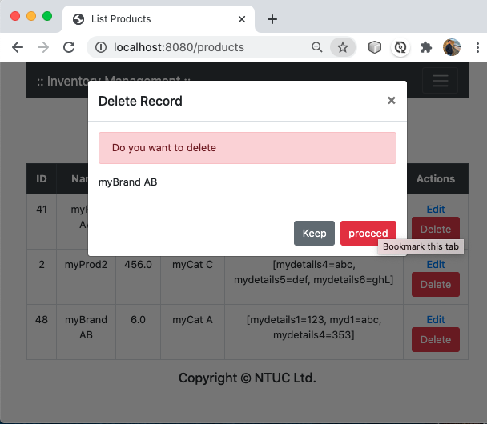
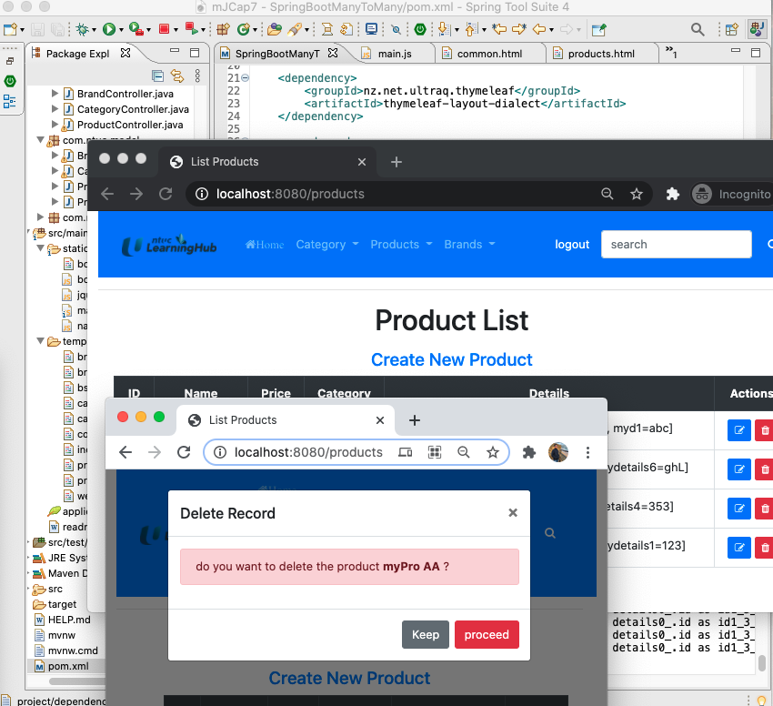
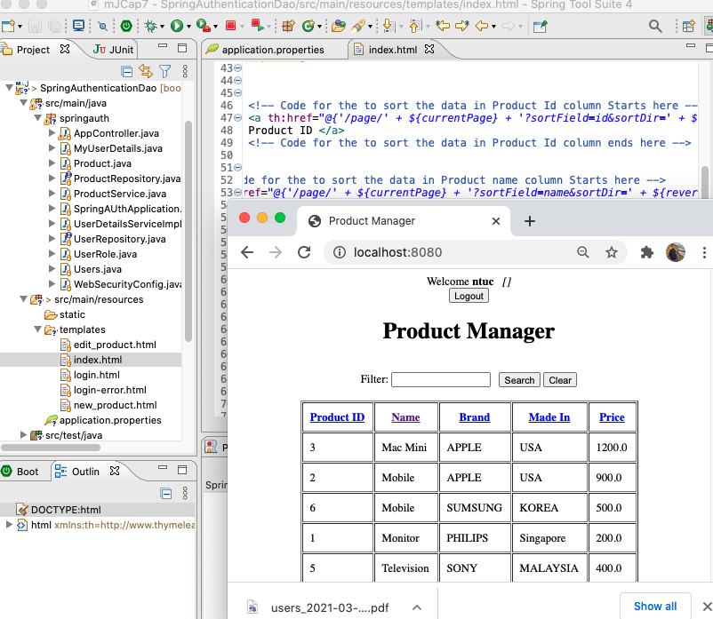
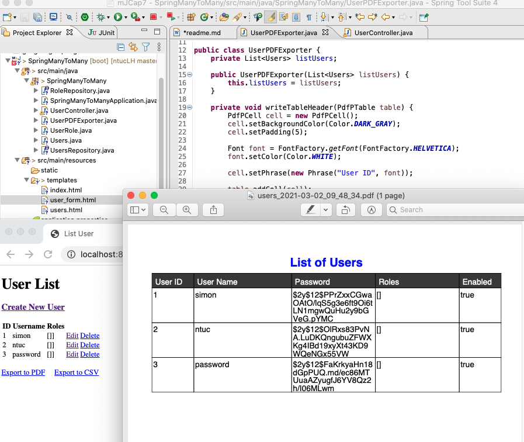
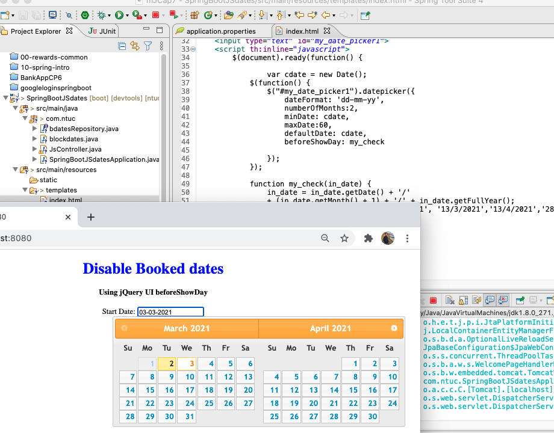
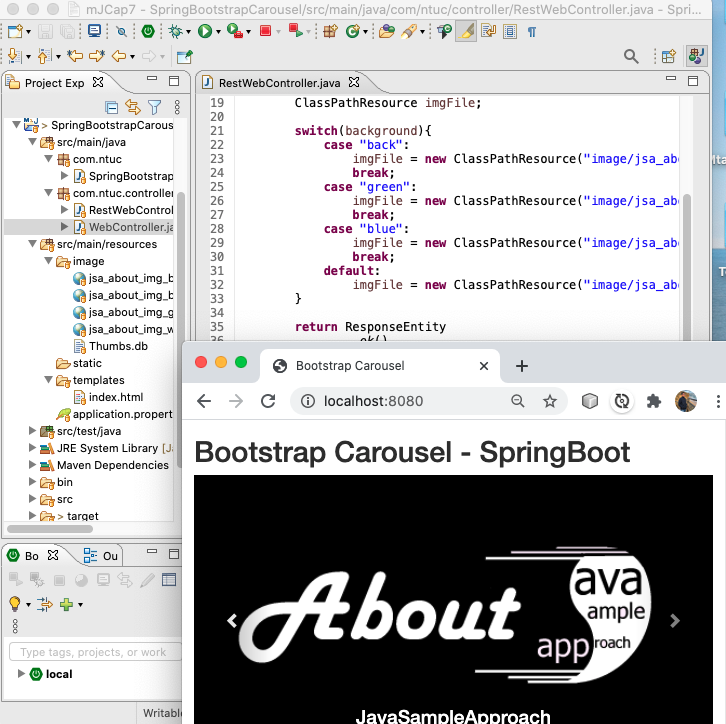
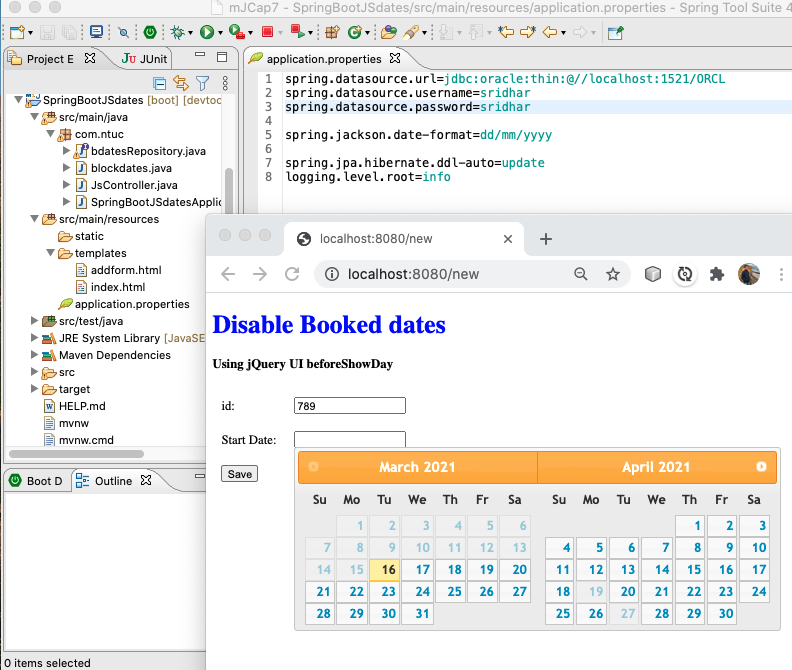
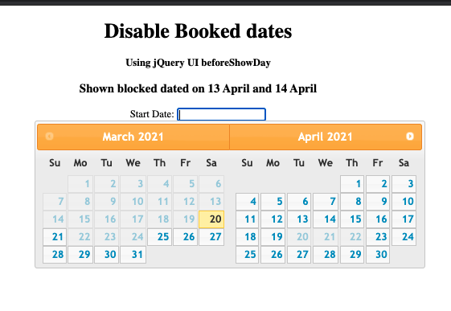
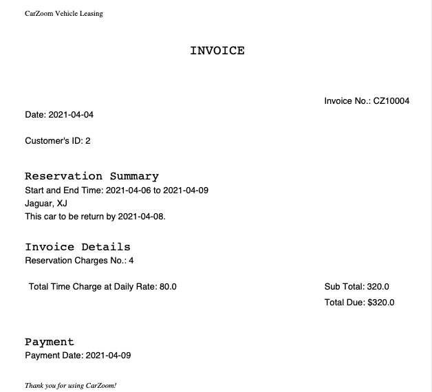
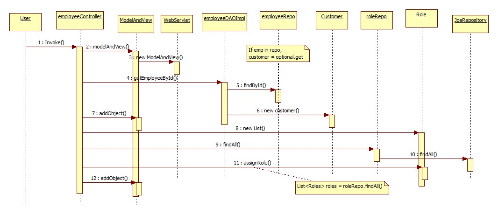

ntuc CapStone 7
===
mJSummativeCapStoneProj

[top]: topOfThePage

| topics | Lesson | Folder | img/details |
| ---: | --- | --- | --- |
| 01 | Delete Alert | [ 210209D-SpringManyToMany ](/mJSummativeCapStoneProj/210209D-SpringManyToMany) |  |
| 02 | CommonHtml NavBar | [ 210209E-SpringManyToMany ](/mJSummativeCapStoneProj/210209E-SpringManyToMany) |  |
| 03 | pagination sorting | [210225Sridhar](/mJSummativeCapStoneProj/210225Sridhar) |  |
| 04 | export to PDF | [210301Sridhar](/mJSummativeCapStoneProj/210301Sridhar/SpringManyToMany) |  |
| 05 | Date Pick | [210302Sridhar](/mJSummativeCapStoneProj/210302Sridhar/SpringBootJSdates) |  |
| 06 | Avatar, kiv | [SpringUserWithAvatar](/mJSummativeCapStoneProj/210304Sridhar/SpringUserWithAvatar) |  |
| 07 | Carousel| [ 210305Sridhar ](/mJSummativeCapStoneProj/210305Sridhar/SpringBootstrapCarousel) |  |
| 08 | Date Dynamic | [210311Sridhar](/mJSummativeCapStoneProj/210311Sridhar/SpringBootJSdates) |  |
| 09 | Date Picker | [210316-DatePicker](/mJSummativeCapStoneProj/210316-DatePicker) |  |
| 10 | --- |  |  |
| 86 | objects in object | [21041RR-SumProj.md](/mJSummativeCapStoneProj/21041RR-SumProj.md) | `public  class InvCust { private Invoice inv; ...`|
| 87 | Numbers Format | [ 210414Q-SumProj.md](/mJSummativeCapStoneProj/210414Q-SumProj.md) | `${#numbers.formatCurrency( inv.invPaymt.amount )}` `String.format("%.2f", 1.23456);` |
| 88 | style html | [210414P-SumProj.md](/mJSummativeCapStoneProj/210414P-SumProj.md) | `style="text-align: right">` |
| 89 | Array | [210412P-SumProj.md](/mJSummativeCapStoneProj/210412P-SumProj.md) | `int partListSum2 = partList.stream().reduce(0, Integer::sum);` `Stream.of(rlist).forEach(s -> Sys ...`|
| 90 | LocalDateArrayMany.java | [210410N-SumProj.md](/mJSummativeCapStoneProj/210410N-SumProj.md) | `public static LocalDate[] mergeDatelists(LocalDate[] listA, LocalDate[] listB) {` |
| 91 | @test hireRepo | [210410M-SumProj.md](/mJSummativeCapStoneProj/210410M-SumProj.md) | `assertEquals(a, 1);` `assertThat(hire).isNotNull();` |
| 92 | request.getParameter | [210406L-SumProj.md](/mJSummativeCapStoneProj/210406L-SumProj.md) | `= request.getParameter("invPaymtAmount");` ` th:value="${inv.invPaymt.paidDate}" /> ` |
| 93 | PDF Exporter | [210405K-SumProj.md](/mJSummativeCapStoneProj/210405K-SumProj.md) |  |
| 94| Table Pagination, Search | [210401J-SumProj.md)](/mJSummativeCapStoneProj/210401J-SumProj.md) |`https://cdn.datatables.net/ ` |
| 95 | Ternary operators | [210329H-SumProj.md ](/mJSummativeCapStoneProj/210329H-SumProj.md) |` th:classappend="${hire.casedone != true ? 'orangeFont' : ''}" ` `return principal != null ? "home/homeSignedIn" : "home/homeNotSignedIn";`|
| 96 | model.addAttribute | [ 210328G-SumProj.md ](/mJSummativeCapStoneProj/210328G-SumProj.md) | `Model model.addAttribute ModelAndView @PathVariable @ModelAttribute`  `[[ ${emp.empId} ]]` `th:field=\"*{empName}\"/>`|
| 97 | pop-up Alert | [210325F-SumProj.md](/mJSummativeCapStoneProj/210325F-SumProj.md) | ` data-toggle="modal" data-target="#doubleConfirm" ` |
| 98 | Snippet others | [210310D-SumProj.md](/mJSummativeCapStoneProj/210310D-SumProj.md) | ` EmployeeDaoImpl implements EmployeeDao` `th:src="@{/assets/piechart.js}">` |
| 97 | Debug snippets | [210314E-SumProj.md](/mJSummativeCapStoneProj/210314E-SumProj.md) |  ` if(bindingResult.hasErrors()) { log.warn(" ... ` |
| 96 | Date | [210318-Date.md](/mJSummativeCapStoneProj/210318-Date.md) |  `  DateTimeFormatter dateTimeFormatter;   String rawDate = "2000-01-01";   dateTimeFormatter = DateTimeFormatter.ISO_LOCAL_DATE; ` |
| 95 | LoggingBeanPostProcessor | [210305C-SumProj.md ](/mJSummativeCapStoneProj/210305C-SumProj.md) | `public class LoggingBeanPostProcessor implements BeanPostProcessor {` |
| 96 | Testing Dao Repo | [210304B-SumProj.md](/mJSummativeCapStoneProj/210304B-SumProj.md) | `@RunWith(SpringRunner.class)  @Transactional  @SpringBootTest	 public class empValidTest {` |
| 98 | Sequence Diagram | [210228A-SumProj](/mJSummativeCapStoneProj/210228A-SumProj) |  |
| 99 | --- |  |  |

[:top: Top](#top)

---
[**myNote**](mynote.md)

---
